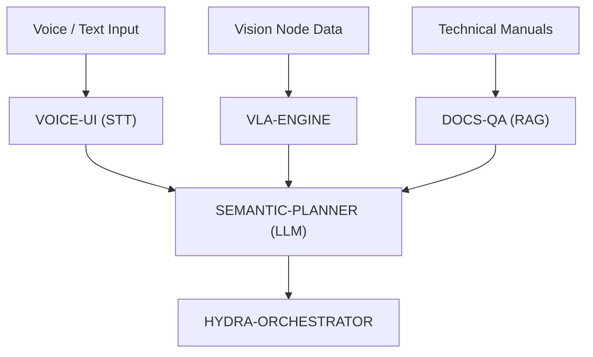

<p align="center">
  
</p>

# 🧠 HYDRA-UMC-COGNITIVE-NODE

<p align="center">🇺🇸 <b>English</b> | <a href="README_spa.md">🇪🇸 Español</a> | <a href="README_fra.md">🇫🇷 Français</a> | <a href="README_ita.md">🇮🇹 Italiano</a> | <a href="README_deu.md">🇩🇪 Deutsch</a> | <a href="README_zho.md">🇨🇳 简体中文</a> | <a href="README_jpn.md">🇯🇵 日本語</a></p>

### 🤖 Semantic Reasoning & GenAI Edge Node (Hailo-10 + Raspberry Pi CM5)

<p align="left">
  
  
  
  
</p>

---

## 1. 🛠️ TECHNICAL OVERVIEW

**HYDRA-UMC-COGNITIVE-NODE** serves as the "frontal lobe" of the HYDRA-UMC ecosystem. Powered by the Hailo-10 NPU (40 TOPS), it enables complex semantic reasoning, natural language understanding, and vision-language-action (VLA) task planning directly at the edge.

It transforms high-level human instructions into logical robotic sequences, managing error recovery and mission optimization without cloud dependency.

### Key Features:
* 🧠 **Local LLM Execution:** Hardware-accelerated inference for quantized models (Llama/Mistral). *(planned - needs the real Hailo-10 model runtime)*
* 👁️ **VLA Integration:** Vision-Language-Action models for intuitive task execution. *(planned)*
* 🎙️ **Voice Command Processing:** Real-time STT/TTS for human-robot interaction. *(planned)*
* 🛡️ **Privacy First:** 100% offline processing of all cognitive tasks. *(true by design once the above exist - nothing here calls out to a network today)*
* 🧩 **Integration Hub (v0):** Owns the shared HydraOS image and quantized model
  weights consumed by its four children, and wires them together as
  sibling services in a single `docker-compose.yml`. Real `family-status`
  check reads each real child's own manifest to report presence/version/
  maturity. *(implemented as a real readiness check - see BUILD & RUN
  below)*
* 🔒 **Versioned status schema + resource-limited manifest reads:** `family-status --json` prints a real, versioned machine-readable result; any sibling manifest bigger than 64 KiB (a corrupted/malicious checkout) degrades to "not found" instead of being read unbounded. *(implemented)*
* 🪫 **Shared model-weights degradation check:** `family-status` honestly reports whether this node's own `models/` directory actually has real weights in it, not just whether the sibling repos are checked out. *(implemented)*
* 📦 **Odometer Versioning:** Every real build bumps `pyproject.toml`'s
  own version automatically (`bump_version.py`) - no manual version edits.

---

## 2. 🔄 COGNITIVE WORKFLOW



---

## 3. 🧱 ARCHITECTURE & DESIGN DECISIONS

This repository is the **parent/integration point** of the Cognitive AI
Node family. It does not itself run a model - it owns the shared
resources and the wiring that let its four children act as one cognitive
unit on the same physical board:

* **Why this node has no hardware/firmware of its own.** Unlike the
  motherboard-level HYDRA-UMC firmware, this node runs entirely on an
  existing Raspberry Pi CM5 + Hailo-10 M.2 module - there is no custom
  PCB or microcontroller to design here, so `hardware/`/`firmware/`
  folders were pruned rather than left empty.
* **Why `os/` and `models/` live only in the parent.** The HydraOS image
  and the quantized LLM/VLA weights are shared, board-level resources -
  keeping one copy in the parent and mounting it read-only into each
  child's container (see `docker-compose.yml`) avoids four divergent
  copies of multi-gigabyte model weights.
* **Why a `src/` layout.** Keeps the installable package
  (`hydra_umc_cognitive_node`) separate from repo-root tooling
  (`bump_version.py`, `docker-compose.yml`), and matches the layout used
  by every other Python project across the ecosystem.
* **Why the entry point only prints identity/version/role today.** This
  is the andamiaje (scaffolding) stage: proving the package installs,
  compiles and imports cleanly - on the actual target Python version - is
  a prerequisite for adding real LLM/VLA/voice orchestration logic later,
  and keeps that later work isolated from packaging concerns.
* **Why `docker-compose.yml` exists before the children have
  Dockerfiles.** Deciding and documenting the integration contract (which
  service depends on which, what device/volume mounts each needs) now
  avoids that shape being invented ad hoc later, even though `docker
  compose up` cannot fully succeed until each child publishes its own
  Dockerfile.
* **How this fits the rest of the ecosystem.** This node sits one layer
  above perception (HYDRA-UMC-VISION-NODE, Hailo-8) and one layer below
  mission orchestration (HYDRA-UMC-ORCHESTRATOR): it turns voice/text
  instructions and detections into semantic decisions, which the
  orchestrator then turns into physical robot commands.
* **Why `family-status` reads each child's own manifest instead of a
  hand-maintained list.** `hydra-umc.project.json` is already the single
  source of truth the ecosystem-wide dashboard and updater trust - a second
  list here would drift the moment
  a child's real maturity changed and nobody remembered to update it.
* **Why a missing sibling checkout is a real, honest "not found", not an
  error.** An integration hub genuinely doesn't know whether a developer
  has checked out all four children locally - `manifest.py` returns
  `None` for every real failure mode (missing repo, missing manifest,
  malformed JSON) so `family-status` reports it plainly instead of
  crashing.
* **Why sibling manifest reads are capped at 64 KiB.** Every real manifest
  across this ecosystem is a few hundred bytes to a couple of KiB - a
  corrupted or malicious checkout whose manifest has been replaced by an
  oversized file must never make a routine readiness check load an
  unbounded amount of data into memory. It degrades to `None`, the same
  as any other malformed manifest.
* **Why `family-status` reports `models/` even though this node runs no
  model itself.** "The sibling repos are checked out" and "the shared
  weights they'd need are actually present" are two different real
  facts - `models.py`'s `check_shared_models()` checks the second
  honestly (empty-but-present counts as missing) instead of letting an
  operator assume readiness from child presence alone.

---

## 📂 DIRECTORY STRUCTURE

```text
HYDRA-UMC-COGNITIVE-NODE/
├── src/hydra_umc_cognitive_node/
│   ├── manifest.py                 # Real, defensive reader for a sibling's own manifest (64 KiB bound)
│   ├── models.py                   # Real check of this node's own shared model-weights directory
│   ├── family.py                    # Real family-readiness check + versioned JSON schema
│   ├── api.py                         # Plain JSON/HTTP surface (stdlib http.server) over `family-status`
│   └── main.py                        # Entry point + real `family-status [--json]` and `serve` subcommands
├── tests/                          # Real tests: manifest reading, models, family status, api, end-to-end CLI
├── docs/
│   └── CLI_REFERENCE.md            # Full command reference: every flag, real captured output, exit codes
├── os/                             # HydraOS image/configuration for the CM5 - deploy-time populated (not in git)
├── models/                         # Hailo-10 optimized weights (LLM/VLA, shared by the 4 children) - deploy-time populated (not in git)
├── images/                         # Media and diagrams
├── systemd/
│   └── hydra-umc-cognitive-node.service # Local CM5 family-status API systemd unit
├── tools/
│   ├── build_test.py               # Non-versioning build/compile check
│   └── ci_validate.py              # Manifest/CHANGELOG/docs validation used by CI
├── build/                          # Local build output (git-ignored)
├── pyproject.toml                  # Package metadata (version odometer-bumped on every real build)
├── bump_version.py                 # Odometer-style native version bump (used by build.sh/.bat)
├── bump_manifest_version.py        # Syncs hydra-umc.project.json's version to the native one (--sync)
├── docker-compose.yml              # Integration map for the 4 child services
├── build.sh / build.bat            # Create venv, install (with dev extras), run tests, verify import
└── run.sh / run.bat                # Run the entry point (forwards args, e.g. `family-status`)
```

> **Note:** `hardware/` and `firmware/` were pruned - this node runs on an
> existing CM5 + Hailo-10 M.2 module with no hardware/firmware design of
> its own. A dedicated auxiliary microcontroller may be added later if it
> becomes necessary.

---

## ⚙️ BUILD & RUN GUIDE

Requires Python >= 3.10.

```bash
# Linux / macOS / Git Bash
./build.sh   # creates .venv, installs the package (editable), verifies import
./run.sh     # runs the entry point

# Windows (cmd)
build.bat
run.bat
```

`build.sh`/`build.bat` bump the version (odometer-style, see
`bump_version.py`) before every real build, and run the real test suite
(`pytest tests/`). Expected output of a bare `run.sh`:

```text
HYDRA-UMC-COGNITIVE-NODE v0.0.8
Semantic reasoning & GenAI edge node (Hailo-10) - integrates VLA-Engine, Voice-UI, Semantic-Planner and Docs-QA into one cognitive node.
```

See `docker-compose.yml` for how the four child services (VLA-Engine,
Voice-UI, Semantic-Planner, Docs-QA) attach to this node once each ships
its own Dockerfile.

The real `family-status` subcommand checks the real children in a real
local checkout:

```bash
./run.sh family-status
./run.sh family-status --workspace /path/to/some/other/checkout
./run.sh family-status --json

# Windows
run.bat family-status
```

`family-status` always reports this node's own shared model weights
too - a real, empty `models/` on a dev machine is honestly `MISSING`,
never silently ignored:

```text
Cognitive AI Node family status (workspace: /path/to/workspace):
  HYDRA-UMC-VLA-ENGINE: v0.1.0, maturity=established, role=service
  ...

Shared model weights: MISSING (.../HYDRA-UMC-COGNITIVE-NODE/models) - this node's own os/models weights have not been provisioned on this machine; children that need them will run in their own honest degraded/no-hardware mode.

All 4 children present.
```

`--json` prints the same real data as a versioned, machine-readable
object instead:

```bash
$ ./run.sh family-status --json
{
  "schema_version": "1.0",
  "shared_models": { "present": false, "path": ".../models" },
  "children": [
    { "name": "HYDRA-UMC-VLA-ENGINE", "present": true, "version": "0.1.0", "maturity": "established", "role": "service" },
    ...
  ],
  "all_children_present": true
}
```

Defaults to this repo's own parent directory - the layout every real
checkout of this ecosystem already uses (all repos as siblings under one
workspace folder). Exits `1` if any real child is missing.

### 🌐 HTTP API (`serve`)

`serve` runs that exact same `family-status` check as a small stdlib
`http.server` instead of a one-shot CLI call - it is the real command the
CM5's own `hydra-umc-cognitive-node.service` systemd unit runs in
production:

```bash
./run.sh serve --addr 127.0.0.1 --port 8096
# GET /family-status  -> the same JSON `family-status --json` prints above
# GET /stats          -> { "workspace": "<configured default>" }
```

`GET /family-status` accepts an optional `?workspace=` override; any other
path returns `404`. See [CLI Reference](docs/CLI_REFERENCE.md) for the
full command reference: every flag, real captured `-h`/`curl` output, and
the exit-code table.

### 🩺 Troubleshooting

* **`python: command not found` / build fails at step 1.** Requires
  Python >= 3.10 on `PATH`. On Windows, install from
  [python.org](https://python.org) and make sure "Add to PATH" was
  checked during setup; `python3` is the usual name on Linux/macOS.
* **`build.sh` fails to activate the venv.** `python3 -m venv .venv`
  lays out the activate script differently per platform:
  `.venv/bin/activate` on Linux/macOS, `.venv/Scripts/activate` on
  Windows (including a Windows Python venv used from Git Bash). `build.sh`
  already checks both paths - if it still fails, delete `.venv/` and
  re-run `./build.sh` to rebuild it from scratch.
* **`pip install -e .` fails.** Usually a stale `.venv/`. Delete the
  `.venv/` folder and re-run `./build.sh`/`build.bat` to recreate it.
* **`import OK` never prints.** Means `python -c "import
  hydra_umc_cognitive_node"` itself failed - re-run with the venv active
  to see the real traceback (a broken `pyproject.toml` edit is the usual
  cause after a manual merge).
* **`docker compose up` does nothing useful.** Expected for now - the
  four child services referenced in `docker-compose.yml` do not have
  published Dockerfiles yet (each currently only ships a Python entry
  point). Run each service directly with its own `run.sh`/`run.bat`
  during development instead.

---

## 🚀 ROADMAP
* **Phase 1:** VLA engine deployment and multi-modal input processing on Hailo-10.
* **Phase 2:** Semantic planner integration with swarm behavioral models and long-term memory.
* **Phase 3:** Voice UI low-latency local execution and industrial noise cancellation.
* **Phase 4:** Autonomous decision-making audits and full integration with Dashboard AI for "See and Ask" feedback.

---

## 🔗 RELATED PROJECTS

This project is part of the HYDRA-UMC robotics ecosystem by the same author (JuanenRac / Electro Hobby 3D). Worth knowing about, since a request might actually be about one of these rather than this repository.

**Child Projects** — each one is a stage of this node's own cognitive workflow (voice in, decision, action, grounding)
- **[HYDRA-UMC-VOICE-UI](https://github.com/JuanenRac/HYDRA-UMC-VOICE-UI)** — real voice front-end (VAD + intent parser) with a bounded, confirmation-gated Watch relay.
- **[HYDRA-UMC-SEMANTIC-PLANNER](https://github.com/JuanenRac/HYDRA-UMC-SEMANTIC-PLANNER)** — real rule-based task decomposition and semantic error recovery over MCU error codes.
- **[HYDRA-UMC-VLA-ENGINE](https://github.com/JuanenRac/HYDRA-UMC-VLA-ENGINE)** — real action-token encoding/decoding and trajectory generation for a Vision-Language-Action model.
- **[HYDRA-UMC-DOCS-QA](https://github.com/JuanenRac/HYDRA-UMC-DOCS-QA)** — real stdlib-only TF-IDF document search over this ecosystem's own Markdown docs.

**Directly Related**
- **[HYDRA-UMC-ORCHESTRATOR](https://github.com/JuanenRac/HYDRA-UMC-ORCHESTRATOR)** — integration hub with a real gRPC/Protobuf health-report contract and mission state machine; it is what gives this node its own mission orders.
- **[HYDRA-UMC-VISION-NODE](https://github.com/JuanenRac/HYDRA-UMC-VISION-NODE)** — integration hub for the Hailo-8 vision pipeline, with a real per-stage hardware-readiness check; this node's own semantic layer consumes its detections.
- **[HYDRA-UMC-STUDIO](https://github.com/JuanenRac/HYDRA-UMC-STUDIO)** — web control dashboard with real-time multi-robot 3D visualization; one of this node's own voice-control surfaces.
- **[HYDRA-UMC-DSI](https://github.com/JuanenRac/HYDRA-UMC-DSI)** — native touch UI for the onboard 7" DSI touchscreen, embedded on the CM5 itself; the other of this node's own voice-control surfaces.

**Also Part of the Ecosystem**

*Core Hardware & Platform*
- **[HYDRA-UMC](https://github.com/JuanenRac/HYDRA-UMC)** — the physical robot-arm motherboard: CM5 host + dual-core STM32H745, orchestrating up to 8 tool arms over CAN-OTA/SPI-OTA.
- **[HYDRA-UMC-OS](https://github.com/JuanenRac/HYDRA-UMC-OS)** — reproducible Raspberry Pi OS product layer for the CM5: read-only agent, validated config/profiles, WiFi first-contact provisioning.
- **[HYDRA-UMC-SDK](https://github.com/JuanenRac/HYDRA-UMC-SDK)** — the shared JSON-Schema contract and safety-gate boundary every bridge validates its commands against.

*Core Backend & Clients*
- **[HYDRA-UMC-SERVER](https://github.com/JuanenRac/HYDRA-UMC-SERVER)** — the real headless backend (REST/WebSocket) every control client actually talks to.
- **[HYDRA-UMC-SUITE](https://github.com/JuanenRac/HYDRA-UMC-SUITE)** — desktop (PySide6) swarm command center for multiple servers at once, packaged as a standalone executable.
- **[HYDRA-UMC-ANDROID-CONTROL](https://github.com/JuanenRac/HYDRA-UMC-ANDROID-CONTROL)** — native Android control app with biometric login and a paired Wear OS companion.
- **[HYDRA-UMC-IOS-CONTROL](https://github.com/JuanenRac/HYDRA-UMC-IOS-CONTROL)** — iOS/iPadOS control app (Flutter) with real-time WebSocket sync.
- **[HYDRA-UMC-EDITOR-URDF](https://github.com/JuanenRac/HYDRA-UMC-EDITOR-URDF)** — desktop graphical URDF creator/editor that pushes finished models into STUDIO's own catalog.
- **[HYDRA-UMC-BRIDGE-AMR](https://github.com/JuanenRac/HYDRA-UMC-BRIDGE-AMR)** — coordination boundary for AGV/AMR fleets via a real VDA 5050 MQTT publisher.
- **[HYDRA-UMC-BRIDGE-CNC](https://github.com/JuanenRac/HYDRA-UMC-BRIDGE-CNC)** — high-level CNC-cell coordinator with real GRBL status/control-byte access.
- **[HYDRA-UMC-BRIDGE-DROIDS](https://github.com/JuanenRac/HYDRA-UMC-BRIDGE-DROIDS)** — coordination boundary for legged/humanoid droids, with a real Boston Dynamics Spot command sender.
- **[HYDRA-UMC-BRIDGE-LASER](https://github.com/JuanenRac/HYDRA-UMC-BRIDGE-LASER)** — laser-cell safety coordinator reading 3 real key/enclosure/interlock GPIO safeguards.
- **[HYDRA-UMC-BRIDGE-OPENPNP](https://github.com/JuanenRac/HYDRA-UMC-BRIDGE-OPENPNP)** — safe high-level board-flow coordinator for OpenPnP pick-and-place.
- **[HYDRA-UMC-BRIDGE-PRINTER3D](https://github.com/JuanenRac/HYDRA-UMC-BRIDGE-PRINTER3D)** — safe coordination boundary for Moonraker/Klipper 3D printers, with real gated job commands.
- **[HYDRA-UMC-BRIDGE-ROS2](https://github.com/JuanenRac/HYDRA-UMC-BRIDGE-ROS2)** — safety coordinator with a real, lazily-imported rclpy ROS 2 transport.
- **[HYDRA-UMC-BRIDGE-UAV](https://github.com/JuanenRac/HYDRA-UMC-BRIDGE-UAV)** — coordination boundary for camera-equipped UAVs, with a real MAVLink command sender.

*URTC Tool Platform*
- **[URTC](https://github.com/JuanenRac/URTC)** — firmware for the physical Universal Robot Tool Controller PCB, 25+ tool profiles over CAN bus.
- **[URTC-FLASHER](https://github.com/JuanenRac/URTC-FLASHER)** — desktop GUI flashing tool for URTC boards, CAN-OTA plus full-chip SWD/JTAG.
- **[URTC-TESTER](https://github.com/JuanenRac/URTC-TESTER)** — desktop live CAN-bus diagnostic tool for URTC boards, one panel per tool profile.
- **[URTC-WEB-STUDIO](https://github.com/JuanenRac/URTC-WEB-STUDIO)** — browser-based alternative to URTC-TESTER via the Web Serial API, no local install needed.

*Vision AI Node (Hailo-8)*
- **[HYDRA-UMC-DETECTION-HEF](https://github.com/JuanenRac/HYDRA-UMC-DETECTION-HEF)** — real compiled-model registry with Hailo-architecture/checksum safe-load verification.
- **[HYDRA-UMC-VISION-STREAMER](https://github.com/JuanenRac/HYDRA-UMC-VISION-STREAMER)** — real GStreamer pipeline + MediaMTX config generator with a real HailoRT integration boundary.
- **[HYDRA-UMC-VISUAL-SERVOING-API](https://github.com/JuanenRac/HYDRA-UMC-VISUAL-SERVOING-API)** — real Position-Based Visual Servoing correction law, safety-gated on upstream zone state.
- **[HYDRA-UMC-SAFETY-ZONES](https://github.com/JuanenRac/HYDRA-UMC-SAFETY-ZONES)** — real zone-breach checking and E-STOP requesting, with calibration-freshness enforcement.

*Orchestration & Swarm*
- **[HYDRA-UMC-JOB-DISPATCHER](https://github.com/JuanenRac/HYDRA-UMC-JOB-DISPATCHER)** — real priority-based job queue with deduplication, over a real HTTP API.
- **[HYDRA-UMC-NODE-HEALING](https://github.com/JuanenRac/HYDRA-UMC-NODE-HEALING)** — real gRPC-based fleet health watchdog with retry/backoff and identity-mismatch detection.
- **[HYDRA-UMC-PATH-PLANNER-3D](https://github.com/JuanenRac/HYDRA-UMC-PATH-PLANNER-3D)** — real RRT-based 3D path planner with real obstacle/workspace collision validation.
- **[HYDRA-UMC-SWARM-SYNC](https://github.com/JuanenRac/HYDRA-UMC-SWARM-SYNC)** — real CRDT LWW-Element-Map state sync, property-tested for multi-cell convergence.

*Digital Twin & Simulation*
- **[HYDRA-UMC-TWIN](https://github.com/JuanenRac/HYDRA-UMC-TWIN)** — integration hub for the digital-twin engine, with a real version-compatibility sync contract.
- **[HYDRA-UMC-HIL-BRIDGE](https://github.com/JuanenRac/HYDRA-UMC-HIL-BRIDGE)** — real hardware-in-the-loop safety interlock routing commands between simulation and real hardware.
- **[HYDRA-UMC-PHYSICS-REPLICA](https://github.com/JuanenRac/HYDRA-UMC-PHYSICS-REPLICA)** — real forward kinematics and joint-limit validation over a real URDF subset.
- **[HYDRA-UMC-SYNTHETIC-DATA-GEN](https://github.com/JuanenRac/HYDRA-UMC-SYNTHETIC-DATA-GEN)** — real procedural 2D scene generator with YOLO/COCO annotation export.

*Data & Analytics*
- **[HYDRA-UMC-DATALAKE](https://github.com/JuanenRac/HYDRA-UMC-DATALAKE)** — real sqlite3-backed time-series store with a real ingest/query HTTP API.
- **[HYDRA-UMC-ANOMALY-DETECTOR](https://github.com/JuanenRac/HYDRA-UMC-ANOMALY-DETECTOR)** — real FFT + statistical baseline anomaly detector with drift monitoring.
- **[HYDRA-UMC-PRODUCTION-REPORTS](https://github.com/JuanenRac/HYDRA-UMC-PRODUCTION-REPORTS)** — real OEE/availability calculation over DATALAKE history, with reproducible CSV export.
- **[HYDRA-UMC-TELEMETRY-COLLECTOR](https://github.com/JuanenRac/HYDRA-UMC-TELEMETRY-COLLECTOR)** — real CAN/WebSocket ingestion pipeline into DATALAKE, with sequence deduplication.

*Industrial Gateway*
- **[HYDRA-UMC-GATEWAY-INDUSTRIAL](https://github.com/JuanenRac/HYDRA-UMC-GATEWAY-INDUSTRIAL)** — integration hub relaying to industrial protocols, with a real command allowlist/backpressure layer.
- **[HYDRA-UMC-OPCUA-SERVER](https://github.com/JuanenRac/HYDRA-UMC-OPCUA-SERVER)** — real OPC-UA address space, verified with a real binary-protocol client session.
- **[HYDRA-UMC-MQTT-BROKER](https://github.com/JuanenRac/HYDRA-UMC-MQTT-BROKER)** — real MQTT broker with optional per-client authentication and topic ACLs.
- **[HYDRA-UMC-MTCONNECT-ADAPTER](https://github.com/JuanenRac/HYDRA-UMC-MTCONNECT-ADAPTER)** — real MTConnect `/probe` and `/current` XML endpoints with degraded-mode output.

*Complementary Tools & Ecosystem Operations*
- **[HYDRA-UMC-DASHBOARD-AI](https://github.com/JuanenRac/HYDRA-UMC-DASHBOARD-AI)** — Smart Summaries and Anomaly Highlighting panels over DATALAKE/ANOMALY-DETECTOR, with an honest statistical fallback.
- **[HYDRA-UMC-TOOL-CLI](https://github.com/JuanenRac/HYDRA-UMC-TOOL-CLI)** — fleet CLI with a real, stable exit-code contract, a genuine live client of HYDRA-UMC-SERVER's own API.
- **[HYDRA-UMC-WATCH](https://github.com/JuanenRac/HYDRA-UMC-WATCH)** — WearOS companion app with real haptic alerts and a paired-phone voice relay.
- **[URTC-SMART-RACK](https://github.com/JuanenRac/URTC-SMART-RACK)** — firmware for a board-mounting rack with real tool-ID decoding and Smart Idle pre-heating logic.
- **[URTC-VISION-TOOL](https://github.com/JuanenRac/URTC-VISION-TOOL)** — firmware plus a real Python vision companion for a thermal/RGB inspection tool head.
- **[HYDRA-UMC-UPDATER](https://github.com/JuanenRac/HYDRA-UMC-UPDATER)** — administrative desktop tool that discovers, clones and updates every repo in this ecosystem.

---

## 📚 Documentation & Community

- **[CONTRIBUTING.md](CONTRIBUTING.md)** — tech stack and coding guidelines for a pull request.
- **[CODE_OF_CONDUCT.md](CODE_OF_CONDUCT.md)** — the standards of behavior expected in this community.
- **[SECURITY.md](SECURITY.md)** — how to report a vulnerability, and this project's own real security focus areas.
- **[SUPPORT.md](SUPPORT.md)** — where to ask questions and report bugs.
- **[LICENSE.md](LICENSE.md)** — this project's own license.

## 👤 AUTHOR
**JuanenRac** (Electro Hobby 3D)
📧 electrohobby3d@gmail.com
📺 [youtube.com/@electrohobby3d](https://youtube.com/@electrohobby3d)

## 📜 LICENSE
GPL-3.0 - See LICENSE for details.
