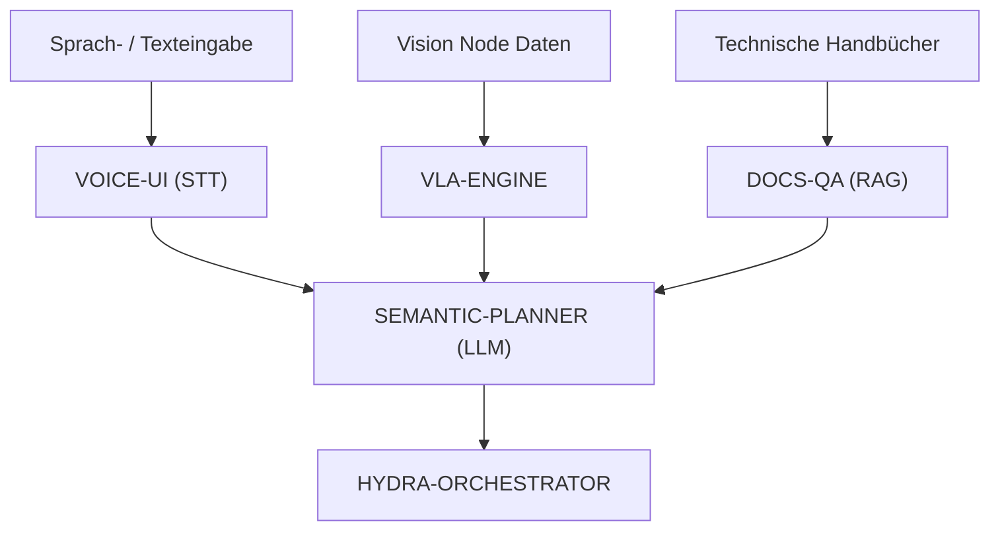

<p align="center">
  
</p>

# 🧠 HYDRA-UMC-COGNITIVE-NODE

<p align="center"><a href="README.md">🇺🇸 English</a> | <a href="README_spa.md">🇪🇸 Español</a> | <a href="README_fra.md">🇫🇷 Français</a> | <a href="README_ita.md">🇮🇹 Italiano</a> | 🇩🇪 <b>Deutsch</b> | <a href="README_zho.md">🇨🇳 简体中文</a> | <a href="README_jpn.md">🇯🇵 日本語</a></p>

### 🤖 Semantisches Denken & GenAI Edge Node (Hailo-10 + Raspberry Pi CM5)

<p align="left">
  
  
  
  
</p>

---

## 1. 🛠️ TECHNISCHER ÜBERBLICK

**HYDRA-UMC-COGNITIVE-NODE** dient als "Frontallappen" des HYDRA-UMC-Ökosystems. Angetrieben von der Hailo-10 NPU (40 TOPS), ermöglicht er komplexes semantisches Denken, natürliches Sprachverständnis und Vision-Language-Action (VLA) Aufgabenplanung direkt am Edge.

Er transformiert hochgradige menschliche Anweisungen in logische Robotersequenzen und verwaltet die Fehlerbehebung sowie die Missionsoptimierung ohne Cloud-Abhängigkeit.

### Hauptmerkmale:
* 🧠 **Lokale LLM-Ausführung:** Hardwarebeschleunigte Inferenz für quantisierte Modelle (Llama/Mistral). *(geplant - benötigt die echte Hailo-10-Modell-Laufzeitumgebung)*
* 👁️ **VLA-Integration:** Vision-Language-Action-Modelle für eine intuitive Aufgabenausführung. *(geplant)*
* 🎙️ **Sprachbefehlsverarbeitung:** Echtzeit-STT/TTS für die Mensch-Roboter-Interaktion. *(geplant)*
* 🛡️ **Datenschutz zuerst:** 100% Offline-Verarbeitung aller kognitiven Aufgaben. *(schon jetzt so konzipiert, sobald das Obige existiert - hier ruft heute nichts ein Netzwerk auf)*
* 🧩 **Integrations-Hub (v0):** Besitzt das gemeinsam genutzte HydraOS-Image
  und die quantisierten Modellgewichte, die von seinen 4 Kindern genutzt
  werden, und verbindet sie als Schwesterdienste in einer einzigen
  `docker-compose.yml`. Die echte `family-status`-Prüfung liest das echte
  Manifest jedes Kindes, um Präsenz/Version/Reifegrad zu melden.
  *(implementiert als echte Bereitschaftsprüfung - siehe BUILD UND
  AUSFÜHRUNG unten)*
* 🔒 **Versioniertes Status-Schema + ressourcenbeschränkte Manifest-Lesevorgänge:** `family-status --json` gibt ein echtes, versioniertes, maschinenlesbares Ergebnis aus; jedes Geschwister-Manifest, das größer als 64 KiB ist (ein beschädigtes oder manipuliertes Checkout), degradiert zu "nicht gefunden", statt unbegrenzt eingelesen zu werden. *(implementiert)*
* 🪫 **Degradationsprüfung für gemeinsam genutzte Modellgewichte:** `family-status` meldet ehrlich, ob das eigene `models/`-Verzeichnis dieses Knotens tatsächlich echte Gewichte enthält - nicht nur, ob die Geschwister-Repos ausgecheckt sind. *(implementiert)*
* 📦 **Kilometerzähler-Versionierung:** Jeder echte Build erhöht
  automatisch die Version in `pyproject.toml` (`bump_version.py`) - keine
  manuellen Versionsänderungen.

---

## 2. 🔄 KOGNITIVER ARBEITSABLAUF



---

## 3. 🧱 ARCHITEKTUR & DESIGNENTSCHEIDUNGEN

Dieses Repository ist der **Eltern-/Integrationspunkt** der Cognitive AI
Node-Familie. Es führt selbst kein Modell aus - es besitzt die
gemeinsamen Ressourcen und die Verdrahtung, die es seinen vier Kindern
ermöglichen, als eine kognitive Einheit auf derselben physischen Platine
zu agieren:

* **Warum dieser Knoten keine eigene Hardware/Firmware hat.** Anders als
  die Firmware auf Motherboard-Ebene von HYDRA-UMC läuft dieser Knoten
  vollständig auf einem bereits vorhandenen Raspberry Pi CM5 + Hailo-10
  M.2-Modul - es gibt hier keine eigene Leiterplatte oder einen eigenen
  Mikrocontroller zu entwerfen, daher wurden die Ordner
  `hardware/`/`firmware/` entfernt, statt sie leer zu lassen.
* **Warum `os/` und `models/` nur im Elternteil liegen.** Das
  HydraOS-Image und die quantisierten LLM/VLA-Gewichte sind gemeinsam
  genutzte Ressourcen auf Platinenebene - eine einzige Kopie im
  Elternteil zu behalten und sie schreibgeschützt in jeden
  Kind-Container zu mounten (siehe `docker-compose.yml`) vermeidet vier
  abweichende Kopien mehrere Gigabyte großer Modellgewichte.
* **Warum ein `src/`-Layout.** Trennt das installierbare Paket
  (`hydra_umc_cognitive_node`) vom Tooling im Repo-Root
  (`bump_version.py`, `docker-compose.yml`) und entspricht dem Layout
  aller anderen Python-Projekte im Ökosystem.
* **Warum der Einstiegspunkt heute nur Identität/Version/Rolle
  ausgibt.** Dies ist die Andamiaje- (Gerüst-) Phase: zu beweisen, dass
  sich das Paket auf der tatsächlichen Ziel-Python-Version sauber
  installieren, kompilieren und importieren lässt, ist Voraussetzung,
  bevor echte LLM/VLA/Sprach-Orchestrierungslogik hinzugefügt wird, und
  hält diese spätere Arbeit von Packaging-Fragen getrennt.
* **Warum `docker-compose.yml` existiert, bevor die Kinder eigene
  Dockerfiles haben.** Den Integrationsvertrag jetzt zu entscheiden und
  zu dokumentieren (welcher Dienst von welchem abhängt, welche
  Geräte-/Volume-Mounts jeder benötigt) verhindert, dass diese Form
  später ad hoc erfunden wird - auch wenn `docker compose up` erst dann
  vollständig funktioniert, wenn jedes Kind sein eigenes Dockerfile
  veröffentlicht.
* **Wie sich das in den Rest des Ökosystems einfügt.** Dieser Knoten
  sitzt eine Schicht über der Wahrnehmung (HYDRA-UMC-VISION-NODE,
  Hailo-8) und eine Schicht unter der Missionsorchestrierung
  (HYDRA-UMC-ORCHESTRATOR): Er wandelt Sprach-/Textanweisungen und
  Erkennungen in semantische Entscheidungen um, die der Orchestrator
  anschließend in physische Roboterbefehle umsetzt.
* **Warum `family-status` das eigene Manifest jedes Kindes liest, statt
  einer von Hand gepflegten Liste.** `hydra-umc.project.json` ist bereits
  die einzige Quelle der Wahrheit, der das ökosystemweite Dashboard und
  der Updater vertrauen - eine zweite
  Liste hier würde in dem Moment auseinanderdriften, in dem sich der
  echte Reifegrad eines Kindes ändert und niemand daran denkt, sie zu
  aktualisieren.
* **Warum ein fehlendes Geschwister-Checkout ein echtes, ehrliches
  "nicht gefunden" ist, kein Fehler.** Ein Integrations-Hub weiß
  wirklich nicht, ob ein Entwickler alle vier Kinder lokal ausgecheckt
  hat - `manifest.py` gibt für jeden echten Fehlerfall (fehlendes Repo,
  fehlendes Manifest, fehlerhaftes JSON) `None` zurück, sodass
  `family-status` dies klar meldet, statt abzustürzen.
* **Warum Manifest-Lesevorgänge von Geschwistern auf 64 KiB begrenzt
  sind.** Jedes echte Manifest in diesem Ökosystem ist einige hundert
  Byte bis wenige KiB groß - ein beschädigtes oder manipuliertes
  Checkout, dessen Manifest durch eine überdimensionierte Datei ersetzt
  wurde, darf eine routinemäßige Bereitschaftsprüfung niemals dazu
  bringen, eine unbegrenzte Menge an Daten in den Speicher zu laden. Es
  degradiert zu `None`, genau wie jedes andere fehlerhafte Manifest.
* **Warum `family-status` `models/` meldet, obwohl dieser Knoten selbst
  kein Modell ausführt.** "Die Geschwister-Repos sind ausgecheckt" und
  "die gemeinsam genutzten Gewichte, die sie bräuchten, sind tatsächlich
  vorhanden" sind zwei unterschiedliche echte Fakten -
  `check_shared_models()` in `models.py` prüft den zweiten ehrlich (leer,
  aber vorhanden zählt als fehlend), statt einen Betreiber allein aus der
  Präsenz der Kinder auf Bereitschaft schließen zu lassen.

---

## 📂 VERZEICHNISSTRUKTUR

```text
HYDRA-UMC-COGNITIVE-NODE/
├── src/hydra_umc_cognitive_node/
│   ├── manifest.py                 # Echter, defensiver Leser für das eigene Manifest eines Geschwisters (64 KiB Grenze)
│   ├── models.py                   # Echte Prüfung des eigenen Verzeichnisses mit gemeinsam genutzten Modellgewichten dieses Knotens
│   ├── family.py                    # Echte Familien-Bereitschaftsprüfung + versioniertes JSON-Schema
│   └── main.py                        # Einstiegspunkt + echtes Subcommand `family-status [--json]`
├── tests/                          # Echte Tests: Manifest-Lesen, Modelle, Familienstatus, End-to-End-CLI
├── docs/                           # Dokumentation und Architektur
├── os/                             # HydraOS-Image/Konfiguration für die CM5
├── models/                         # Hailo-10-optimierte Gewichte (LLM/VLA, von den 4 Kindern gemeinsam genutzt)
├── images/                         # Medien und Diagramme
├── scripts/                        # Utility-Skripte
├── build/                          # Lokale Build-Ausgabe (von git ignoriert)
├── pyproject.toml                  # Paket-Metadaten (Version 0.0.5, Kilometerzähler-Inkrement)
├── bump_version.py                 # Versionserhöhung im Kilometerzähler-Stil (von build.sh/.bat verwendet)
├── docker-compose.yml              # Integrationskarte für die 4 Kind-Dienste
├── build.sh / build.bat            # Erstellt das venv, installiert (mit Dev-Extras), führt Tests aus, prüft den Import
└── run.sh / run.bat                # Führt den Einstiegspunkt aus (leitet Argumente weiter, z. B. `family-status`)
```

> **Hinweis:** `hardware/` und `firmware/` wurden entfernt - dieser Knoten
> läuft auf einem bereits vorhandenen CM5 + Hailo-10 M.2 Modul ohne
> eigenes Hardware-/Firmware-Design. Ein eigener Hilfsmikrocontroller
> könnte später bei Bedarf ergänzt werden.

---

## ⚙️ BUILD UND AUSFÜHRUNG

Erfordert Python >= 3.10.

```bash
# Linux / macOS / Git Bash
./build.sh   # erstellt .venv, installiert das Paket (editable), prüft den Import
./run.sh     # führt den Einstiegspunkt aus

# Windows (cmd)
build.bat
run.bat
```

`build.sh`/`build.bat` erhöhen die Version (Kilometerzähler-Stil, siehe
`bump_version.py`) vor jedem echten Build und führen die echte Testsuite
aus (`pytest tests/`). Erwartete Ausgabe eines `run.sh` ohne Argumente:

```text
HYDRA-UMC-COGNITIVE-NODE v0.0.5
Semantic reasoning & GenAI edge node (Hailo-10) - integrates VLA-Engine, Voice-UI, Semantic-Planner and Docs-QA into one cognitive node.
```

Siehe `docker-compose.yml` dafür, wie die vier Kind-Dienste (VLA-Engine,
Voice-UI, Semantic-Planner, Docs-QA) an diesen Knoten angebunden werden,
sobald jeder sein eigenes Dockerfile veröffentlicht.

Das echte Subcommand `family-status` prüft die echten Kinder in einem
echten lokalen Checkout:

```bash
./run.sh family-status
./run.sh family-status --workspace /pfad/zu/einem/anderen/checkout
./run.sh family-status --json

# Windows
run.bat family-status
```

`family-status` meldet immer auch die eigenen gemeinsam genutzten
Modellgewichte dieses Knotens - ein echtes, leeres `models/` auf einer
Entwicklungsmaschine ist ehrlich `MISSING`, niemals stillschweigend
ignoriert:

```text
Cognitive AI Node family status (workspace: /path/to/workspace):
  HYDRA-UMC-VLA-ENGINE: v0.0.4, maturity=functional, role=service
  ...

Shared model weights: MISSING (.../HYDRA-UMC-COGNITIVE-NODE/models) - this node's own os/models weights have not been provisioned on this machine; children that need them will run in their own honest degraded/no-hardware mode.

All 4 children present.
```

`--json` gibt stattdessen dieselben echten Daten als versioniertes,
maschinenlesbares Objekt aus:

```bash
$ ./run.sh family-status --json
{
  "schema_version": "1.0",
  "shared_models": { "present": false, "path": ".../models" },
  "children": [
    { "name": "HYDRA-UMC-VLA-ENGINE", "present": true, "version": "0.0.4", "maturity": "functional", "role": "service" },
    ...
  ],
  "all_children_present": true
}
```

Standardmäßig wird das eigene übergeordnete Verzeichnis dieses Repos
verwendet - dasselbe Layout, das jeder echte Checkout dieses Ökosystems
bereits nutzt (alle Repos als Geschwister unter einem gemeinsamen
Workspace-Ordner). Beendet sich mit `1`, wenn ein echtes Kind fehlt.

### 🩺 Fehlerbehebung

* **`python: Befehl nicht gefunden` / der Build schlägt bei Schritt 1
  fehl.** Erfordert Python >= 3.10 im `PATH`. Unter Windows von
  [python.org](https://python.org) installieren und bei der Installation
  "Add to PATH" ankreuzen; unter Linux/macOS heißt es meist `python3`.
* **`build.sh` kann das venv nicht aktivieren.** `python3 -m venv .venv`
  legt das Aktivierungsskript je nach Plattform an anderer Stelle ab:
  `.venv/bin/activate` unter Linux/macOS, `.venv/Scripts/activate` unter
  Windows (auch bei einem Windows-Python-venv, das aus Git Bash heraus
  verwendet wird). `build.sh` prüft bereits beide Pfade - schlägt es
  weiterhin fehl, `.venv/` löschen und `./build.sh` erneut ausführen, um
  es von Grund auf neu zu erstellen.
* **`pip install -e .` schlägt fehl.** Meist wegen eines veralteten
  `.venv/`. Den Ordner `.venv/` löschen und `./build.sh`/`build.bat`
  erneut ausführen, um ihn neu zu erstellen.
* **`import OK` erscheint nie.** Bedeutet, dass `python -c "import
  hydra_umc_cognitive_node"` selbst fehlgeschlagen ist - mit aktivem venv
  erneut ausführen, um den echten Traceback zu sehen (eine defekte
  manuelle Änderung an `pyproject.toml` ist nach einem manuellen Merge
  meist die Ursache).
* **`docker compose up` bewirkt nichts Sinnvolles.** Das ist derzeit
  erwartet - die vier in `docker-compose.yml` referenzierten
  Kind-Dienste haben noch kein veröffentlichtes Dockerfile (jeder bietet
  bisher nur einen Python-Einstiegspunkt). Jeden Dienst während der
  Entwicklung direkt mit seinem eigenen `run.sh`/`run.bat` ausführen.

---

## 🚀 FAHRPLAN
* **Phase 1:** VLA-Engine-Bereitstellung und multimodale Eingabeverarbeitung auf Hailo-10.
* **Phase 2:** Integration des semantischen Planers mit Schwarmverhaltensmodellen und Langzeitgedächtnis.
* **Phase 3:** Lokale Ausführung der Voice-UI mit niedriger Latenz und industrielle Geräuschunterdrückung.
* **Phase 4:** Audits zur autonomen Entscheidungsfindung und vollständige Integration mit Dashboard AI für „See and Ask“-Feedback.

---

## 🔗 VERWANDTE PROJEKTE

Dieses Projekt ist Teil eines größeren Robotik-Ökosystems desselben Autors (JuanenRac / Electro Hobby 3D), das Firmware, Steuerungssoftware, KI-Knoten und Flotten-Tooling umfasst.

### Familie

Dieser Knoten ist der Integrations-Hub (v0) für die folgenden 4 Dienste: Er besitzt das gemeinsame HydraOS-Image und die quantisierten Modellgewichte, verbindet sie in einer einzigen `docker-compose.yml` und prüft ihre Präsenz/Version/Reife über `family-status`.

**Kinder:**
- **[HYDRA-UMC-VOICE-UI](https://github.com/JuanenRac/HYDRA-UMC-VOICE-UI)** — STT/TTS-Gateway; die Spracheingabe, mit der der kognitive Workflow dieses Knotens beginnt.
- **[HYDRA-UMC-SEMANTIC-PLANNER](https://github.com/JuanenRac/HYDRA-UMC-SEMANTIC-PLANNER)** — der LLM-Planer, der die Eingaben dieses Knotens in Missionsentscheidungen umwandelt.
- **[HYDRA-UMC-VLA-ENGINE](https://github.com/JuanenRac/HYDRA-UMC-VLA-ENGINE)** — wandelt Daten des Vision-Knotens in Aktions-Tokens um, die der Planer dieses Knotens verarbeitet.
- **[HYDRA-UMC-DOCS-QA](https://github.com/JuanenRac/HYDRA-UMC-DOCS-QA)** — RAG-Assistent, der die Planung dieses Knotens in technischen Handbüchern verankert.

### Direkt mit diesem Knoten verbunden

- **[HYDRA-UMC-ORCHESTRATOR](https://github.com/JuanenRac/HYDRA-UMC-ORCHESTRATOR)** — gibt diesem Knoten seine Missionsaufträge.
- **[HYDRA-UMC-VISION-NODE](https://github.com/JuanenRac/HYDRA-UMC-VISION-NODE)** — dieser Knoten nutzt dessen Erkennungen.
- **[HYDRA-UMC-STUDIO](https://github.com/JuanenRac/HYDRA-UMC-STUDIO)** / **[HYDRA-UMC-DSI](https://github.com/JuanenRac/HYDRA-UMC-DSI)** — Sprachsteuerungs-Oberflächen für diesen Knoten.

### Rest des Ökosystems

**HYDRA-UMC-Plattform** — die Multi-Roboter-Mikrofabrikzelle
- **[HYDRA-UMC](https://github.com/JuanenRac/HYDRA-UMC)** — das Motherboard selbst: Raspberry Pi CM5 Host + dualer STM32H745 Echtzeit-Co-Prozessor, der bis zu 8 verteilte Roboterarme über CAN-OTA/SPI-OTA orchestriert.
- **[HYDRA-UMC SERVER](https://github.com/JuanenRac/HYDRA-UMC-SERVER)** — headless Express/WebSocket-Backend, das den Roboterzustand besitzt.
- **[HYDRA-UMC-ANDROID-CONTROL](https://github.com/JuanenRac/HYDRA-UMC-ANDROID-CONTROL)** — Android-Steuerungs-App für HYDRA-UMC.
- **[HYDRA-UMC-IOS-CONTROL](https://github.com/JuanenRac/HYDRA-UMC-IOS-CONTROL)** — iOS/iPadOS-Steuerungs-App für HYDRA-UMC.
- **[HYDRA-UMC-SUITE](https://github.com/JuanenRac/HYDRA-UMC-SUITE)** — Desktop-Schwarm-Kommandozentrale.
- **[HYDRA-UMC-EDITOR-URDF](https://github.com/JuanenRac/HYDRA-UMC-EDITOR-URDF)** — grafischer Desktop-URDF-Ersteller/-Editor.

**URTC-Plattform** — der Werkzeugkopf-Controller, den jeder HYDRA-UMC-Roboterarm trägt
- **[URTC](https://github.com/JuanenRac/URTC)** — Universal Robot Tool Controller, Firmware.
- **[URTC Flasher](https://github.com/JuanenRac/URTC-FLASHER)** — Desktop-Tool für CAN-OTA + SWD/JTAG-Flashing.
- **[URTC Tester](https://github.com/JuanenRac/URTC-TESTER)** — Desktop-Tool für Live-CAN-Bus-Diagnose.
- **[URTC Web Studio](https://github.com/JuanenRac/URTC-WEB-STUDIO)** — browserbasierte Alternative zu den beiden Desktop-Tools oben.

**👁️ Vision-KI-Knoten (Hailo-8)**
- [HYDRA-UMC-VISION-STREAMER](https://github.com/JuanenRac/HYDRA-UMC-VISION-STREAMER)
- [HYDRA-UMC-DETECTION-HEF](https://github.com/JuanenRac/HYDRA-UMC-DETECTION-HEF)
- [HYDRA-UMC-SAFETY-ZONES](https://github.com/JuanenRac/HYDRA-UMC-SAFETY-ZONES)
- [HYDRA-UMC-VISUAL-SERVOING-API](https://github.com/JuanenRac/HYDRA-UMC-VISUAL-SERVOING-API)

**🐝 Orchestrierung & Schwarm**
- [HYDRA-UMC-SWARM-SYNC](https://github.com/JuanenRac/HYDRA-UMC-SWARM-SYNC)
- [HYDRA-UMC-PATH-PLANNER-3D](https://github.com/JuanenRac/HYDRA-UMC-PATH-PLANNER-3D)
- [HYDRA-UMC-JOB-DISPATCHER](https://github.com/JuanenRac/HYDRA-UMC-JOB-DISPATCHER)
- [HYDRA-UMC-NODE-HEALING](https://github.com/JuanenRac/HYDRA-UMC-NODE-HEALING)

**🎮 Digitaler Zwilling & Simulation**
- [HYDRA-UMC-TWIN](https://github.com/JuanenRac/HYDRA-UMC-TWIN)
- [HYDRA-UMC-PHYSICS-REPLICA](https://github.com/JuanenRac/HYDRA-UMC-PHYSICS-REPLICA)
- [HYDRA-UMC-HIL-BRIDGE](https://github.com/JuanenRac/HYDRA-UMC-HIL-BRIDGE)
- [HYDRA-UMC-SYNTHETIC-DATA-GEN](https://github.com/JuanenRac/HYDRA-UMC-SYNTHETIC-DATA-GEN)

**📊 Daten & Analytik**
- [HYDRA-UMC-DATALAKE](https://github.com/JuanenRac/HYDRA-UMC-DATALAKE)
- [HYDRA-UMC-TELEMETRY-COLLECTOR](https://github.com/JuanenRac/HYDRA-UMC-TELEMETRY-COLLECTOR)
- [HYDRA-UMC-ANOMALY-DETECTOR](https://github.com/JuanenRac/HYDRA-UMC-ANOMALY-DETECTOR)
- [HYDRA-UMC-PRODUCTION-REPORTS](https://github.com/JuanenRac/HYDRA-UMC-PRODUCTION-REPORTS)

**🏭 Industrielles Gateway**
- [HYDRA-UMC-GATEWAY-INDUSTRIAL](https://github.com/JuanenRac/HYDRA-UMC-GATEWAY-INDUSTRIAL)
- [HYDRA-UMC-OPCUA-SERVER](https://github.com/JuanenRac/HYDRA-UMC-OPCUA-SERVER)
- [HYDRA-UMC-MQTT-BROKER](https://github.com/JuanenRac/HYDRA-UMC-MQTT-BROKER)
- [HYDRA-UMC-MTCONNECT-ADAPTER](https://github.com/JuanenRac/HYDRA-UMC-MTCONNECT-ADAPTER)

**🛠️ Ergänzende Werkzeuge**
- [URTC-SMART-RACK](https://github.com/JuanenRac/URTC-SMART-RACK)
- [URTC-VISION-TOOL](https://github.com/JuanenRac/URTC-VISION-TOOL)
- [HYDRA-UMC-WATCH](https://github.com/JuanenRac/HYDRA-UMC-WATCH)
- [HYDRA-UMC-TOOL-CLI](https://github.com/JuanenRac/HYDRA-UMC-TOOL-CLI)
- [HYDRA-UMC-DASHBOARD-AI](https://github.com/JuanenRac/HYDRA-UMC-DASHBOARD-AI)

---

## 👤 AUTOR
**JuanenRac** (Electro Hobby 3D)
📧 electrohobby3d@gmail.com
📺 [youtube.com/@electrohobby3d](https://youtube.com/@electrohobby3d)

## 📜 LIZENZ
GPL-3.0 - Siehe LICENSE für Details.
