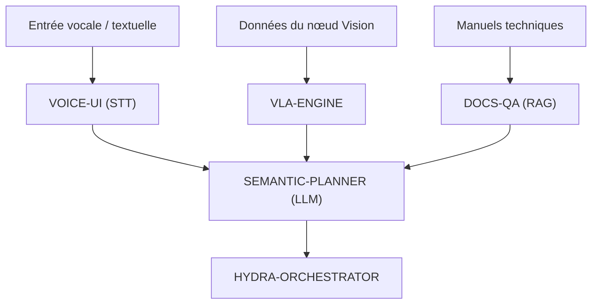

<p align="center">
  
</p>

# 🧠 HYDRA-UMC-COGNITIVE-NODE

<p align="center"><a href="README.md">🇺🇸 English</a> | <a href="README_spa.md">🇪🇸 Español</a> | 🇫🇷 <b>Français</b> | <a href="README_ita.md">🇮🇹 Italiano</a> | <a href="README_deu.md">🇩🇪 Deutsch</a> | <a href="README_zho.md">🇨🇳 简体中文</a> | <a href="README_jpn.md">🇯🇵 日本語</a></p>

### 🤖 Nœud d'IA Edge pour Raisonnement Sémantique & GenAI (Hailo-10 + Raspberry Pi CM5)

<p align="left">
  
  
  
  
</p>

---

## 1. 🛠️ APERÇU TECHNIQUE

**HYDRA-UMC-COGNITIVE-NODE** sert de « lobe frontal » de l'écosystème HYDRA-UMC. Propulsé par le NPU Hailo-10 (40 TOPS), il permet un raisonnement sémantique complexe, une compréhension du langage naturel et une planification de tâches vision-language-action (VLA) directement à la périphérie (edge).

Il transforme les instructions humaines de haut niveau en séquences robotiques logiques, gérant la récupération d'erreurs et l'optimisation des missions sans dépendance au cloud.

### Caractéristiques principales :
* 🧠 **Exécution de LLM locale :** Inférence accélérée matériellement pour les modèles quantifiés (Llama/Mistral). *(prévu - nécessite le vrai runtime de modèles Hailo-10)*
* 👁️ **Intégration VLA :** Modèles Vision-Language-Action pour une exécution intuitive des tâches. *(prévu)*
* 🎙️ **Traitement des commandes vocales :** STT/TTS en temps réel pour l'interaction homme-robot. *(prévu)*
* 🛡️ **Priorité à la confidentialité :** Traitement 100 % hors ligne de toutes les tâches cognitives. *(vrai par conception une fois ce qui précède en place - rien ici n'appelle un réseau aujourd'hui)*
* 🧩 **Hub d'intégration (v0) :** Détient l'image HydraOS partagée et les poids
  de modèles quantifiés consommés par ses 4 enfants, et les relie entre
  eux comme des services frères dans un seul `docker-compose.yml`. Le
  vrai contrôle `family-status` lit le manifeste réel de chaque enfant
  pour signaler présence/version/maturité. *(implémenté comme un vrai
  contrôle de disponibilité - voir BUILD ET EXÉCUTION ci-dessous)*
* 🔒 **Schéma de statut versionné + lectures de manifeste à ressources limitées :** `family-status --json` affiche un résultat réel, versionné et lisible par machine ; tout manifeste d'un frère dépassant 64 Kio (un checkout corrompu ou malveillant) se dégrade en « non trouvé » plutôt que d'être lu sans limite. *(implémenté)*
* 🪫 **Contrôle de dégradation des poids de modèle partagés :** `family-status` signale honnêtement si le répertoire `models/` propre à ce nœud contient réellement de vrais poids, et pas seulement si les dépôts frères sont clonés. *(implémenté)*
* 📦 **Versionnage compteur kilométrique :** Chaque build réel incrémente
  automatiquement la version de `pyproject.toml` (`bump_version.py`) - pas
  de modification manuelle de version.

---

## 2. 🔄 FLUX DE TRAVAIL COGNITIF



---

## 3. 🧱 ARCHITECTURE & DÉCISIONS DE CONCEPTION

Ce dépôt est le **point parent/d'intégration** de la famille Cognitive AI
Node. Il n'exécute aucun modèle lui-même - il détient les ressources
partagées et le câblage qui permettent à ses quatre enfants d'agir comme
une seule unité cognitive sur la même carte physique :

* **Pourquoi ce nœud n'a pas de matériel/firmware propre.** Contrairement
  au firmware au niveau de la carte mère HYDRA-UMC, ce nœud fonctionne
  entièrement sur un module Raspberry Pi CM5 + Hailo-10 M.2 déjà
  existant - il n'y a aucun PCB ou microcontrôleur propre à concevoir
  ici, donc les dossiers `hardware/`/`firmware/` ont été supprimés
  plutôt que laissés vides.
* **Pourquoi `os/` et `models/` ne vivent que dans le parent.** L'image
  HydraOS et les poids LLM/VLA quantifiés sont des ressources partagées
  au niveau de la carte - garder une seule copie dans le parent et la
  monter en lecture seule dans chaque conteneur enfant (voir
  `docker-compose.yml`) évite quatre copies divergentes de poids de
  plusieurs gigaoctets.
* **Pourquoi une structure `src/`.** Sépare le paquet installable
  (`hydra_umc_cognitive_node`) de l'outillage à la racine du dépôt
  (`bump_version.py`, `docker-compose.yml`), conformément au reste des
  projets Python de l'écosystème.
* **Pourquoi le point d'entrée se contente d'afficher
  identité/version/rôle aujourd'hui.** C'est l'étape d'échafaudage :
  prouver que le paquet s'installe, se compile et s'importe correctement
  - sur la version Python cible réelle - est un prérequis avant d'ajouter
  une vraie logique d'orchestration LLM/VLA/vocale, et isole ce travail
  ultérieur des préoccupations d'empaquetage.
* **Pourquoi `docker-compose.yml` existe avant que les enfants n'aient de
  Dockerfile.** Décider et documenter le contrat d'intégration (quel
  service dépend de quel autre, quels montages de périphérique/volume
  chacun nécessite) dès maintenant évite que cette forme soit inventée
  plus tard de manière improvisée, même si `docker compose up` ne peut
  pas pleinement réussir tant que chaque enfant n'a pas publié son propre
  Dockerfile.
* **Comment cela s'intègre dans le reste de l'écosystème.** Ce nœud se
  situe une couche au-dessus de la perception (HYDRA-UMC-VISION-NODE,
  Hailo-8) et une couche en dessous de l'orchestration de mission
  (HYDRA-UMC-ORCHESTRATOR) : il transforme les instructions vocales/
  textuelles et les détections en décisions sémantiques, que
  l'orchestrateur transforme ensuite en commandes physiques pour les
  robots.
* **Pourquoi `family-status` lit le manifeste propre de chaque enfant
  plutôt qu'une liste tenue à la main.** `hydra-umc.project.json` est déjà
  la source unique de vérité en laquelle le tableau de bord et l'updater
  de tout l'écosystème ont confiance -
  une seconde liste ici dériverait dès qu'un enfant changerait réellement
  de maturité sans que personne ne pense à la mettre à jour.
* **Pourquoi un enfant sans checkout local est un « non trouvé » réel et
  honnête, pas une erreur.** Un hub d'intégration ne sait réellement pas
  si un développeur a cloné localement les quatre enfants -
  `manifest.py` renvoie `None` pour chaque échec réel (dépôt absent,
  manifeste absent, JSON malformé) afin que `family-status` le signale
  clairement plutôt que de planter.
* **Pourquoi les lectures de manifeste d'un frère sont plafonnées à
  64 Kio.** Chaque manifeste réel de cet écosystème pèse de quelques
  centaines d'octets à quelques Kio - un checkout corrompu ou malveillant
  dont le manifeste aurait été remplacé par un fichier surdimensionné ne
  doit jamais faire charger en mémoire une quantité illimitée de données
  par un simple contrôle de disponibilité de routine. Il se dégrade en
  `None`, comme tout autre manifeste malformé.
* **Pourquoi `family-status` signale `models/` alors que ce nœud
  n'exécute lui-même aucun modèle.** « Les dépôts frères sont clonés »
  et « les poids partagés dont ils auraient besoin sont réellement
  présents » sont deux faits réels distincts - `check_shared_models()`
  de `models.py` vérifie honnêtement le second (vide mais présent compte
  comme manquant) plutôt que de laisser un opérateur présumer de la
  disponibilité à partir de la seule présence des enfants.

---

## 📂 STRUCTURE DES RÉPERTOIRES

```text
HYDRA-UMC-COGNITIVE-NODE/
├── src/hydra_umc_cognitive_node/
│   ├── manifest.py                 # Lecteur réel et défensif du manifeste propre d'un frère (plafonné à 64 Kio)
│   ├── models.py                   # Contrôle réel du répertoire de poids de modèle partagés propre à ce nœud
│   ├── family.py                    # Vrai contrôle de disponibilité de famille + schéma JSON versionné
│   └── main.py                        # Point d'entrée + sous-commande réelle `family-status [--json]`
├── tests/                          # Tests réels : lecture de manifeste, modèles, statut de famille, CLI de bout en bout
├── docs/                           # Documentation et architecture
├── os/                             # Image/configuration HydraOS pour le CM5
├── models/                         # Poids optimisés Hailo-10 (LLM/VLA, partagés par les 4 enfants)
├── images/                         # Médias et diagrammes
├── scripts/                        # Scripts utilitaires
├── build/                          # Sortie de build locale (ignorée par git)
├── pyproject.toml                  # Métadonnées du paquet (version 0.0.5, incrément type compteur kilométrique)
├── bump_version.py                 # Incrément de version type compteur kilométrique (utilisé par build.sh/.bat)
├── docker-compose.yml              # Carte d'intégration des 4 services enfants
├── build.sh / build.bat            # Crée le venv, installe (avec extras dev), exécute les tests, vérifie l'import
└── run.sh / run.bat                # Exécute le point d'entrée (transmet les arguments, ex. `family-status`)
```

> **Remarque :** `hardware/` et `firmware/` ont été supprimés - ce nœud
> fonctionne sur un module CM5 + Hailo-10 M.2 déjà existant, sans
> conception matérielle/firmware propre. Un microcontrôleur auxiliaire
> dédié pourra être ajouté plus tard si cela devient nécessaire.

---

## ⚙️ BUILD ET EXÉCUTION

Nécessite Python >= 3.10.

```bash
# Linux / macOS / Git Bash
./build.sh   # crée .venv, installe le paquet (éditable), vérifie l'import
./run.sh     # exécute le point d'entrée

# Windows (cmd)
build.bat
run.bat
```

`build.sh`/`build.bat` incrémentent la version (type compteur
kilométrique, voir `bump_version.py`) avant chaque build réel, et
exécutent la vraie suite de tests (`pytest tests/`). Sortie attendue
d'un `run.sh` sans argument :

```text
HYDRA-UMC-COGNITIVE-NODE v0.0.5
Semantic reasoning & GenAI edge node (Hailo-10) - integrates VLA-Engine, Voice-UI, Semantic-Planner and Docs-QA into one cognitive node.
```

Voir `docker-compose.yml` pour savoir comment les quatre services enfants
(VLA-Engine, Voice-UI, Semantic-Planner, Docs-QA) se rattachent à ce nœud
une fois que chacun publie son propre Dockerfile.

La vraie sous-commande `family-status` vérifie les vrais enfants dans un
vrai checkout local :

```bash
./run.sh family-status
./run.sh family-status --workspace /chemin/vers/un/autre/checkout
./run.sh family-status --json

# Windows
run.bat family-status
```

`family-status` signale toujours aussi les poids de modèle partagés
propres à ce nœud - un `models/` réel et vide sur une machine de
développement est honnêtement `MISSING`, jamais ignoré en silence :

```text
Cognitive AI Node family status (workspace: /path/to/workspace):
  HYDRA-UMC-VLA-ENGINE: v0.0.4, maturity=functional, role=service
  ...

Shared model weights: MISSING (.../HYDRA-UMC-COGNITIVE-NODE/models) - this node's own os/models weights have not been provisioned on this machine; children that need them will run in their own honest degraded/no-hardware mode.

All 4 children present.
```

`--json` affiche à la place les mêmes données réelles sous forme d'un
objet versionné et lisible par machine :

```bash
$ ./run.sh family-status --json
{
  "schema_version": "1.0",
  "shared_models": { "present": false, "path": ".../models" },
  "children": [
    { "name": "HYDRA-UMC-VLA-ENGINE", "present": true, "version": "0.0.4", "maturity": "functional", "role": "service" },
    ...
  ],
  "all_children_present": true
}
```

Par défaut, utilise le propre répertoire parent de ce dépôt - la même
disposition que tout checkout réel de cet écosystème utilise déjà (tous
les dépôts en frères sous un même dossier de workspace). Se termine avec
`1` si un vrai enfant manque.

### 🩺 Dépannage

* **`python : commande introuvable` / le build échoue à l'étape 1.**
  Nécessite Python >= 3.10 dans le `PATH`. Sous Windows, installez-le
  depuis [python.org](https://python.org) et cochez "Add to PATH" lors de
  l'installation ; sous Linux/macOS, c'est généralement `python3`.
* **`build.sh` n'arrive pas à activer le venv.** `python3 -m venv .venv`
  place le script d'activation à un emplacement différent selon la
  plateforme : `.venv/bin/activate` sous Linux/macOS,
  `.venv/Scripts/activate` sous Windows (également pour un venv Python
  Windows utilisé depuis Git Bash). `build.sh` vérifie déjà les deux
  chemins - si cela échoue toujours, supprimez `.venv/` et relancez
  `./build.sh` pour le reconstruire entièrement.
* **`pip install -e .` échoue.** Généralement dû à un `.venv/` obsolète.
  Supprimez le dossier `.venv/` et relancez `./build.sh`/`build.bat` pour
  le recréer.
* **`import OK` ne s'affiche jamais.** Signifie que `python -c "import
  hydra_umc_cognitive_node"` a lui-même échoué - relancez avec le venv
  actif pour voir la vraie trace d'erreur (une modification manuelle
  cassée de `pyproject.toml` est la cause habituelle après une fusion
  manuelle).
* **`docker compose up` ne fait rien d'utile.** C'est normal pour
  l'instant - les quatre services enfants référencés dans
  `docker-compose.yml` n'ont pas encore de Dockerfile publié (chacun ne
  fournit pour l'instant qu'un point d'entrée Python). Lancez chaque
  service directement avec son propre `run.sh`/`run.bat` pendant le
  développement.

---

## 🚀 FEUILLE DE ROUTE
* **Phase 1 :** Déploiement du moteur VLA et traitement des entrées multimodales sur Hailo-10.
* **Phase 2 :** Intégration du planificateur sémantique avec des modèles de comportement en essaim et une mémoire à long terme.
* **Phase 3 :** Exécution locale à faible latence de l'interface vocale et suppression du bruit industriel.
* **Phase 4 :** Audits de prise de décision autonomes et intégration complète avec Dashboard AI pour le retour « Voir et demander ».

---

## 🔗 PROJETS LIÉS

Ce projet fait partie d'un écosystème robotique plus large du même auteur (JuanenRac / Electro Hobby 3D), couvrant firmware, logiciel de contrôle, nœuds IA et outillage de flotte.

### Directement liés à ce nœud

- **[HYDRA-UMC-ORCHESTRATOR](https://github.com/JuanenRac/HYDRA-UMC-ORCHESTRATOR)** — donne à ce nœud ses ordres de mission.
- **[HYDRA-UMC-VISION-NODE](https://github.com/JuanenRac/HYDRA-UMC-VISION-NODE)** — ce nœud consomme ses détections.
- **[HYDRA-UMC-STUDIO](https://github.com/JuanenRac/HYDRA-UMC-STUDIO)** / **[HYDRA-UMC-DSI](https://github.com/JuanenRac/HYDRA-UMC-DSI)** — surfaces de contrôle vocal pour ce nœud.

### Reste de l'écosystème

**Plateforme HYDRA-UMC** — la micro-usine multi-robots
- **[HYDRA-UMC](https://github.com/JuanenRac/HYDRA-UMC)** — la carte mère elle-même : hôte Raspberry Pi CM5 + coprocesseur temps réel STM32H745 double cœur, orchestrant jusqu'à 8 bras robotiques distribués via CAN-OTA/SPI-OTA.
- **[HYDRA-UMC SERVER](https://github.com/JuanenRac/HYDRA-UMC-SERVER)** — backend Express/WebSocket headless détenant l'état des robots.
- **[HYDRA-UMC-ANDROID-CONTROL](https://github.com/JuanenRac/HYDRA-UMC-ANDROID-CONTROL)** — application Android de contrôle pour HYDRA-UMC.
- **[HYDRA-UMC-IOS-CONTROL](https://github.com/JuanenRac/HYDRA-UMC-IOS-CONTROL)** — application iOS/iPadOS de contrôle pour HYDRA-UMC.
- **[HYDRA-UMC-SUITE](https://github.com/JuanenRac/HYDRA-UMC-SUITE)** — centre de commande de bureau pour l'essaim.
- **[HYDRA-UMC-EDITOR-URDF](https://github.com/JuanenRac/HYDRA-UMC-EDITOR-URDF)** — créateur/éditeur graphique de bureau pour modèles URDF.

**Plateforme URTC** — le contrôleur de tête d'outil que porte chaque bras HYDRA-UMC
- **[URTC](https://github.com/JuanenRac/URTC)** — Universal Robot Tool Controller, firmware.
- **[URTC Flasher](https://github.com/JuanenRac/URTC-FLASHER)** — outil de bureau de flashage CAN-OTA + SWD/JTAG.
- **[URTC Tester](https://github.com/JuanenRac/URTC-TESTER)** — outil de bureau de diagnostic CAN en direct.
- **[URTC Web Studio](https://github.com/JuanenRac/URTC-WEB-STUDIO)** — alternative navigateur aux 2 outils de bureau ci-dessus.

**👁️ Nœud de Vision IA (Hailo-8)**
- [HYDRA-UMC-VISION-STREAMER](https://github.com/JuanenRac/HYDRA-UMC-VISION-STREAMER)
- [HYDRA-UMC-DETECTION-HEF](https://github.com/JuanenRac/HYDRA-UMC-DETECTION-HEF)
- [HYDRA-UMC-SAFETY-ZONES](https://github.com/JuanenRac/HYDRA-UMC-SAFETY-ZONES)
- [HYDRA-UMC-VISUAL-SERVOING-API](https://github.com/JuanenRac/HYDRA-UMC-VISUAL-SERVOING-API)

**🐝 Orchestration et Essaim**
- [HYDRA-UMC-SWARM-SYNC](https://github.com/JuanenRac/HYDRA-UMC-SWARM-SYNC)
- [HYDRA-UMC-PATH-PLANNER-3D](https://github.com/JuanenRac/HYDRA-UMC-PATH-PLANNER-3D)
- [HYDRA-UMC-JOB-DISPATCHER](https://github.com/JuanenRac/HYDRA-UMC-JOB-DISPATCHER)
- [HYDRA-UMC-NODE-HEALING](https://github.com/JuanenRac/HYDRA-UMC-NODE-HEALING)

**🎮 Jumeau Numérique et Simulation**
- [HYDRA-UMC-TWIN](https://github.com/JuanenRac/HYDRA-UMC-TWIN)
- [HYDRA-UMC-PHYSICS-REPLICA](https://github.com/JuanenRac/HYDRA-UMC-PHYSICS-REPLICA)
- [HYDRA-UMC-HIL-BRIDGE](https://github.com/JuanenRac/HYDRA-UMC-HIL-BRIDGE)
- [HYDRA-UMC-SYNTHETIC-DATA-GEN](https://github.com/JuanenRac/HYDRA-UMC-SYNTHETIC-DATA-GEN)

**📊 Données et Analytique**
- [HYDRA-UMC-DATALAKE](https://github.com/JuanenRac/HYDRA-UMC-DATALAKE)
- [HYDRA-UMC-TELEMETRY-COLLECTOR](https://github.com/JuanenRac/HYDRA-UMC-TELEMETRY-COLLECTOR)
- [HYDRA-UMC-ANOMALY-DETECTOR](https://github.com/JuanenRac/HYDRA-UMC-ANOMALY-DETECTOR)
- [HYDRA-UMC-PRODUCTION-REPORTS](https://github.com/JuanenRac/HYDRA-UMC-PRODUCTION-REPORTS)

**🏭 Passerelle Industrielle**
- [HYDRA-UMC-GATEWAY-INDUSTRIAL](https://github.com/JuanenRac/HYDRA-UMC-GATEWAY-INDUSTRIAL)
- [HYDRA-UMC-OPCUA-SERVER](https://github.com/JuanenRac/HYDRA-UMC-OPCUA-SERVER)
- [HYDRA-UMC-MQTT-BROKER](https://github.com/JuanenRac/HYDRA-UMC-MQTT-BROKER)
- [HYDRA-UMC-MTCONNECT-ADAPTER](https://github.com/JuanenRac/HYDRA-UMC-MTCONNECT-ADAPTER)

**🛠️ Outils Complémentaires**
- [URTC-SMART-RACK](https://github.com/JuanenRac/URTC-SMART-RACK)
- [URTC-VISION-TOOL](https://github.com/JuanenRac/URTC-VISION-TOOL)
- [HYDRA-UMC-WATCH](https://github.com/JuanenRac/HYDRA-UMC-WATCH)
- [HYDRA-UMC-TOOL-CLI](https://github.com/JuanenRac/HYDRA-UMC-TOOL-CLI)
- [HYDRA-UMC-DASHBOARD-AI](https://github.com/JuanenRac/HYDRA-UMC-DASHBOARD-AI)

---

## 👤 AUTEUR
**JuanenRac** (Electro Hobby 3D)
📧 electrohobby3d@gmail.com

## 📜 LICENCE
GPL-3.0 - Voir le fichier LICENSE pour plus de détails.
