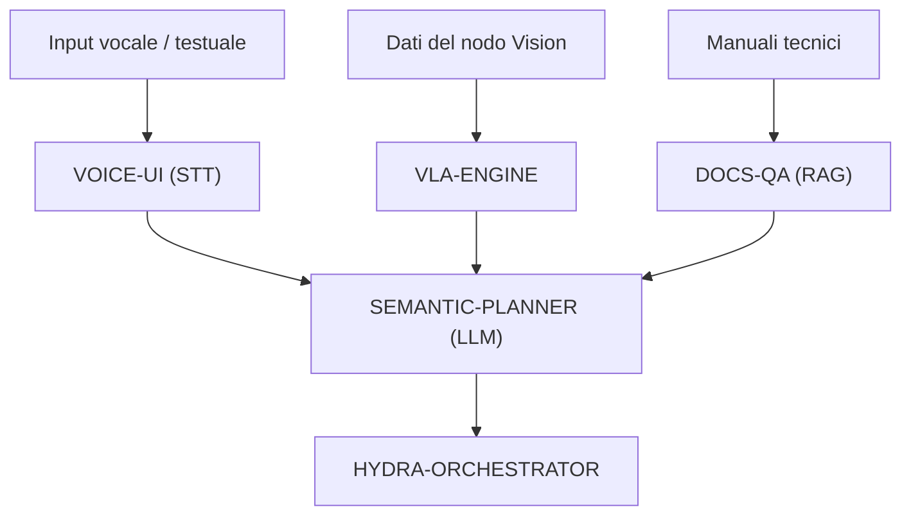

<p align="center">
  
</p>

# 🧠 HYDRA-UMC-COGNITIVE-NODE

<p align="center"><a href="README.md">🇺🇸 English</a> | <a href="README_spa.md">🇪🇸 Español</a> | <a href="README_fra.md">🇫🇷 Français</a> | 🇮🇹 <b>Italiano</b> | <a href="README_deu.md">🇩🇪 Deutsch</a> | <a href="README_zho.md">🇨🇳 简体中文</a> | <a href="README_jpn.md">🇯🇵 日本語</a></p>

### 🤖 Nodo AI Edge per Ragionamento Semantico & GenAI (Hailo-10 + Raspberry Pi CM5)

<p align="left">
  
  
  
  
</p>

---

## 1. 🛠️ PANORAMICA TECNICA

**HYDRA-UMC-COGNITIVE-NODE** funge da "lobo frontale" dell'ecosistema HYDRA-UMC. Alimentato dalla NPU Hailo-10 (40 TOPS), consente ragionamenti semantici complessi, comprensione del linguaggio naturale e pianificazione di compiti vision-language-action (VLA) direttamente all'edge.

Trasforma le istruzioni umane di alto livello in sequenze robotiche logiche, gestendo il recupero degli errori e l'ottimizzazione della missione senza dipendenza dal cloud.

### Caratteristiche principali:
* 🧠 **Esecuzione LLM locale:** Inferenza accelerata dall'hardware per modelli quantizzati (Llama/Mistral). *(pianificato - richiede il vero runtime di modelli Hailo-10)*
* 👁️ **Integrazione VLA:** Modelli Vision-Language-Action per un'esecuzione intuitiva dei compiti. *(pianificato)*
* 🎙️ **Elaborazione comandi vocali:** STT/TTS in tempo reale per l'interazione uomo-robot. *(pianificato)*
* 🛡️ **Privacy innanzitutto:** Elaborazione 100% offline di tutte le attività cognitive. *(vero per progettazione una volta che quanto sopra esista - nulla qui chiama una rete oggi)*
* 🧩 **Hub di Integrazione (v0):** Possiede l'immagine HydraOS condivisa e i
  pesi dei modelli quantizzati consumati dai suoi 4 figli, e li collega
  tra loro come servizi fratelli in un unico `docker-compose.yml`. Il vero
  controllo `family-status` legge il manifest reale di ciascun figlio per
  segnalare presenza/versione/maturità. *(implementato come un vero
  controllo di disponibilità - vedi BUILD ED ESECUZIONE sotto)*
* 📦 **Versionamento Contachilometri:** Ogni build reale incrementa
  automaticamente la versione di `pyproject.toml` (`bump_version.py`) -
  nessuna modifica manuale della versione.

---

## 2. 🔄 FLUSSO DI LAVORO COGNITIVO



---

## 3. 🧱 ARCHITETTURA E DECISIONI DI PROGETTAZIONE

Questo repository è il **punto padre/di integrazione** della famiglia
Cognitive AI Node. Non esegue esso stesso alcun modello - possiede le
risorse condivise e il cablaggio che permettono ai suoi quattro figli di
agire come un'unica unità cognitiva sulla stessa scheda fisica:

* **Perché questo nodo non ha hardware/firmware proprio.** A differenza
  del firmware a livello di scheda madre di HYDRA-UMC, questo nodo gira
  interamente su un modulo Raspberry Pi CM5 + Hailo-10 M.2 già
  esistente - non c'è alcun PCB o microcontrollore proprio da
  progettare qui, quindi le cartelle `hardware/`/`firmware/` sono state
  potate invece di essere lasciate vuote.
* **Perché `os/` e `models/` vivono solo nel padre.** L'immagine HydraOS
  e i pesi LLM/VLA quantizzati sono risorse condivise a livello di
  scheda - mantenere un'unica copia nel padre e montarla in sola lettura
  in ogni container figlio (vedi `docker-compose.yml`) evita quattro
  copie divergenti di pesi di più gigabyte.
* **Perché una struttura `src/`.** Mantiene il pacchetto installabile
  (`hydra_umc_cognitive_node`) separato dal tooling nella radice del repo
  (`bump_version.py`, `docker-compose.yml`), coerentemente con il resto
  dei progetti Python dell'ecosistema.
* **Perché il punto di ingresso oggi si limita a stampare
  identità/versione/ruolo.** Questa è la fase di andamiaje
  (impalcatura): dimostrare che il pacchetto si installa, compila e
  importa correttamente - sulla versione Python reale di destinazione -
  è un prerequisito prima di aggiungere la vera logica di orchestrazione
  LLM/VLA/vocale, e mantiene quel lavoro successivo isolato dalle
  questioni di packaging.
* **Perché `docker-compose.yml` esiste prima che i figli abbiano un
  Dockerfile.** Decidere e documentare il contratto di integrazione
  (quale servizio dipende da quale, quali mount di dispositivo/volume
  serve a ciascuno) ora evita che questa forma venga inventata più tardi
  in modo improvvisato, anche se `docker compose up` non può avere pieno
  successo finché ogni figlio non pubblica il proprio Dockerfile.
* **Come si inserisce nel resto dell'ecosistema.** Questo nodo si trova
  un livello sopra la percezione (HYDRA-UMC-VISION-NODE, Hailo-8) e un
  livello sotto l'orchestrazione della missione
  (HYDRA-UMC-ORCHESTRATOR): trasforma istruzioni vocali/testuali e
  rilevamenti in decisioni semantiche, che l'orchestratore trasforma poi
  in comandi fisici per i robot.
* **Perché `family-status` legge il manifest proprio di ciascun figlio
  invece di un elenco mantenuto a mano.** `hydra-umc.project.json` è già
  l'unica fonte di verità di cui si fidano dashboard e updater di tutto
  l'ecosistema - un secondo elenco qui
  andrebbe fuori sincrono non appena la maturità reale di un figlio
  cambiasse e nessuno si ricordasse di aggiornarlo.
* **Perché un figlio senza checkout locale è un "non trovato" reale e
  onesto, non un errore.** Un hub di integrazione non sa davvero se uno
  sviluppatore ha clonato localmente tutti e quattro i figli -
  `manifest.py` restituisce `None` per ogni fallimento reale (repo
  assente, manifest assente, JSON malformato) affinché `family-status`
  lo segnali chiaramente invece di andare in crash.

---

## 📂 STRUTTURA DELLE CARTELLE

```text
HYDRA-UMC-COGNITIVE-NODE/
├── src/hydra_umc_cognitive_node/
│   ├── manifest.py                 # Lettore reale e difensivo del manifest proprio di un fratello
│   ├── family.py                    # Vero controllo di disponibilità di famiglia sui 4 figli reali
│   └── main.py                        # Punto di ingresso + sottocomando reale `family-status`
├── tests/                          # Test reali: lettura manifest, stato famiglia, CLI end-to-end
├── docs/                           # Documentazione e architettura
├── os/                             # Immagine/configurazione HydraOS per la CM5
├── models/                         # Pesi ottimizzati Hailo-10 (LLM/VLA, condivisi dai 4 figli)
├── images/                         # Media e diagrammi
├── scripts/                        # Script di utilità
├── build/                          # Output di build locale (ignorato da git)
├── pyproject.toml                  # Metadati del pacchetto (versione 0.0.5, incremento stile contachilometri)
├── bump_version.py                 # Incremento versione stile contachilometri (usato da build.sh/.bat)
├── docker-compose.yml              # Mappa di integrazione dei 4 servizi figli
├── build.sh / build.bat            # Crea il venv, installa (con extra dev), esegue i test, verifica l'import
└── run.sh / run.bat                # Esegue il punto di ingresso (inoltra gli argomenti, es. `family-status`)
```

> **Nota:** `hardware/` e `firmware/` sono stati potati - questo nodo
> funziona su un modulo CM5 + Hailo-10 M.2 già esistente, senza un
> progetto hardware/firmware proprio. In futuro potrebbe essere aggiunto
> un microcontrollore ausiliario dedicato, se necessario.

---

## ⚙️ BUILD ED ESECUZIONE

Richiede Python >= 3.10.

```bash
# Linux / macOS / Git Bash
./build.sh   # crea .venv, installa il pacchetto (editable), verifica l'import
./run.sh     # esegue il punto di ingresso

# Windows (cmd)
build.bat
run.bat
```

`build.sh`/`build.bat` incrementano la versione (stile contachilometri,
vedi `bump_version.py`) prima di ogni build reale, ed eseguono la vera
suite di test (`pytest tests/`). Output atteso di un `run.sh` senza
argomenti:

```text
HYDRA-UMC-COGNITIVE-NODE v0.0.5
Semantic reasoning & GenAI edge node (Hailo-10) - integrates VLA-Engine, Voice-UI, Semantic-Planner and Docs-QA into one cognitive node.
```

Vedere `docker-compose.yml` per come i quattro servizi figli (VLA-Engine,
Voice-UI, Semantic-Planner, Docs-QA) si collegano a questo nodo non appena
ciascuno pubblica il proprio Dockerfile.

Il vero sottocomando `family-status` controlla i veri figli in un vero
checkout locale:

```bash
./run.sh family-status
./run.sh family-status --workspace /percorso/a/un/altro/checkout

# Windows
run.bat family-status
```

Per impostazione predefinita usa la propria directory padre di questo
repo - lo stesso layout che qualsiasi checkout reale di questo
ecosistema già usa (tutti i repo come fratelli sotto un'unica cartella
di workspace). Termina con `1` se manca un figlio reale.

### 🩺 Risoluzione dei problemi

* **`python: comando non trovato` / il build fallisce al passo 1.**
  Richiede Python >= 3.10 nel `PATH`. Su Windows, installalo da
  [python.org](https://python.org) e spunta "Add to PATH" durante
  l'installazione; su Linux/macOS di solito si chiama `python3`.
* **`build.sh` non riesce ad attivare il venv.** `python3 -m venv .venv`
  posiziona lo script di attivazione in un percorso diverso a seconda
  della piattaforma: `.venv/bin/activate` su Linux/macOS,
  `.venv/Scripts/activate` su Windows (anche per un venv Python Windows
  usato da Git Bash). `build.sh` verifica già entrambi i percorsi - se
  continua a fallire, elimina `.venv/` e riesegui `./build.sh` per
  ricrearlo da zero.
* **`pip install -e .` fallisce.** Di solito per un `.venv/` obsoleto.
  Elimina la cartella `.venv/` e riesegui `./build.sh`/`build.bat` per
  ricrearla.
* **`import OK` non viene mai stampato.** Significa che `python -c
  "import hydra_umc_cognitive_node"` è fallito - riesegui con il venv
  attivo per vedere il traceback reale (una modifica manuale rotta di
  `pyproject.toml` è la causa abituale dopo un merge manuale).
* **`docker compose up` non fa nulla di utile.** È normale per ora - i
  quattro servizi figli referenziati in `docker-compose.yml` non hanno
  ancora un Dockerfile pubblicato (ognuno per ora ha solo un punto di
  ingresso Python). Esegui ogni servizio direttamente con il proprio
  `run.sh`/`run.bat` durante lo sviluppo.

---

## 🚀 ROADMAP
* **Fase 1:** Distribuzione del motore VLA e elaborazione dell'input multi-modale su Hailo-10.
* **Fase 2:** Integrazione del pianificatore semantico con modelli comportamentali di sciame e memoria a lungo termine.
* **Fase 3:** Esecuzione locale a bassa latenza dell'interfaccia vocale e cancellazione del rumore industriale.
* **Fase 4:** Audit del processo decisionale autonomo e integrazione completa con Dashboard AI per il feedback "Verifica e Chiedi".

---

## 🔗 PROGETTI CORRELATI

Questo progetto fa parte di un ecosistema robotico più ampio dello stesso autore (JuanenRac / Electro Hobby 3D), che copre firmware, software di controllo, nodi AI e strumenti di flotta.

### Direttamente correlati a questo nodo

- **[HYDRA-UMC-ORCHESTRATOR](https://github.com/JuanenRac/HYDRA-UMC-ORCHESTRATOR)** — dà a questo nodo i suoi ordini di missione.
- **[HYDRA-UMC-VISION-NODE](https://github.com/JuanenRac/HYDRA-UMC-VISION-NODE)** — questo nodo consuma le sue rilevazioni.
- **[HYDRA-UMC-STUDIO](https://github.com/JuanenRac/HYDRA-UMC-STUDIO)** / **[HYDRA-UMC-DSI](https://github.com/JuanenRac/HYDRA-UMC-DSI)** — superfici di controllo vocale per questo nodo.

### Resto dell'ecosistema

**Piattaforma HYDRA-UMC** — la micro-fabbrica multi-robot
- **[HYDRA-UMC](https://github.com/JuanenRac/HYDRA-UMC)** — la scheda madre stessa: host Raspberry Pi CM5 + coprocessore real-time STM32H745 dual-core, che orchestra fino a 8 bracci robotici distribuiti via CAN-OTA/SPI-OTA.
- **[HYDRA-UMC SERVER](https://github.com/JuanenRac/HYDRA-UMC-SERVER)** — backend Express/WebSocket headless che possiede lo stato dei robot.
- **[HYDRA-UMC-ANDROID-CONTROL](https://github.com/JuanenRac/HYDRA-UMC-ANDROID-CONTROL)** — app Android di controllo per HYDRA-UMC.
- **[HYDRA-UMC-IOS-CONTROL](https://github.com/JuanenRac/HYDRA-UMC-IOS-CONTROL)** — app iOS/iPadOS di controllo per HYDRA-UMC.
- **[HYDRA-UMC-SUITE](https://github.com/JuanenRac/HYDRA-UMC-SUITE)** — centro di comando desktop per lo sciame.
- **[HYDRA-UMC-EDITOR-URDF](https://github.com/JuanenRac/HYDRA-UMC-EDITOR-URDF)** — creatore/editor grafico desktop per modelli URDF.

**Piattaforma URTC** — il controller della testa utensile che ogni braccio HYDRA-UMC porta
- **[URTC](https://github.com/JuanenRac/URTC)** — Universal Robot Tool Controller, firmware.
- **[URTC Flasher](https://github.com/JuanenRac/URTC-FLASHER)** — strumento desktop di flashing CAN-OTA + SWD/JTAG.
- **[URTC Tester](https://github.com/JuanenRac/URTC-TESTER)** — strumento desktop di diagnostica CAN live.
- **[URTC Web Studio](https://github.com/JuanenRac/URTC-WEB-STUDIO)** — alternativa basata su browser ai 2 strumenti desktop sopra.

**👁️ Vision AI Node (Hailo-8)**
- [HYDRA-UMC-VISION-STREAMER](https://github.com/JuanenRac/HYDRA-UMC-VISION-STREAMER)
- [HYDRA-UMC-DETECTION-HEF](https://github.com/JuanenRac/HYDRA-UMC-DETECTION-HEF)
- [HYDRA-UMC-SAFETY-ZONES](https://github.com/JuanenRac/HYDRA-UMC-SAFETY-ZONES)
- [HYDRA-UMC-VISUAL-SERVOING-API](https://github.com/JuanenRac/HYDRA-UMC-VISUAL-SERVOING-API)

**🐝 Orchestration & Swarm**
- [HYDRA-UMC-SWARM-SYNC](https://github.com/JuanenRac/HYDRA-UMC-SWARM-SYNC)
- [HYDRA-UMC-PATH-PLANNER-3D](https://github.com/JuanenRac/HYDRA-UMC-PATH-PLANNER-3D)
- [HYDRA-UMC-JOB-DISPATCHER](https://github.com/JuanenRac/HYDRA-UMC-JOB-DISPATCHER)
- [HYDRA-UMC-NODE-HEALING](https://github.com/JuanenRac/HYDRA-UMC-NODE-HEALING)

**🎮 Digital Twin & Simulation**
- [HYDRA-UMC-TWIN](https://github.com/JuanenRac/HYDRA-UMC-TWIN)
- [HYDRA-UMC-PHYSICS-REPLICA](https://github.com/JuanenRac/HYDRA-UMC-PHYSICS-REPLICA)
- [HYDRA-UMC-HIL-BRIDGE](https://github.com/JuanenRac/HYDRA-UMC-HIL-BRIDGE)
- [HYDRA-UMC-SYNTHETIC-DATA-GEN](https://github.com/JuanenRac/HYDRA-UMC-SYNTHETIC-DATA-GEN)

**📊 Data & Analytics**
- [HYDRA-UMC-DATALAKE](https://github.com/JuanenRac/HYDRA-UMC-DATALAKE)
- [HYDRA-UMC-TELEMETRY-COLLECTOR](https://github.com/JuanenRac/HYDRA-UMC-TELEMETRY-COLLECTOR)
- [HYDRA-UMC-ANOMALY-DETECTOR](https://github.com/JuanenRac/HYDRA-UMC-ANOMALY-DETECTOR)
- [HYDRA-UMC-PRODUCTION-REPORTS](https://github.com/JuanenRac/HYDRA-UMC-PRODUCTION-REPORTS)

**🏭 Industrial Gateway**
- [HYDRA-UMC-GATEWAY-INDUSTRIAL](https://github.com/JuanenRac/HYDRA-UMC-GATEWAY-INDUSTRIAL)
- [HYDRA-UMC-OPCUA-SERVER](https://github.com/JuanenRac/HYDRA-UMC-OPCUA-SERVER)
- [HYDRA-UMC-MQTT-BROKER](https://github.com/JuanenRac/HYDRA-UMC-MQTT-BROKER)
- [HYDRA-UMC-MTCONNECT-ADAPTER](https://github.com/JuanenRac/HYDRA-UMC-MTCONNECT-ADAPTER)

**🛠️ Complementary Tools**
- [URTC-SMART-RACK](https://github.com/JuanenRac/URTC-SMART-RACK)
- [URTC-VISION-TOOL](https://github.com/JuanenRac/URTC-VISION-TOOL)
- [HYDRA-UMC-WATCH](https://github.com/JuanenRac/HYDRA-UMC-WATCH)
- [HYDRA-UMC-TOOL-CLI](https://github.com/JuanenRac/HYDRA-UMC-TOOL-CLI)
- [HYDRA-UMC-DASHBOARD-AI](https://github.com/JuanenRac/HYDRA-UMC-DASHBOARD-AI)

---

## 👤 AUTORE
**JuanenRac** (Electro Hobby 3D)
📧 electrohobby3d@gmail.com

## 📜 LICENZA
GPL-3.0 - Vedere LICENSE per i dettagli.

## 🛠️ BUILD & RUN

Usa il controllo di compilazione senza versionamento prima di una compilazione di rilascio:

| Azione | Windows | Linux / macOS |
|---|---|---|
| Controllo di compilazione (senza modificare versione o CHANGELOG) | `build-test.bat` | `./build-test.sh` |
| Esecuzione / sviluppo (se disponibile) | `run*.bat` o `dev*.bat` | `./run*.sh` o `./dev*.sh` |

`build-test.bat` e `build-test.sh` compilano o convalidano lo stack del progetto senza incrementare `hydra-umc.project.json` né modificare `CHANGELOG.md`. Possono creare solo i normali output del compilatore. Gli script esistenti `build*.bat`, `build*.sh`, `run*` e `dev*` mantengono il comportamento specifico di versione o esecuzione; usali quando tale comportamento è necessario.