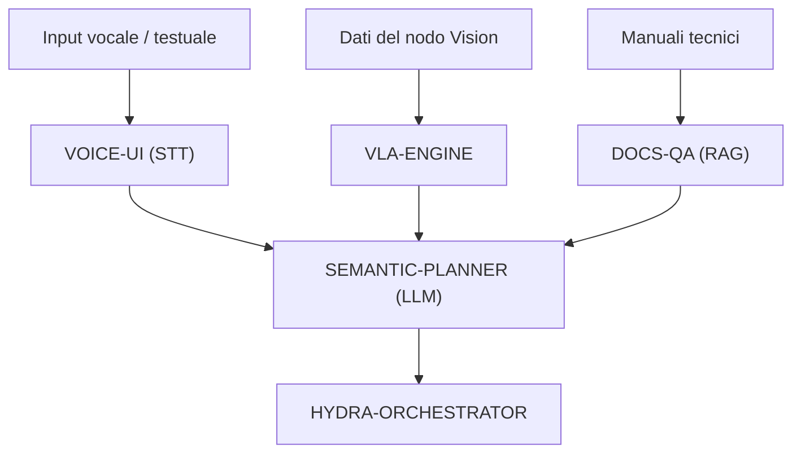

<p align="center">
  
</p>

# 🧠 HYDRA-UMC-COGNITIVE-NODE

<p align="center"><a href="README.md">🇺🇸 English</a> | <a href="README_spa.md">🇪🇸 Español</a> | <a href="README_fra.md">🇫🇷 Français</a> | 🇮🇹 <b>Italiano</b> | <a href="README_deu.md">🇩🇪 Deutsch</a> | <a href="README_zho.md">🇨🇳 简体中文</a> | <a href="README_jpn.md">🇯🇵 日本語</a></p>

### 🤖 Nodo AI Edge per Ragionamento Semantico & GenAI (Hailo-10 + Raspberry Pi CM5)

<p align="left">
  
  
  
  
</p>

---

## 1. 🛠️ PANORAMICA TECNICA

**HYDRA-UMC-COGNITIVE-NODE** funge da "lobo frontale" dell'ecosistema HYDRA-UMC. Alimentato dalla NPU Hailo-10 (40 TOPS), consente ragionamenti semantici complessi, comprensione del linguaggio naturale e pianificazione di compiti vision-language-action (VLA) direttamente all'edge.

Trasforma le istruzioni umane di alto livello in sequenze robotiche logiche, gestendo il recupero degli errori e l'ottimizzazione della missione senza dipendenza dal cloud.

### Caratteristiche principali:
* 🧠 **Esecuzione LLM locale:** Inferenza accelerata dall'hardware per modelli quantizzati (Llama/Mistral). *(pianificato - richiede il vero runtime di modelli Hailo-10)*
* 👁️ **Integrazione VLA:** Modelli Vision-Language-Action per un'esecuzione intuitiva dei compiti. *(pianificato)*
* 🎙️ **Elaborazione comandi vocali:** STT/TTS in tempo reale per l'interazione uomo-robot. *(pianificato)*
* 🛡️ **Privacy innanzitutto:** Elaborazione 100% offline di tutte le attività cognitive. *(vero per progettazione una volta che quanto sopra esista - nulla qui chiama una rete oggi)*
* 🧩 **Hub di Integrazione (v0):** Possiede l'immagine HydraOS condivisa e i
  pesi dei modelli quantizzati consumati dai suoi 4 figli, e li collega
  tra loro come servizi fratelli in un unico `docker-compose.yml`. Il vero
  controllo `family-status` legge il manifest reale di ciascun figlio per
  segnalare presenza/versione/maturità. *(implementato come un vero
  controllo di disponibilità - vedi BUILD ED ESECUZIONE sotto)*
* 🔒 **Schema di stato versionato + letture del manifest con limite di risorse:** `family-status --json` stampa un risultato reale, versionato e leggibile da macchina; qualsiasi manifest di un fratello superiore a 64 KiB (un checkout corrotto o malevolo) degrada a "non trovato" invece di essere letto senza limiti. *(implementato)*
* 🪫 **Controllo di degrado dei pesi di modello condivisi:** `family-status` segnala onestamente se la directory `models/` di questo nodo contiene realmente pesi veri, non solo se i repository fratelli sono clonati. *(implementato)*
* 📦 **Versionamento Contachilometri:** Ogni build reale incrementa
  automaticamente la versione di `pyproject.toml` (`bump_version.py`) -
  nessuna modifica manuale della versione.

---

## 2. 🔄 FLUSSO DI LAVORO COGNITIVO



---

## 3. 🧱 ARCHITETTURA E DECISIONI DI PROGETTAZIONE

Questo repository è il **punto padre/di integrazione** della famiglia
Cognitive AI Node. Non esegue esso stesso alcun modello - possiede le
risorse condivise e il cablaggio che permettono ai suoi quattro figli di
agire come un'unica unità cognitiva sulla stessa scheda fisica:

* **Perché questo nodo non ha hardware/firmware proprio.** A differenza
  del firmware a livello di scheda madre di HYDRA-UMC, questo nodo gira
  interamente su un modulo Raspberry Pi CM5 + Hailo-10 M.2 già
  esistente - non c'è alcun PCB o microcontrollore proprio da
  progettare qui, quindi le cartelle `hardware/`/`firmware/` sono state
  potate invece di essere lasciate vuote.
* **Perché `os/` e `models/` vivono solo nel padre.** L'immagine HydraOS
  e i pesi LLM/VLA quantizzati sono risorse condivise a livello di
  scheda - mantenere un'unica copia nel padre e montarla in sola lettura
  in ogni container figlio (vedi `docker-compose.yml`) evita quattro
  copie divergenti di pesi di più gigabyte.
* **Perché una struttura `src/`.** Mantiene il pacchetto installabile
  (`hydra_umc_cognitive_node`) separato dal tooling nella radice del repo
  (`bump_version.py`, `docker-compose.yml`), coerentemente con il resto
  dei progetti Python dell'ecosistema.
* **Perché il punto di ingresso oggi si limita a stampare
  identità/versione/ruolo.** Questa è la fase di andamiaje
  (impalcatura): dimostrare che il pacchetto si installa, compila e
  importa correttamente - sulla versione Python reale di destinazione -
  è un prerequisito prima di aggiungere la vera logica di orchestrazione
  LLM/VLA/vocale, e mantiene quel lavoro successivo isolato dalle
  questioni di packaging.
* **Perché `docker-compose.yml` esiste prima che i figli abbiano un
  Dockerfile.** Decidere e documentare il contratto di integrazione
  (quale servizio dipende da quale, quali mount di dispositivo/volume
  serve a ciascuno) ora evita che questa forma venga inventata più tardi
  in modo improvvisato, anche se `docker compose up` non può avere pieno
  successo finché ogni figlio non pubblica il proprio Dockerfile.
* **Come si inserisce nel resto dell'ecosistema.** Questo nodo si trova
  un livello sopra la percezione (HYDRA-UMC-VISION-NODE, Hailo-8) e un
  livello sotto l'orchestrazione della missione
  (HYDRA-UMC-ORCHESTRATOR): trasforma istruzioni vocali/testuali e
  rilevamenti in decisioni semantiche, che l'orchestratore trasforma poi
  in comandi fisici per i robot.
* **Perché `family-status` legge il manifest proprio di ciascun figlio
  invece di un elenco mantenuto a mano.** `hydra-umc.project.json` è già
  l'unica fonte di verità di cui si fidano dashboard e updater di tutto
  l'ecosistema - un secondo elenco qui
  andrebbe fuori sincrono non appena la maturità reale di un figlio
  cambiasse e nessuno si ricordasse di aggiornarlo.
* **Perché un figlio senza checkout locale è un "non trovato" reale e
  onesto, non un errore.** Un hub di integrazione non sa davvero se uno
  sviluppatore ha clonato localmente tutti e quattro i figli -
  `manifest.py` restituisce `None` per ogni fallimento reale (repo
  assente, manifest assente, JSON malformato) affinché `family-status`
  lo segnali chiaramente invece di andare in crash.
* **Perché le letture del manifest di un fratello sono limitate a
  64 KiB.** Ogni manifest reale in questo ecosistema pesa da poche
  centinaia di byte a un paio di KiB - un checkout corrotto o malevolo il
  cui manifest sia stato sostituito con un file sovradimensionato non
  deve mai far caricare in memoria una quantità illimitata di dati da un
  normale controllo di disponibilità. Degrada a `None`, come qualsiasi
  altro manifest malformato.
* **Perché `family-status` segnala `models/` anche se questo nodo non
  esegue esso stesso alcun modello.** "I repository fratelli sono
  clonati" e "i pesi condivisi di cui avrebbero bisogno sono realmente
  presenti" sono due fatti reali distinti - `check_shared_models()` di
  `models.py` verifica onestamente il secondo (vuoto ma presente conta
  come mancante) invece di lasciare che un operatore presuma la
  disponibilità solo dalla presenza dei figli.

---

## 📂 STRUTTURA DELLE CARTELLE

```text
HYDRA-UMC-COGNITIVE-NODE/
├── src/hydra_umc_cognitive_node/
│   ├── manifest.py                 # Lettore reale e difensivo del manifest proprio di un fratello (limite di 64 KiB)
│   ├── models.py                   # Controllo reale della directory di pesi di modello condivisi propria di questo nodo
│   ├── family.py                    # Vero controllo di disponibilità di famiglia + schema JSON versionato
│   ├── api.py                         # Superficie JSON/HTTP semplice (http.server di stdlib) su `family-status`
│   └── main.py                        # Punto di ingresso + sottocomando reale `family-status [--json]`
├── tests/                          # Test reali: lettura manifest, modelli, stato famiglia, api, CLI end-to-end
├── docs/                           # Documentazione e architettura
├── os/                             # Immagine/configurazione HydraOS per la CM5 - popolata al deployment (non in git)
├── models/                         # Pesi ottimizzati Hailo-10 (LLM/VLA, condivisi dai 4 figli) - popolata al deployment (non in git)
├── images/                         # Media e diagrammi
├── systemd/
│   └── hydra-umc-cognitive-node.service # Unità systemd della API locale family-status sulla CM5
├── tools/
│   ├── build_test.py               # Controllo build senza versionamento
│   └── ci_validate.py              # Validazione manifest/CHANGELOG/docs usata dalla CI
├── build/                          # Output di build locale (ignorato da git)
├── pyproject.toml                  # Metadati del pacchetto (versione a incremento contachilometri)
├── bump_version.py                 # Incremento versione nativa stile contachilometri (usato da build.sh/.bat)
├── bump_manifest_version.py        # Sincronizza la versione di hydra-umc.project.json con quella nativa (--sync)
├── docker-compose.yml              # Mappa di integrazione dei 4 servizi figli
├── build.sh / build.bat            # Crea il venv, installa (con extra dev), esegue i test, verifica l'import
└── run.sh / run.bat                # Esegue il punto di ingresso (inoltra gli argomenti, es. `family-status`)
```

> **Nota:** `hardware/` e `firmware/` sono stati potati - questo nodo
> funziona su un modulo CM5 + Hailo-10 M.2 già esistente, senza un
> progetto hardware/firmware proprio. In futuro potrebbe essere aggiunto
> un microcontrollore ausiliario dedicato, se necessario.

---

## ⚙️ BUILD ED ESECUZIONE

Richiede Python >= 3.10.

```bash
# Linux / macOS / Git Bash
./build.sh   # crea .venv, installa il pacchetto (editable), verifica l'import
./run.sh     # esegue il punto di ingresso

# Windows (cmd)
build.bat
run.bat
```

`build.sh`/`build.bat` incrementano la versione (stile contachilometri,
vedi `bump_version.py`) prima di ogni build reale, ed eseguono la vera
suite di test (`pytest tests/`). Output atteso di un `run.sh` senza
argomenti:

```text
HYDRA-UMC-COGNITIVE-NODE v0.0.8
Semantic reasoning & GenAI edge node (Hailo-10) - integrates VLA-Engine, Voice-UI, Semantic-Planner and Docs-QA into one cognitive node.
```

Vedere `docker-compose.yml` per come i quattro servizi figli (VLA-Engine,
Voice-UI, Semantic-Planner, Docs-QA) si collegano a questo nodo non appena
ciascuno pubblica il proprio Dockerfile.

Il vero sottocomando `family-status` controlla i veri figli in un vero
checkout locale:

```bash
./run.sh family-status
./run.sh family-status --workspace /percorso/a/un/altro/checkout
./run.sh family-status --json

# Windows
run.bat family-status
```

`family-status` segnala sempre anche i pesi di modello condivisi propri
di questo nodo - una `models/` reale e vuota su una macchina di sviluppo
è onestamente `MISSING`, mai ignorata silenziosamente:

```text
Cognitive AI Node family status (workspace: /path/to/workspace):
  HYDRA-UMC-VLA-ENGINE: v0.1.0, maturity=established, role=service
  ...

Shared model weights: MISSING (.../HYDRA-UMC-COGNITIVE-NODE/models) - this node's own os/models weights have not been provisioned on this machine; children that need them will run in their own honest degraded/no-hardware mode.

All 4 children present.
```

`--json` stampa invece gli stessi dati reali come un oggetto versionato
e leggibile da macchina:

```bash
$ ./run.sh family-status --json
{
  "schema_version": "1.0",
  "shared_models": { "present": false, "path": ".../models" },
  "children": [
    { "name": "HYDRA-UMC-VLA-ENGINE", "present": true, "version": "0.1.0", "maturity": "established", "role": "service" },
    ...
  ],
  "all_children_present": true
}
```

Per impostazione predefinita usa la propria directory padre di questo
repo - lo stesso layout che qualsiasi checkout reale di questo
ecosistema già usa (tutti i repo come fratelli sotto un'unica cartella
di workspace). Termina con `1` se manca un figlio reale.

### 🩺 Risoluzione dei problemi

* **`python: comando non trovato` / il build fallisce al passo 1.**
  Richiede Python >= 3.10 nel `PATH`. Su Windows, installalo da
  [python.org](https://python.org) e spunta "Add to PATH" durante
  l'installazione; su Linux/macOS di solito si chiama `python3`.
* **`build.sh` non riesce ad attivare il venv.** `python3 -m venv .venv`
  posiziona lo script di attivazione in un percorso diverso a seconda
  della piattaforma: `.venv/bin/activate` su Linux/macOS,
  `.venv/Scripts/activate` su Windows (anche per un venv Python Windows
  usato da Git Bash). `build.sh` verifica già entrambi i percorsi - se
  continua a fallire, elimina `.venv/` e riesegui `./build.sh` per
  ricrearlo da zero.
* **`pip install -e .` fallisce.** Di solito per un `.venv/` obsoleto.
  Elimina la cartella `.venv/` e riesegui `./build.sh`/`build.bat` per
  ricrearla.
* **`import OK` non viene mai stampato.** Significa che `python -c
  "import hydra_umc_cognitive_node"` è fallito - riesegui con il venv
  attivo per vedere il traceback reale (una modifica manuale rotta di
  `pyproject.toml` è la causa abituale dopo un merge manuale).
* **`docker compose up` non fa nulla di utile.** È normale per ora - i
  quattro servizi figli referenziati in `docker-compose.yml` non hanno
  ancora un Dockerfile pubblicato (ognuno per ora ha solo un punto di
  ingresso Python). Esegui ogni servizio direttamente con il proprio
  `run.sh`/`run.bat` durante lo sviluppo.

---

## 🚀 TABELLA DI MARCIA
* **Fase 1:** Distribuzione del motore VLA e elaborazione dell'input multi-modale su Hailo-10.
* **Fase 2:** Integrazione del pianificatore semantico con modelli comportamentali di sciame e memoria a lungo termine.
* **Fase 3:** Esecuzione locale a bassa latenza dell'interfaccia vocale e cancellazione del rumore industriale.
* **Fase 4:** Audit del processo decisionale autonomo e integrazione completa con Dashboard AI per il feedback "Verifica e Chiedi".

---

## 🔗 PROGETTI CORRELATI

Questo progetto fa parte dell'ecosistema robotico HYDRA-UMC dello stesso autore (JuanenRac / Electro Hobby 3D). Vale la pena conoscerlo, poiché una richiesta potrebbe in realtà riguardare uno di questi invece di questo repository.

**Progetti Figli** — ciascuno è una fase del flusso cognitivo di questo nodo (ingresso vocale, decisione, azione, fondamento)
- **[HYDRA-UMC-VOICE-UI](https://github.com/JuanenRac/HYDRA-UMC-VOICE-UI)** — vero front-end vocale (VAD + parser di intenti) con un relay verso Watch limitato e soggetto a conferma.
- **[HYDRA-UMC-SEMANTIC-PLANNER](https://github.com/JuanenRac/HYDRA-UMC-SEMANTIC-PLANNER)** — vera scomposizione dei task basata su regole e recupero semantico degli errori sui codici errore MCU.
- **[HYDRA-UMC-VLA-ENGINE](https://github.com/JuanenRac/HYDRA-UMC-VLA-ENGINE)** — vera codifica/decodifica di token d'azione e generazione di traiettoria per un modello Vision-Language-Action.
- **[HYDRA-UMC-DOCS-QA](https://github.com/JuanenRac/HYDRA-UMC-DOCS-QA)** — vera ricerca documentale TF-IDF (solo libreria standard) sui documenti Markdown di questo ecosistema.

**Direttamente Correlati**
- **[HYDRA-UMC-ORCHESTRATOR](https://github.com/JuanenRac/HYDRA-UMC-ORCHESTRATOR)** — hub di integrazione con un vero contratto di health-report gRPC/Protobuf e una macchina a stati di missione; è ciò che dà a questo nodo i propri ordini di missione.
- **[HYDRA-UMC-VISION-NODE](https://github.com/JuanenRac/HYDRA-UMC-VISION-NODE)** — hub di integrazione per la pipeline di visione Hailo-8, con un vero controllo di prontezza hardware per fase; lo strato semantico di questo nodo ne consuma le rilevazioni.
- **[HYDRA-UMC-STUDIO](https://github.com/JuanenRac/HYDRA-UMC-STUDIO)** — dashboard di controllo web con visualizzazione 3D multi-robot in tempo reale; una delle superfici di controllo vocale di questo nodo.
- **[HYDRA-UMC-DSI](https://github.com/JuanenRac/HYDRA-UMC-DSI)** — interfaccia touch nativa per il touchscreen DSI da 7" a bordo, incorporata direttamente nel CM5; l'altra superficie di controllo vocale di questo nodo.

**Fa Anche Parte dell'Ecosistema**

*Hardware e Piattaforma di Base*
- **[HYDRA-UMC](https://github.com/JuanenRac/HYDRA-UMC)** — la scheda madre fisica del braccio robotico: host CM5 + coprocessore STM32H745 dual-core, che coordina fino a 8 bracci utensile via CAN-OTA/SPI-OTA.
- **[HYDRA-UMC-OS](https://github.com/JuanenRac/HYDRA-UMC-OS)** — livello prodotto riproducibile su Raspberry Pi OS per il CM5: agente in sola lettura, config/profili validati, provisioning WiFi al primo contatto.
- **[HYDRA-UMC-SDK](https://github.com/JuanenRac/HYDRA-UMC-SDK)** — il contratto JSON-Schema condiviso e la barriera di sicurezza contro cui ogni bridge valida i propri comandi.

*Backend Centrale e Client*
- **[HYDRA-UMC-SERVER](https://github.com/JuanenRac/HYDRA-UMC-SERVER)** — il vero backend headless (REST/WebSocket) con cui parla davvero ogni client di controllo.
- **[HYDRA-UMC-SUITE](https://github.com/JuanenRac/HYDRA-UMC-SUITE)** — centro di comando sciame desktop (PySide6) per più server contemporaneamente, pacchettizzato come eseguibile standalone.
- **[HYDRA-UMC-ANDROID-CONTROL](https://github.com/JuanenRac/HYDRA-UMC-ANDROID-CONTROL)** — app di controllo nativa per Android con login biometrico e un companion Wear OS abbinato.
- **[HYDRA-UMC-IOS-CONTROL](https://github.com/JuanenRac/HYDRA-UMC-IOS-CONTROL)** — app di controllo per iOS/iPadOS (Flutter) con sincronizzazione WebSocket in tempo reale.
- **[HYDRA-UMC-EDITOR-URDF](https://github.com/JuanenRac/HYDRA-UMC-EDITOR-URDF)** — creatore/editor grafico desktop di URDF che invia i modelli finiti al catalogo di STUDIO.
- **[HYDRA-UMC-BRIDGE-AMR](https://github.com/JuanenRac/HYDRA-UMC-BRIDGE-AMR)** — barriera di coordinamento per flotte AGV/AMR tramite un publisher MQTT VDA 5050 reale.
- **[HYDRA-UMC-BRIDGE-CNC](https://github.com/JuanenRac/HYDRA-UMC-BRIDGE-CNC)** — coordinatore ad alto livello per celle CNC con accesso reale a stato/byte di controllo GRBL.
- **[HYDRA-UMC-BRIDGE-DROIDS](https://github.com/JuanenRac/HYDRA-UMC-BRIDGE-DROIDS)** — barriera di coordinamento per droidi con zampe/umanoidi, con un vero mittente di comandi per Boston Dynamics Spot.
- **[HYDRA-UMC-BRIDGE-LASER](https://github.com/JuanenRac/HYDRA-UMC-BRIDGE-LASER)** — coordinatore di sicurezza per celle laser che legge 3 salvaguardie GPIO reali di chiave/involucro/interblocco.
- **[HYDRA-UMC-BRIDGE-OPENPNP](https://github.com/JuanenRac/HYDRA-UMC-BRIDGE-OPENPNP)** — coordinatore ad alto livello sicuro per il flusso schede del pick-and-place OpenPnP.
- **[HYDRA-UMC-BRIDGE-PRINTER3D](https://github.com/JuanenRac/HYDRA-UMC-BRIDGE-PRINTER3D)** — barriera di coordinamento sicura per stampanti 3D Moonraker/Klipper, con comandi di lavoro reali e controllati.
- **[HYDRA-UMC-BRIDGE-ROS2](https://github.com/JuanenRac/HYDRA-UMC-BRIDGE-ROS2)** — coordinatore di sicurezza con un vero trasporto ROS 2 rclpy, importato in modo lazy.
- **[HYDRA-UMC-BRIDGE-UAV](https://github.com/JuanenRac/HYDRA-UMC-BRIDGE-UAV)** — barriera di coordinamento per UAV dotati di fotocamera, con un vero mittente di comandi MAVLink.

*Piattaforma Strumenti URTC*
- **[URTC](https://github.com/JuanenRac/URTC)** — firmware per la scheda fisica dell'Universal Robot Tool Controller, oltre 25 profili utensile su bus CAN.
- **[URTC-FLASHER](https://github.com/JuanenRac/URTC-FLASHER)** — strumento desktop con GUI per il flashing delle schede URTC, CAN-OTA più SWD/JTAG a chip intero.
- **[URTC-TESTER](https://github.com/JuanenRac/URTC-TESTER)** — strumento desktop di diagnostica CAN-bus dal vivo per schede URTC, un pannello per profilo utensile.
- **[URTC-WEB-STUDIO](https://github.com/JuanenRac/URTC-WEB-STUDIO)** — alternativa basata su browser a URTC-TESTER tramite la Web Serial API, senza installazione locale.

*Nodo IA Visione (Hailo-8)*
- **[HYDRA-UMC-DETECTION-HEF](https://github.com/JuanenRac/HYDRA-UMC-DETECTION-HEF)** — registro reale di modelli compilati con verifica di caricamento sicuro per architettura Hailo/checksum.
- **[HYDRA-UMC-VISION-STREAMER](https://github.com/JuanenRac/HYDRA-UMC-VISION-STREAMER)** — generatore reale di pipeline GStreamer + config MediaMTX, con una vera barriera di integrazione HailoRT.
- **[HYDRA-UMC-VISUAL-SERVOING-API](https://github.com/JuanenRac/HYDRA-UMC-VISUAL-SERVOING-API)** — vera legge di correzione Position-Based Visual Servoing, con cancello di sicurezza sullo stato di zona a monte.
- **[HYDRA-UMC-SAFETY-ZONES](https://github.com/JuanenRac/HYDRA-UMC-SAFETY-ZONES)** — vero controllo di violazione zona e richiesta E-STOP, con imposizione della freschezza di calibrazione.

*Orchestrazione e Sciame*
- **[HYDRA-UMC-JOB-DISPATCHER](https://github.com/JuanenRac/HYDRA-UMC-JOB-DISPATCHER)** — vera coda di lavori basata su priorità con deduplicazione, su una vera API HTTP.
- **[HYDRA-UMC-NODE-HEALING](https://github.com/JuanenRac/HYDRA-UMC-NODE-HEALING)** — vero watchdog di salute della flotta basato su gRPC, con retry/backoff e rilevamento di discrepanza d'identità.
- **[HYDRA-UMC-PATH-PLANNER-3D](https://github.com/JuanenRac/HYDRA-UMC-PATH-PLANNER-3D)** — vero pianificatore di percorsi 3D basato su RRT, con vera validazione delle collisioni ostacolo/spazio di lavoro.
- **[HYDRA-UMC-SWARM-SYNC](https://github.com/JuanenRac/HYDRA-UMC-SWARM-SYNC)** — vera sincronizzazione di stato CRDT LWW-Element-Map, con property test per la convergenza multi-cella.

*Gemello Digitale e Simulazione*
- **[HYDRA-UMC-TWIN](https://github.com/JuanenRac/HYDRA-UMC-TWIN)** — hub di integrazione per il motore di gemello digitale, con un vero contratto di sincronizzazione per compatibilità di versione.
- **[HYDRA-UMC-HIL-BRIDGE](https://github.com/JuanenRac/HYDRA-UMC-HIL-BRIDGE)** — vero interblocco di sicurezza hardware-in-the-loop che instrada i comandi tra simulazione e hardware reale.
- **[HYDRA-UMC-PHYSICS-REPLICA](https://github.com/JuanenRac/HYDRA-UMC-PHYSICS-REPLICA)** — vera cinematica diretta e validazione dei limiti articolari su un vero sottoinsieme URDF.
- **[HYDRA-UMC-SYNTHETIC-DATA-GEN](https://github.com/JuanenRac/HYDRA-UMC-SYNTHETIC-DATA-GEN)** — vero generatore procedurale di scene 2D con esportazione di annotazioni YOLO/COCO.

*Dati e Analisi*
- **[HYDRA-UMC-DATALAKE](https://github.com/JuanenRac/HYDRA-UMC-DATALAKE)** — vero archivio di serie temporali basato su sqlite3, con una vera API HTTP di ingestione/query.
- **[HYDRA-UMC-ANOMALY-DETECTOR](https://github.com/JuanenRac/HYDRA-UMC-ANOMALY-DETECTOR)** — vero rilevatore di anomalie FFT + baseline statistica, con monitoraggio della deriva.
- **[HYDRA-UMC-PRODUCTION-REPORTS](https://github.com/JuanenRac/HYDRA-UMC-PRODUCTION-REPORTS)** — vero calcolo OEE/disponibilità sullo storico di DATALAKE, con esportazione CSV riproducibile.
- **[HYDRA-UMC-TELEMETRY-COLLECTOR](https://github.com/JuanenRac/HYDRA-UMC-TELEMETRY-COLLECTOR)** — vera pipeline di ingestione CAN/WebSocket verso DATALAKE, con deduplicazione per sequenza.

*Gateway Industriale*
- **[HYDRA-UMC-GATEWAY-INDUSTRIAL](https://github.com/JuanenRac/HYDRA-UMC-GATEWAY-INDUSTRIAL)** — hub di integrazione che inoltra ai protocolli industriali, con un vero livello di allowlist dei comandi/backpressure.
- **[HYDRA-UMC-OPCUA-SERVER](https://github.com/JuanenRac/HYDRA-UMC-OPCUA-SERVER)** — vero spazio di indirizzi OPC-UA, verificato con una vera sessione client del protocollo binario.
- **[HYDRA-UMC-MQTT-BROKER](https://github.com/JuanenRac/HYDRA-UMC-MQTT-BROKER)** — vero broker MQTT con autenticazione opzionale per client e ACL sui topic.
- **[HYDRA-UMC-MTCONNECT-ADAPTER](https://github.com/JuanenRac/HYDRA-UMC-MTCONNECT-ADAPTER)** — veri endpoint XML `/probe` e `/current` di MTConnect, con output in modalità degradata.

*Strumenti Complementari e Operazioni dell'Ecosistema*
- **[HYDRA-UMC-DASHBOARD-AI](https://github.com/JuanenRac/HYDRA-UMC-DASHBOARD-AI)** — pannelli Smart Summaries e Anomaly Highlighting su DATALAKE/ANOMALY-DETECTOR, con un fallback statistico onesto.
- **[HYDRA-UMC-TOOL-CLI](https://github.com/JuanenRac/HYDRA-UMC-TOOL-CLI)** — CLI di flotta con un vero e stabile contratto di exit-code, un client live reale della stessa API di HYDRA-UMC-SERVER.
- **[HYDRA-UMC-WATCH](https://github.com/JuanenRac/HYDRA-UMC-WATCH)** — app companion WearOS con avvisi aptici reali e un relay vocale verso il telefono abbinato.
- **[URTC-SMART-RACK](https://github.com/JuanenRac/URTC-SMART-RACK)** — firmware per un rack di montaggio schede con decodifica reale dell'ID utensile e logica di preriscaldamento Smart Idle.
- **[URTC-VISION-TOOL](https://github.com/JuanenRac/URTC-VISION-TOOL)** — firmware più un vero companion di visione Python per una testa utensile di ispezione termica/RGB.
- **[HYDRA-UMC-UPDATER](https://github.com/JuanenRac/HYDRA-UMC-UPDATER)** — strumento amministrativo desktop che scopre, clona e aggiorna ogni repository di questo ecosistema.

---

## 👤 AUTORE
**JuanenRac** (Electro Hobby 3D)
📧 electrohobby3d@gmail.com
📺 [youtube.com/@electrohobby3d](https://youtube.com/@electrohobby3d)

## 📜 LICENZA
GPL-3.0 - Vedere LICENSE per i dettagli.
