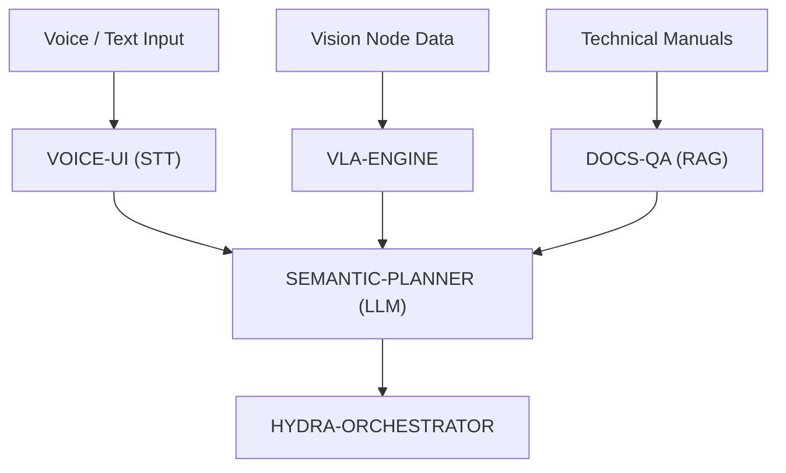

<p align="center">
  
</p>

# 🧠 HYDRA-UMC-COGNITIVE-NODE

<p align="center"><a href="README.md">🇺🇸 English</a> | <a href="README_spa.md">🇪🇸 Español</a> | <a href="README_fra.md">🇫🇷 Français</a> | <a href="README_ita.md">🇮🇹 Italiano</a> | <a href="README_deu.md">🇩🇪 Deutsch</a> | <a href="README_zho.md">🇨🇳 简体中文</a> | 🇯🇵 <b>日本語</b></p>

### 🤖 意味推論と生成 AI エッジノード（Hailo-10 + Raspberry Pi CM5）

<p align="left">
  
  
  
  
</p>

---

## 1. 🛠️ 技術概要

**HYDRA-UMC-COGNITIVE-NODE** は、HYDRA-UMC エコシステムの「前頭葉」として
機能します。Hailo-10 NPU（40 TOPS）によって駆動され、エッジ上で直接、
複雑な意味推論、自然言語理解、そして視覚言語行動（VLA）タスクプランニング
を可能にします。

高レベルの人間の指示を論理的なロボット操作シーケンスに変換し、クラウドに
依存することなくエラー回復とミッション最適化を管理します。

### 主な機能：
* 🧠 **ローカル LLM 実行：** 量子化モデル（Llama/Mistral）向けのハードウェアアクセラレーション推論。*（計画中——実際の Hailo-10 モデルランタイムが必要です）*
* 👁️ **VLA 統合：** 直感的なタスク実行のための視覚言語行動モデル。*（計画中）*
* 🎙️ **音声コマンド処理：** 人間とロボットのインタラクション向けのリアルタイム STT/TTS。*（計画中）*
* 🛡️ **プライバシー第一：** すべての認知タスクを 100% オフラインで処理。*（上記が実現すれば設計上当然にそうなります——現時点ではここから外部ネットワークを呼び出す処理は一切ありません）*
* 🧩 **統合ハブ（v0）：** 4 つの子プロジェクトが消費する共有 HydraOS イメージと
  量子化モデルの重みを保持し、単一の `docker-compose.yml` で兄弟サービス
  として結び付けます。実際の `family-status` チェックは各子プロジェクト
  自身の実際のマニフェストを読み取り、存在/バージョン/成熟度を報告します。
  *（実際のレディネスチェックとして実装済み——下記の「ビルドと実行」を
  参照）*
* 🔒 **バージョン管理されたステータススキーマ + リソース制限付きマニフェスト読み込み：** `family-status --json` は実際の、バージョン管理された機械可読の結果を出力します。64 KiB を超える兄弟プロジェクトのマニフェスト（破損または悪意のあるチェックアウト）は、無制限に読み込まれるのではなく「見つかりません」に縮退します。*（実装済み）*
* 🪫 **共有モデル重みの縮退チェック：** `family-status` は、本ノード自身の `models/` ディレクトリに実際に重みが存在するかどうかを正直に報告します。兄弟リポジトリがチェックアウトされているかどうかだけではありません。*（実装済み）*
* 📦 **オドメーター式バージョン管理：** 実際のビルドのたびに
  `pyproject.toml` 自身のバージョンが自動的に増加します
  （`bump_version.py`）——手動でのバージョン編集は不要です。

---

## 2. 🔄 認知ワークフロー



---

## 3. 🧱 アーキテクチャと設計上の決定

本リポジトリは Cognitive AI Node ファミリーの**親/統合ポイント**です。
それ自体はモデルを実行しません——共有リソースと、4 つの子プロジェクトが
同一の物理基板上で単一の認知ユニットとして機能するための配線を保持して
います：

* **本ノードに独自のハードウェア/ファームウェアがない理由。** マザーボードレベルの HYDRA-UMC ファームウェアとは異なり、本ノードは既存の Raspberry Pi CM5 + Hailo-10 M.2 モジュール上で完全に動作します——ここには設計すべきカスタム PCB やマイクロコントローラーが存在しないため、`hardware/`/`firmware/` フォルダは空のまま残すのではなく意図的に省略されています。
* **`os/` と `models/` が親プロジェクトにのみ存在する理由。** HydraOS イメージと量子化された LLM/VLA の重みは共有される基板レベルのリソースです——親プロジェクトに 1 つのコピーを保持し、それを各子プロジェクトのコンテナに読み取り専用でマウントすること（`docker-compose.yml` 参照）で、数 GB にも及ぶモデルの重みが 4 つの食い違ったコピーとして存在することを避けられます。
* **`src/` レイアウトを採用した理由。** インストール可能なパッケージ（`hydra_umc_cognitive_node`）をリポジトリルートのツール（`bump_version.py`、`docker-compose.yml`）から分離し、エコシステム内の他のすべての Python プロジェクトで使用されているレイアウトと一致させるためです。
* **エントリポイントが今日は身元/バージョン/役割のみを表示する理由。** これは足場（アンダミアヘ、スキャフォールディング）段階です：実際のターゲット Python バージョン上で、本パッケージが正しくインストール・コンパイルされ、問題なくインポートできることを証明することが、後で実際の LLM/VLA/音声オーケストレーションロジックを追加するための前提条件であり、その後の作業をパッケージングの懸念から切り離しておきます。
* **子プロジェクトが Dockerfile を持つ前に `docker-compose.yml` が存在する理由。** 統合契約（どのサービスがどのサービスに依存するか、それぞれがどのデバイス/ボリュームマウントを必要とするか）を今のうちに決定し文書化しておくことで、各子プロジェクトが独自の Dockerfile を公開するまで `docker compose up` が完全には成功しないとしても、この形が後から場当たり的に考案されることを防ぎます。
* **エコシステムの他の部分との関係。** 本ノードは、知覚層（HYDRA-UMC-VISION-NODE、Hailo-8）の 1 つ上の層、ミッションオーケストレーション（HYDRA-UMC-ORCHESTRATOR）の 1 つ下の層に位置します：音声/テキストによる指示や検知結果を意味的な決定へと変換し、オーケストレーターがそれを物理的なロボットコマンドへと変換します。
* **`family-status` が手作業で管理するリストではなく、各子プロジェクト自身のマニフェストを読み取る理由。** `hydra-umc.project.json` は、エコシステム全体のダッシュボードとアップデーターがすでに信頼している唯一の真実の情報源です。ここに第 2 のリストを持つと、子プロジェクトの実際の成熟度が変わった瞬間、すぐに食い違いが生じてしまいます。
* **兄弟プロジェクトのローカルチェックアウトが見つからない場合、エラーではなく実際の正直な「見つかりません」になる理由。** 統合ハブは、開発者が実際に 4 つの子プロジェクトすべてをローカルにチェックアウトしているかどうかを本当には知り得ません——`manifest.py` は実際に起こりうるあらゆる失敗（リポジトリなし、マニフェストなし、不正な JSON）に対して `None` を返すため、`family-status` はクラッシュする代わりにそれを明確に報告します。
* **兄弟プロジェクトのマニフェスト読み込みが 64 KiB に制限されている理由。** このエコシステム内の実際のマニフェストは、どれも数百バイトから数 KiB 程度です——マニフェストが巨大なファイルに置き換えられた、破損または悪意のあるチェックアウトによって、通常のレディネスチェックが無制限の量のデータをメモリに読み込んでしまうことは決してあってはなりません。他の不正な形式のマニフェストと同様に `None` に縮退します。
* **本ノード自身はモデルを一切実行しないにもかかわらず、`family-status` が `models/` を報告する理由。** 「兄弟リポジトリがチェックアウトされている」ことと「それらが必要とする共有の重みが実際に存在する」ことは、2 つの異なる実際の事実です——`models.py` の `check_shared_models()` は、子プロジェクトの存在だけからレディネスを推測させるのではなく、後者を正直にチェックします（空だが存在する場合も「なし」として扱われます）。

---

## 📂 リポジトリ構成

```text
HYDRA-UMC-COGNITIVE-NODE/
├── src/hydra_umc_cognitive_node/
│   ├── manifest.py                 # 兄弟プロジェクト自身のマニフェストの実際の防御的リーダー（64 KiB 上限）
│   ├── models.py                   # 本ノード自身の共有モデル重みディレクトリに対する実際のチェック
│   ├── family.py                    # 実際のファミリーレディネスチェック + バージョン管理された JSON スキーマ
│   ├── api.py                         # シンプルなJSON/HTTPサーフェス(stdlibのhttp.server)。`family-status`を橋渡し
│   └── main.py                        # エントリポイント + 実際の `family-status [--json]` と `serve` サブコマンド
├── tests/                          # 実際のテスト：マニフェスト読み込み、モデル、ファミリーステータス、api、エンドツーエンド CLI
├── docs/
│   └── CLI_REFERENCE.md            # 完全なコマンドリファレンス:全フラグ、実際に取得した出力、終了コード
├── os/                             # CM5 向けの HydraOS イメージ/設定 - デプロイ時に配置(gitには含まれない)
├── models/                         # Hailo-10 最適化済みの重み（LLM/VLA、4 つの子プロジェクトで共有） - デプロイ時に配置(gitには含まれない)
├── images/                         # メディアと図表
├── systemd/
│   └── hydra-umc-cognitive-node.service # ローカルCM5 family-status APIのsystemdユニット
├── tools/
│   ├── build_test.py               # バージョンを増やさないビルドチェック
│   └── ci_validate.py              # CI が使用するマニフェスト/CHANGELOG/ドキュメント検証
├── build/                          # ローカルビルド出力（git 管理外）
├── pyproject.toml                  # パッケージメタデータ（オドメーター式バージョン増加）
├── bump_version.py                 # ネイティブバージョンのオドメーター式インクリメント（build.sh/.bat が使用）
├── bump_manifest_version.py        # hydra-umc.project.json のバージョンをネイティブ版と同期(--sync)
├── docker-compose.yml              # 4 つの子サービスの統合マップ
├── build.sh / build.bat            # venv 作成、インストール（dev エクストラ付き）、テスト実行、インポート検証
└── run.sh / run.bat                # エントリポイントを実行（引数を転送、例：`family-status`）
```

> **注：** `hardware/` と `firmware/` は省略されています——本ノードは
> 既存の CM5 + Hailo-10 M.2 モジュール上で動作し、独自のハードウェア/
> ファームウェア設計を持ちません。必要になった場合、専用の補助
> マイクロコントローラーが後で追加される可能性があります。

---

## ⚙️ ビルドと実行

Python >= 3.10 が必要です。

```bash
# Linux / macOS / Git Bash
./build.sh   # .venv を作成し、パッケージを（editable モードで）インストールし、インポートを検証します
./run.sh     # エントリポイントを実行します

# Windows (cmd)
build.bat
run.bat
```

`build.sh`/`build.bat` は、実際の各ビルドの前にバージョンを増加させます
（オドメーター方式、`bump_version.py` を参照）。`run.sh` の予期される
出力：

```text
HYDRA-UMC-COGNITIVE-NODE v0.0.8
Semantic reasoning & GenAI edge node (Hailo-10) - integrates VLA-Engine, Voice-UI, Semantic-Planner and Docs-QA into one cognitive node.
```

4 つの子サービス（VLA-Engine、Voice-UI、Semantic-Planner、Docs-QA）が
それぞれ独自の Dockerfile を発行した際に、それらが本ノードにどのように
接続されるかについては `docker-compose.yml` を参照してください。

実際の `family-status` サブコマンドは、実際のローカルチェックアウトで
実際の子プロジェクトを確認します：

```bash
./run.sh family-status
./run.sh family-status --workspace /path/to/some/other/checkout
./run.sh family-status --json

# Windows
run.bat family-status
```

`family-status` は、本ノード自身の共有モデル重みについても常に報告します
——開発マシン上の実際の空の `models/` は正直に `MISSING` として報告され、
黙って無視されることはありません：

```text
Cognitive AI Node family status (workspace: /path/to/workspace):
  HYDRA-UMC-VLA-ENGINE: v0.1.0, maturity=established, role=service
  ...

Shared model weights: MISSING (.../HYDRA-UMC-COGNITIVE-NODE/models) - this node's own os/models weights have not been provisioned on this machine; children that need them will run in their own honest degraded/no-hardware mode.

All 4 children present.
```

`--json` は、代わりに同じ実際のデータをバージョン管理された機械可読の
オブジェクトとして出力します：

```bash
$ ./run.sh family-status --json
{
  "schema_version": "1.0",
  "shared_models": { "present": false, "path": ".../models" },
  "children": [
    { "name": "HYDRA-UMC-VLA-ENGINE", "present": true, "version": "0.1.0", "maturity": "established", "role": "service" },
    ...
  ],
  "all_children_present": true
}
```

デフォルトでは、本リポジトリ自身の親ディレクトリを使用します——これは
このエコシステムの実際のチェックアウトがすでに使用しているのと同じ
レイアウトです（すべてのリポジトリが 1 つのワークスペースフォルダの下に
兄弟として存在します）。実際の子プロジェクトが 1 つでも見つからない
場合は `1` で終了します。

### 🌐 HTTP API(`serve`)

`serve` は、その全く同じ `family-status` チェックを、単発の CLI 呼び出し
の代わりに小さな標準ライブラリの `http.server` として実行します——これは
CM5 自身の `hydra-umc-cognitive-node.service` systemd ユニットが本番環境
で実行している実際のコマンドです:

```bash
./run.sh serve --addr 127.0.0.1 --port 8096
# GET /family-status  -> 上記の `family-status --json` と同じ JSON を返す
# GET /stats          -> { "workspace": "<設定済みデフォルト>" }
```

`GET /family-status` はオプションの `?workspace=` 上書きを受け付けます。
それ以外のパスは `404` を返します。完全なコマンドリファレンス(全フラグ、
実際に取得した `-h`/`curl` の出力、終了コード表)については
[CLI リファレンス](docs/CLI_REFERENCE.md) を参照してください。

### 🩺 トラブルシューティング

* **`python: command not found` / ビルドがステップ 1 で失敗する。** `PATH` 上に Python >= 3.10 が必要です。Windows では [python.org](https://python.org) からインストールし、セットアップ中に「Add to PATH」がチェックされていることを確認してください。Linux/macOS では通常 `python3` という名前が使われます。
* **`build.sh` が venv をアクティブ化できない。** `python3 -m venv .venv` は、プラットフォームごとに異なる場所にアクティベートスクリプトを配置します：Linux/macOS では `.venv/bin/activate`、Windows（Git Bash から使用される Windows Python venv を含む）では `.venv/Scripts/activate`。`build.sh` は既に両方のパスをチェックしています——それでも失敗する場合は、`.venv/` を削除して `./build.sh` を再実行し、ゼロから再構築してください。
* **`pip install -e .` が失敗する。** 通常は `.venv/` が古くなっていることが原因です。`.venv/` フォルダを削除して `./build.sh`/`build.bat` を再実行し、再作成してください。
* **`import OK` が一度も表示されない。** `python -c "import hydra_umc_cognitive_node"` 自体が失敗したことを意味します——venv がアクティブな状態で再実行し、実際のトレースバックを確認してください（手動マージ後に `pyproject.toml` が壊れていることがよくある原因です）。
* **`docker compose up` が何も有用なことをしない。** 現時点ではこれが想定どおりです——`docker-compose.yml` で参照されている 4 つの子サービスはまだ Dockerfile を公開していません（現在それぞれが Python エントリポイントのみを提供しています）。開発中は、代わりに各サービス自身の `run.sh`/`run.bat` を直接実行してください。

---

## 🚀 ロードマップ
* **フェーズ 1：** Hailo-10 上での VLA エンジンのデプロイとマルチモーダル入力処理。
* **フェーズ 2：** 意味プランナーと群行動モデルおよび長期記憶の統合。
* **フェーズ 3：** 音声 UI の低遅延ローカル実行と産業用ノイズキャンセリング。
* **フェーズ 4：** 自律的意思決定の監査、および Dashboard AI との「見て尋ねる」フィードバックの完全統合。

---

## 🔗 関連プロジェクト

本プロジェクトは、同じ作者(JuanenRac / Electro Hobby 3D)による HYDRA-UMC ロボティクスエコシステムの一部です。リクエストが実はこの中のどれかについてのものである可能性があるため、知っておく価値があります。

**子プロジェクト** —— いずれも、本ノード自身の認知フロー(音声入力、判断、行動、根拠付け)における一段階です
- **[HYDRA-UMC-VOICE-UI](https://github.com/JuanenRac/HYDRA-UMC-VOICE-UI)** — 確認ゲート付きの限定的な Watch リレーを備えた、実際の音声フロントエンド(VAD + 意図解析)。
- **[HYDRA-UMC-SEMANTIC-PLANNER](https://github.com/JuanenRac/HYDRA-UMC-SEMANTIC-PLANNER)** — MCU エラーコードに対する、実際のルールベースのタスク分解と意味的エラー復旧。
- **[HYDRA-UMC-VLA-ENGINE](https://github.com/JuanenRac/HYDRA-UMC-VLA-ENGINE)** — Vision-Language-Action モデル向けの、実際のアクショントークンのエンコード/デコードと軌道生成。
- **[HYDRA-UMC-DOCS-QA](https://github.com/JuanenRac/HYDRA-UMC-DOCS-QA)** — このエコシステム自身の Markdown ドキュメントに対する、標準ライブラリのみの実際の TF-IDF 文書検索。

**直接関連**
- **[HYDRA-UMC-ORCHESTRATOR](https://github.com/JuanenRac/HYDRA-UMC-ORCHESTRATOR)** — 実際の gRPC/Protobuf ヘルスレポート契約とミッションステートマシンを持つ統合ハブ。本ノードに自身のミッション指令を与える存在。
- **[HYDRA-UMC-VISION-NODE](https://github.com/JuanenRac/HYDRA-UMC-VISION-NODE)** — Hailo-8 ビジョンパイプラインの統合ハブ、段階ごとの実際のハードウェア準備状況チェック付き。本ノード自身の意味層がその検出結果を消費する。
- **[HYDRA-UMC-STUDIO](https://github.com/JuanenRac/HYDRA-UMC-STUDIO)** — リアルタイムのマルチロボット 3D 可視化を備えたウェブ制御ダッシュボード。本ノード自身の音声制御サーフェスの一つ。
- **[HYDRA-UMC-DSI](https://github.com/JuanenRac/HYDRA-UMC-DSI)** — 本体搭載の 7 インチ DSI タッチスクリーン向けネイティブタッチ UI、CM5 自体に組み込み。本ノード自身のもう一つの音声制御サーフェス。

**エコシステムの他のプロジェクト**

*コアハードウェア&プラットフォーム*
- **[HYDRA-UMC](https://github.com/JuanenRac/HYDRA-UMC)** — 実際のロボットアームのマザーボード——CM5 ホスト + デュアルコア STM32H745、CAN-OTA/SPI-OTA 経由で最大 8 本のツールアームを統括。
- **[HYDRA-UMC-OS](https://github.com/JuanenRac/HYDRA-UMC-OS)** — CM5 向けの再現可能な Raspberry Pi OS プロダクト層——読み取り専用エージェント、検証済み設定/プロファイル、WiFi 初回接続プロビジョニング。
- **[HYDRA-UMC-SDK](https://github.com/JuanenRac/HYDRA-UMC-SDK)** — すべてのブリッジが自身のコマンドを検証する共有 JSON-Schema 契約と安全ゲートの境界。

*コアバックエンド&クライアント*
- **[HYDRA-UMC-SERVER](https://github.com/JuanenRac/HYDRA-UMC-SERVER)** — すべての制御クライアントが実際に通信する、本物のヘッドレスバックエンド(REST/WebSocket)。
- **[HYDRA-UMC-SUITE](https://github.com/JuanenRac/HYDRA-UMC-SUITE)** — 複数のサーバーを同時に扱えるデスクトップ(PySide6)スウォームコマンドセンター、スタンドアロン実行ファイルとしてパッケージ化。
- **[HYDRA-UMC-ANDROID-CONTROL](https://github.com/JuanenRac/HYDRA-UMC-ANDROID-CONTROL)** — 生体認証ログインとペアリングされた Wear OS コンパニオンを備えたネイティブ Android 制御アプリ。
- **[HYDRA-UMC-IOS-CONTROL](https://github.com/JuanenRac/HYDRA-UMC-IOS-CONTROL)** — リアルタイム WebSocket 同期を備えた iOS/iPadOS 制御アプリ(Flutter)。
- **[HYDRA-UMC-EDITOR-URDF](https://github.com/JuanenRac/HYDRA-UMC-EDITOR-URDF)** — 完成したモデルを STUDIO 自身のカタログへ送信するデスクトップ用グラフィカル URDF 作成/編集ツール。
- **[HYDRA-UMC-BRIDGE-AMR](https://github.com/JuanenRac/HYDRA-UMC-BRIDGE-AMR)** — 実際の VDA 5050 MQTT パブリッシャーによる AGV/AMR フリートの調整境界。
- **[HYDRA-UMC-BRIDGE-CNC](https://github.com/JuanenRac/HYDRA-UMC-BRIDGE-CNC)** — 実際の GRBL ステータス/制御バイトへのアクセスを持つ、CNC セルの高レベルコーディネーター。
- **[HYDRA-UMC-BRIDGE-DROIDS](https://github.com/JuanenRac/HYDRA-UMC-BRIDGE-DROIDS)** — 実際の Boston Dynamics Spot コマンド送信機能を持つ、脚型/ヒューマノイドドロイドの調整境界。
- **[HYDRA-UMC-BRIDGE-LASER](https://github.com/JuanenRac/HYDRA-UMC-BRIDGE-LASER)** — 実際のキー/筐体/インターロック GPIO セーフガード 3 系統を読み取る、レーザーセルの安全コーディネーター。
- **[HYDRA-UMC-BRIDGE-OPENPNP](https://github.com/JuanenRac/HYDRA-UMC-BRIDGE-OPENPNP)** — OpenPnP ピックアンドプレースの基板フローを安全に統括する高レベルコーディネーター。
- **[HYDRA-UMC-BRIDGE-PRINTER3D](https://github.com/JuanenRac/HYDRA-UMC-BRIDGE-PRINTER3D)** — 実際にゲート制御されたジョブコマンドを持つ、Moonraker/Klipper 3D プリンター向けの安全な調整境界。
- **[HYDRA-UMC-BRIDGE-ROS2](https://github.com/JuanenRac/HYDRA-UMC-BRIDGE-ROS2)** — 実際の遅延インポート rclpy ROS 2 トランスポートを持つ安全コーディネーター。
- **[HYDRA-UMC-BRIDGE-UAV](https://github.com/JuanenRac/HYDRA-UMC-BRIDGE-UAV)** — 実際の MAVLink コマンド送信機能を持つ、カメラ搭載 UAV の調整境界。

*URTC ツールプラットフォーム*
- **[URTC](https://github.com/JuanenRac/URTC)** — 物理的な Universal Robot Tool Controller 基板向けファームウェア、CAN バス経由の 25 以上のツールプロファイル。
- **[URTC-FLASHER](https://github.com/JuanenRac/URTC-FLASHER)** — URTC 基板用のデスクトップ GUI 書き込みツール、CAN-OTA およびフルチップ SWD/JTAG。
- **[URTC-TESTER](https://github.com/JuanenRac/URTC-TESTER)** — URTC 基板向けのデスクトップ CAN バスライブ診断ツール、ツールプロファイルごとに 1 パネル。
- **[URTC-WEB-STUDIO](https://github.com/JuanenRac/URTC-WEB-STUDIO)** — Web Serial API を使ったブラウザベースの URTC-TESTER の代替、ローカルインストール不要。

*ビジョン AI ノード(Hailo-8)*
- **[HYDRA-UMC-DETECTION-HEF](https://github.com/JuanenRac/HYDRA-UMC-DETECTION-HEF)** — Hailo アーキテクチャ/チェックサムによる安全読み込み検証を備えた、実際のコンパイル済みモデルレジストリ。
- **[HYDRA-UMC-VISION-STREAMER](https://github.com/JuanenRac/HYDRA-UMC-VISION-STREAMER)** — 実際の HailoRT 統合境界を持つ、実際の GStreamer パイプライン + MediaMTX 設定生成器。
- **[HYDRA-UMC-VISUAL-SERVOING-API](https://github.com/JuanenRac/HYDRA-UMC-VISUAL-SERVOING-API)** — 上流のゾーン状態に応じて安全ゲート制御される、実際の Position-Based Visual Servoing 補正則。
- **[HYDRA-UMC-SAFETY-ZONES](https://github.com/JuanenRac/HYDRA-UMC-SAFETY-ZONES)** — キャリブレーションの鮮度を強制する、実際のゾーン侵入チェックと E-STOP 要求。

*オーケストレーション&スウォーム*
- **[HYDRA-UMC-JOB-DISPATCHER](https://github.com/JuanenRac/HYDRA-UMC-JOB-DISPATCHER)** — 実際の HTTP API 上に構築された、優先度ベースの実際のジョブキュー(重複排除付き)。
- **[HYDRA-UMC-NODE-HEALING](https://github.com/JuanenRac/HYDRA-UMC-NODE-HEALING)** — リトライ/バックオフとアイデンティティ不一致検出を備えた、実際の gRPC ベースのフリートヘルスウォッチドッグ。
- **[HYDRA-UMC-PATH-PLANNER-3D](https://github.com/JuanenRac/HYDRA-UMC-PATH-PLANNER-3D)** — 実際の障害物/ワークスペース衝突検証を備えた、実際の RRT ベースの 3D 経路プランナー。
- **[HYDRA-UMC-SWARM-SYNC](https://github.com/JuanenRac/HYDRA-UMC-SWARM-SYNC)** — 複数セルの収束についてプロパティテストされた、実際の CRDT LWW-Element-Map 状態同期。

*デジタルツイン&シミュレーション*
- **[HYDRA-UMC-TWIN](https://github.com/JuanenRac/HYDRA-UMC-TWIN)** — 実際のバージョン互換性同期契約を持つ、デジタルツインエンジンの統合ハブ。
- **[HYDRA-UMC-HIL-BRIDGE](https://github.com/JuanenRac/HYDRA-UMC-HIL-BRIDGE)** — シミュレーションと実際のハードウェアの間でコマンドをルーティングする、実際のハードウェア・イン・ザ・ループ安全インターロック。
- **[HYDRA-UMC-PHYSICS-REPLICA](https://github.com/JuanenRac/HYDRA-UMC-PHYSICS-REPLICA)** — 実際の URDF サブセットに対する、実際の順運動学と関節限界検証。
- **[HYDRA-UMC-SYNTHETIC-DATA-GEN](https://github.com/JuanenRac/HYDRA-UMC-SYNTHETIC-DATA-GEN)** — YOLO/COCO アノテーションのエクスポート機能を持つ、実際のプロシージャル 2D シーンジェネレーター。

*データ&分析*
- **[HYDRA-UMC-DATALAKE](https://github.com/JuanenRac/HYDRA-UMC-DATALAKE)** — 実際の取り込み/クエリ HTTP API を備えた、実際の sqlite3 ベースの時系列ストア。
- **[HYDRA-UMC-ANOMALY-DETECTOR](https://github.com/JuanenRac/HYDRA-UMC-ANOMALY-DETECTOR)** — ドリフト監視を備えた、実際の FFT + 統計ベースラインによる異常検知器。
- **[HYDRA-UMC-PRODUCTION-REPORTS](https://github.com/JuanenRac/HYDRA-UMC-PRODUCTION-REPORTS)** — DATALAKE の履歴に対する実際の OEE/稼働率計算、再現可能な CSV エクスポート付き。
- **[HYDRA-UMC-TELEMETRY-COLLECTOR](https://github.com/JuanenRac/HYDRA-UMC-TELEMETRY-COLLECTOR)** — シーケンス重複排除機能を備えた、DATALAKE への実際の CAN/WebSocket 取り込みパイプライン。

*産業用ゲートウェイ*
- **[HYDRA-UMC-GATEWAY-INDUSTRIAL](https://github.com/JuanenRac/HYDRA-UMC-GATEWAY-INDUSTRIAL)** — 実際のコマンド許可リスト/バックプレッシャー層を持つ、産業用プロトコルへ中継する統合ハブ。
- **[HYDRA-UMC-OPCUA-SERVER](https://github.com/JuanenRac/HYDRA-UMC-OPCUA-SERVER)** — 実際のバイナリプロトコルクライアントセッションで検証された、実際の OPC-UA アドレス空間。
- **[HYDRA-UMC-MQTT-BROKER](https://github.com/JuanenRac/HYDRA-UMC-MQTT-BROKER)** — クライアント単位のオプション認証とトピック ACL を備えた、実際の MQTT ブローカー。
- **[HYDRA-UMC-MTCONNECT-ADAPTER](https://github.com/JuanenRac/HYDRA-UMC-MTCONNECT-ADAPTER)** — 縮退モード出力を備えた、実際の MTConnect `/probe` および `/current` XML エンドポイント。

*補完ツール&エコシステム運用*
- **[HYDRA-UMC-DASHBOARD-AI](https://github.com/JuanenRac/HYDRA-UMC-DASHBOARD-AI)** — 誠実な統計フォールバックを備えた、DATALAKE/ANOMALY-DETECTOR 上のスマートサマリーと異常ハイライトパネル。
- **[HYDRA-UMC-TOOL-CLI](https://github.com/JuanenRac/HYDRA-UMC-TOOL-CLI)** — 実際の安定した終了コード契約を持つフリート CLI、HYDRA-UMC-SERVER 自身の API の本物のライブクライアント。
- **[HYDRA-UMC-WATCH](https://github.com/JuanenRac/HYDRA-UMC-WATCH)** — 実際の触覚アラートとペアリングされたスマートフォンへの音声リレーを備えた WearOS コンパニオンアプリ。
- **[URTC-SMART-RACK](https://github.com/JuanenRac/URTC-SMART-RACK)** — 実際の工具 ID デコードと Smart Idle 予熱ロジックを備えた、基板搭載ラック用ファームウェア。
- **[URTC-VISION-TOOL](https://github.com/JuanenRac/URTC-VISION-TOOL)** — サーマル/RGB 検査ツールヘッド向けの、ファームウェアと実際の Python ビジョンコンパニオン。
- **[HYDRA-UMC-UPDATER](https://github.com/JuanenRac/HYDRA-UMC-UPDATER)** — このエコシステム内のすべてのリポジトリを検出・クローン・更新する、管理用デスクトップツール。
- **[HYDRA-UMC-OS-REBUILDER](https://github.com/JuanenRac/HYDRA-UMC-OS-REBUILDER)** — エコシステムの最新バージョンをプリロードした、書き込み可能なCM5イメージを構築するWindows/Linuxデスクトップツール。Raspberry Pi Imager方式の初回起動Wi-Fi/ユーザー/SSH設定を備える。

---

## 📚 ドキュメント & コミュニティ

- **[CONTRIBUTING.md](CONTRIBUTING.md)** —— プルリクエストのための技術スタックとコーディング指針。
- **[CODE_OF_CONDUCT.md](CODE_OF_CONDUCT.md)** —— このコミュニティで期待される行動規範。
- **[SECURITY.md](SECURITY.md)** —— 脆弱性の報告方法と、このプロジェクトの実際のセキュリティ重点領域。
- **[SUPPORT.md](SUPPORT.md)** —— 質問の投稿先とバグの報告先。
- **[LICENSE.md](LICENSE.md)** —— このプロジェクト自身のライセンス。

## 👤 作者
**JuanenRac** (Electro Hobby 3D)
📧 electrohobby3d@gmail.com
📺 [youtube.com/@electrohobby3d](https://youtube.com/@electrohobby3d)

## 📜 ライセンス
GPL-3.0 —— 詳細は LICENSE を参照してください。
