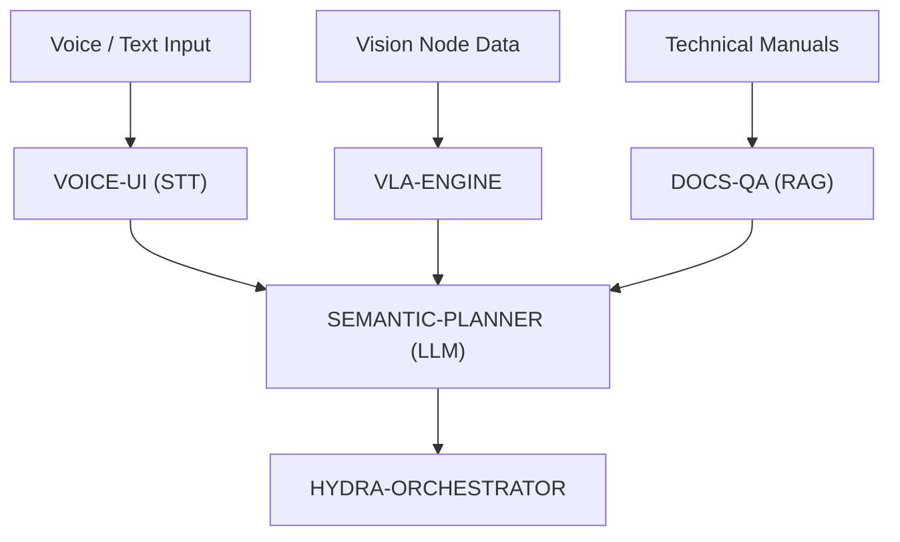

<p align="center">
  
</p>

# 🧠 HYDRA-UMC-COGNITIVE-NODE

<p align="center"><a href="README.md">🇺🇸 English</a> | <a href="README_spa.md">🇪🇸 Español</a> | <a href="README_fra.md">🇫🇷 Français</a> | <a href="README_ita.md">🇮🇹 Italiano</a> | <a href="README_deu.md">🇩🇪 Deutsch</a> | <a href="README_zho.md">🇨🇳 简体中文</a> | 🇯🇵 <b>日本語</b></p>

### 🤖 意味推論と生成 AI エッジノード（Hailo-10 + Raspberry Pi CM5）

<p align="left">
  
  
  
  
</p>

---

## 1. 🛠️ 技術概要

**HYDRA-UMC-COGNITIVE-NODE** は、HYDRA-UMC エコシステムの「前頭葉」として
機能します。Hailo-10 NPU（40 TOPS）によって駆動され、エッジ上で直接、
複雑な意味推論、自然言語理解、そして視覚言語行動（VLA）タスクプランニング
を可能にします。

高レベルの人間の指示を論理的なロボット操作シーケンスに変換し、クラウドに
依存することなくエラー回復とミッション最適化を管理します。

### 主な機能：
* 🧠 **ローカル LLM 実行：** 量子化モデル（Llama/Mistral）向けのハードウェアアクセラレーション推論。*（計画中——実際の Hailo-10 モデルランタイムが必要です）*
* 👁️ **VLA 統合：** 直感的なタスク実行のための視覚言語行動モデル。*（計画中）*
* 🎙️ **音声コマンド処理：** 人間とロボットのインタラクション向けのリアルタイム STT/TTS。*（計画中）*
* 🛡️ **プライバシー第一：** すべての認知タスクを 100% オフラインで処理。*（上記が実現すれば設計上当然にそうなります——現時点ではここから外部ネットワークを呼び出す処理は一切ありません）*
* 🧩 **統合ハブ（v0）：** 4 つの子プロジェクトが消費する共有 HydraOS イメージと
  量子化モデルの重みを保持し、単一の `docker-compose.yml` で兄弟サービス
  として結び付けます。実際の `family-status` チェックは各子プロジェクト
  自身の実際のマニフェストを読み取り、存在/バージョン/成熟度を報告します。
  *（実際のレディネスチェックとして実装済み——下記の「ビルドと実行」を
  参照）*
* 🔒 **バージョン管理されたステータススキーマ + リソース制限付きマニフェスト読み込み：** `family-status --json` は実際の、バージョン管理された機械可読の結果を出力します。64 KiB を超える兄弟プロジェクトのマニフェスト（破損または悪意のあるチェックアウト）は、無制限に読み込まれるのではなく「見つかりません」に縮退します。*（実装済み）*
* 🪫 **共有モデル重みの縮退チェック：** `family-status` は、本ノード自身の `models/` ディレクトリに実際に重みが存在するかどうかを正直に報告します。兄弟リポジトリがチェックアウトされているかどうかだけではありません。*（実装済み）*
* 📦 **オドメーター式バージョン管理：** 実際のビルドのたびに
  `pyproject.toml` 自身のバージョンが自動的に増加します
  （`bump_version.py`）——手動でのバージョン編集は不要です。

---

## 2. 🔄 認知ワークフロー



---

## 3. 🧱 アーキテクチャと設計上の決定

本リポジトリは Cognitive AI Node ファミリーの**親/統合ポイント**です。
それ自体はモデルを実行しません——共有リソースと、4 つの子プロジェクトが
同一の物理基板上で単一の認知ユニットとして機能するための配線を保持して
います：

* **本ノードに独自のハードウェア/ファームウェアがない理由。** マザーボードレベルの HYDRA-UMC ファームウェアとは異なり、本ノードは既存の Raspberry Pi CM5 + Hailo-10 M.2 モジュール上で完全に動作します——ここには設計すべきカスタム PCB やマイクロコントローラーが存在しないため、`hardware/`/`firmware/` フォルダは空のまま残すのではなく意図的に省略されています。
* **`os/` と `models/` が親プロジェクトにのみ存在する理由。** HydraOS イメージと量子化された LLM/VLA の重みは共有される基板レベルのリソースです——親プロジェクトに 1 つのコピーを保持し、それを各子プロジェクトのコンテナに読み取り専用でマウントすること（`docker-compose.yml` 参照）で、数 GB にも及ぶモデルの重みが 4 つの食い違ったコピーとして存在することを避けられます。
* **`src/` レイアウトを採用した理由。** インストール可能なパッケージ（`hydra_umc_cognitive_node`）をリポジトリルートのツール（`bump_version.py`、`docker-compose.yml`）から分離し、エコシステム内の他のすべての Python プロジェクトで使用されているレイアウトと一致させるためです。
* **エントリポイントが今日は身元/バージョン/役割のみを表示する理由。** これは足場（アンダミアヘ、スキャフォールディング）段階です：実際のターゲット Python バージョン上で、本パッケージが正しくインストール・コンパイルされ、問題なくインポートできることを証明することが、後で実際の LLM/VLA/音声オーケストレーションロジックを追加するための前提条件であり、その後の作業をパッケージングの懸念から切り離しておきます。
* **子プロジェクトが Dockerfile を持つ前に `docker-compose.yml` が存在する理由。** 統合契約（どのサービスがどのサービスに依存するか、それぞれがどのデバイス/ボリュームマウントを必要とするか）を今のうちに決定し文書化しておくことで、各子プロジェクトが独自の Dockerfile を公開するまで `docker compose up` が完全には成功しないとしても、この形が後から場当たり的に考案されることを防ぎます。
* **エコシステムの他の部分との関係。** 本ノードは、知覚層（HYDRA-UMC-VISION-NODE、Hailo-8）の 1 つ上の層、ミッションオーケストレーション（HYDRA-UMC-ORCHESTRATOR）の 1 つ下の層に位置します：音声/テキストによる指示や検知結果を意味的な決定へと変換し、オーケストレーターがそれを物理的なロボットコマンドへと変換します。
* **`family-status` が手作業で管理するリストではなく、各子プロジェクト自身のマニフェストを読み取る理由。** `hydra-umc.project.json` は、エコシステム全体のダッシュボードとアップデーターがすでに信頼している唯一の真実の情報源です。ここに第 2 のリストを持つと、子プロジェクトの実際の成熟度が変わった瞬間、すぐに食い違いが生じてしまいます。
* **兄弟プロジェクトのローカルチェックアウトが見つからない場合、エラーではなく実際の正直な「見つかりません」になる理由。** 統合ハブは、開発者が実際に 4 つの子プロジェクトすべてをローカルにチェックアウトしているかどうかを本当には知り得ません——`manifest.py` は実際に起こりうるあらゆる失敗（リポジトリなし、マニフェストなし、不正な JSON）に対して `None` を返すため、`family-status` はクラッシュする代わりにそれを明確に報告します。
* **兄弟プロジェクトのマニフェスト読み込みが 64 KiB に制限されている理由。** このエコシステム内の実際のマニフェストは、どれも数百バイトから数 KiB 程度です——マニフェストが巨大なファイルに置き換えられた、破損または悪意のあるチェックアウトによって、通常のレディネスチェックが無制限の量のデータをメモリに読み込んでしまうことは決してあってはなりません。他の不正な形式のマニフェストと同様に `None` に縮退します。
* **本ノード自身はモデルを一切実行しないにもかかわらず、`family-status` が `models/` を報告する理由。** 「兄弟リポジトリがチェックアウトされている」ことと「それらが必要とする共有の重みが実際に存在する」ことは、2 つの異なる実際の事実です——`models.py` の `check_shared_models()` は、子プロジェクトの存在だけからレディネスを推測させるのではなく、後者を正直にチェックします（空だが存在する場合も「なし」として扱われます）。

---

## 📂 リポジトリ構成

```text
HYDRA-UMC-COGNITIVE-NODE/
├── src/hydra_umc_cognitive_node/
│   ├── manifest.py                 # 兄弟プロジェクト自身のマニフェストの実際の防御的リーダー（64 KiB 上限）
│   ├── models.py                   # 本ノード自身の共有モデル重みディレクトリに対する実際のチェック
│   ├── family.py                    # 実際のファミリーレディネスチェック + バージョン管理された JSON スキーマ
│   └── main.py                        # エントリポイント + 実際の `family-status [--json]` サブコマンド
├── tests/                          # 実際のテスト：マニフェスト読み込み、モデル、ファミリーステータス、エンドツーエンド CLI
├── docs/                           # ドキュメントとアーキテクチャ
├── os/                             # CM5 向けの HydraOS イメージ/設定
├── models/                         # Hailo-10 最適化済みの重み（LLM/VLA、4 つの子プロジェクトで共有）
├── images/                         # メディアと図表
├── scripts/                        # ユーティリティスクリプト
├── build/                          # ローカルビルド出力（git 管理外）
├── pyproject.toml                  # パッケージメタデータ（バージョン 0.0.5、オドメーター式増加）
├── bump_version.py                 # オドメーター式バージョンインクリメント（build.sh/.bat が使用）
├── docker-compose.yml              # 4 つの子サービスの統合マップ
├── build.sh / build.bat            # venv 作成、インストール（dev エクストラ付き）、テスト実行、インポート検証
└── run.sh / run.bat                # エントリポイントを実行（引数を転送、例：`family-status`）
```

> **注：** `hardware/` と `firmware/` は省略されています——本ノードは
> 既存の CM5 + Hailo-10 M.2 モジュール上で動作し、独自のハードウェア/
> ファームウェア設計を持ちません。必要になった場合、専用の補助
> マイクロコントローラーが後で追加される可能性があります。

---

## ⚙️ ビルドと実行

Python >= 3.10 が必要です。

```bash
# Linux / macOS / Git Bash
./build.sh   # .venv を作成し、パッケージを（editable モードで）インストールし、インポートを検証します
./run.sh     # エントリポイントを実行します

# Windows (cmd)
build.bat
run.bat
```

`build.sh`/`build.bat` は、実際の各ビルドの前にバージョンを増加させます
（オドメーター方式、`bump_version.py` を参照）。`run.sh` の予期される
出力：

```text
HYDRA-UMC-COGNITIVE-NODE v0.0.5
Semantic reasoning & GenAI edge node (Hailo-10) - integrates VLA-Engine, Voice-UI, Semantic-Planner and Docs-QA into one cognitive node.
```

4 つの子サービス（VLA-Engine、Voice-UI、Semantic-Planner、Docs-QA）が
それぞれ独自の Dockerfile を発行した際に、それらが本ノードにどのように
接続されるかについては `docker-compose.yml` を参照してください。

実際の `family-status` サブコマンドは、実際のローカルチェックアウトで
実際の子プロジェクトを確認します：

```bash
./run.sh family-status
./run.sh family-status --workspace /path/to/some/other/checkout
./run.sh family-status --json

# Windows
run.bat family-status
```

`family-status` は、本ノード自身の共有モデル重みについても常に報告します
——開発マシン上の実際の空の `models/` は正直に `MISSING` として報告され、
黙って無視されることはありません：

```text
Cognitive AI Node family status (workspace: /path/to/workspace):
  HYDRA-UMC-VLA-ENGINE: v0.0.4, maturity=functional, role=service
  ...

Shared model weights: MISSING (.../HYDRA-UMC-COGNITIVE-NODE/models) - this node's own os/models weights have not been provisioned on this machine; children that need them will run in their own honest degraded/no-hardware mode.

All 4 children present.
```

`--json` は、代わりに同じ実際のデータをバージョン管理された機械可読の
オブジェクトとして出力します：

```bash
$ ./run.sh family-status --json
{
  "schema_version": "1.0",
  "shared_models": { "present": false, "path": ".../models" },
  "children": [
    { "name": "HYDRA-UMC-VLA-ENGINE", "present": true, "version": "0.0.4", "maturity": "functional", "role": "service" },
    ...
  ],
  "all_children_present": true
}
```

デフォルトでは、本リポジトリ自身の親ディレクトリを使用します——これは
このエコシステムの実際のチェックアウトがすでに使用しているのと同じ
レイアウトです（すべてのリポジトリが 1 つのワークスペースフォルダの下に
兄弟として存在します）。実際の子プロジェクトが 1 つでも見つからない
場合は `1` で終了します。

### 🩺 トラブルシューティング

* **`python: command not found` / ビルドがステップ 1 で失敗する。** `PATH` 上に Python >= 3.10 が必要です。Windows では [python.org](https://python.org) からインストールし、セットアップ中に「Add to PATH」がチェックされていることを確認してください。Linux/macOS では通常 `python3` という名前が使われます。
* **`build.sh` が venv をアクティブ化できない。** `python3 -m venv .venv` は、プラットフォームごとに異なる場所にアクティベートスクリプトを配置します：Linux/macOS では `.venv/bin/activate`、Windows（Git Bash から使用される Windows Python venv を含む）では `.venv/Scripts/activate`。`build.sh` は既に両方のパスをチェックしています——それでも失敗する場合は、`.venv/` を削除して `./build.sh` を再実行し、ゼロから再構築してください。
* **`pip install -e .` が失敗する。** 通常は `.venv/` が古くなっていることが原因です。`.venv/` フォルダを削除して `./build.sh`/`build.bat` を再実行し、再作成してください。
* **`import OK` が一度も表示されない。** `python -c "import hydra_umc_cognitive_node"` 自体が失敗したことを意味します——venv がアクティブな状態で再実行し、実際のトレースバックを確認してください（手動マージ後に `pyproject.toml` が壊れていることがよくある原因です）。
* **`docker compose up` が何も有用なことをしない。** 現時点ではこれが想定どおりです——`docker-compose.yml` で参照されている 4 つの子サービスはまだ Dockerfile を公開していません（現在それぞれが Python エントリポイントのみを提供しています）。開発中は、代わりに各サービス自身の `run.sh`/`run.bat` を直接実行してください。

---

## 🚀 ロードマップ
* **フェーズ 1：** Hailo-10 上での VLA エンジンのデプロイとマルチモーダル入力処理。
* **フェーズ 2：** 意味プランナーと群行動モデルおよび長期記憶の統合。
* **フェーズ 3：** 音声 UI の低遅延ローカル実行と産業用ノイズキャンセリング。
* **フェーズ 4：** 自律的意思決定の監査、および Dashboard AI との「見て尋ねる」フィードバックの完全統合。

---

## 🔗 関連プロジェクト

本プロジェクトは、同一著者（JuanenRac / Electro Hobby 3D）による、
ファームウェア、制御ソフトウェア、AI ノード、フリート管理ツールにまたがる、
より大きなロボティクスエコシステムの一部です。

### ファミリー

このノードは以下の4つのサービスの統合ハブ（v0）です。共有 HydraOS イメージと量子化モデルの重みを所有し、単一の `docker-compose.yml` でそれらを結びつけ、`family-status` を介してそれらの存在/バージョン/成熟度を確認します。

**子:**
- **[HYDRA-UMC-VOICE-UI](https://github.com/JuanenRac/HYDRA-UMC-VOICE-UI)** —— STT/TTS ゲートウェイ。このノードの認知ワークフローが始まる音声入力。
- **[HYDRA-UMC-SEMANTIC-PLANNER](https://github.com/JuanenRac/HYDRA-UMC-SEMANTIC-PLANNER)** —— このノードの入力をミッション決定に変換する LLM プランナー。
- **[HYDRA-UMC-VLA-ENGINE](https://github.com/JuanenRac/HYDRA-UMC-VLA-ENGINE)** —— ビジョンノードのデータを、このノードのプランナーが消費するアクショントークンに変換します。
- **[HYDRA-UMC-DOCS-QA](https://github.com/JuanenRac/HYDRA-UMC-DOCS-QA)** —— このノードのプランニングを技術マニュアルに基づかせる RAG アシスタント。

### 本ノードに直接関連

- **[HYDRA-UMC-ORCHESTRATOR](https://github.com/JuanenRac/HYDRA-UMC-ORCHESTRATOR)** —— 本ノードにミッション命令を与えます。
- **[HYDRA-UMC-VISION-NODE](https://github.com/JuanenRac/HYDRA-UMC-VISION-NODE)** —— 本ノードはその検知結果を消費します。
- **[HYDRA-UMC-STUDIO](https://github.com/JuanenRac/HYDRA-UMC-STUDIO)** / **[HYDRA-UMC-DSI](https://github.com/JuanenRac/HYDRA-UMC-DSI)** —— 本ノードの音声制御インターフェース。

### エコシステムのその他のプロジェクト

**HYDRA-UMC プラットフォーム** — マルチロボット・マイクロファクトリーセル
- **[HYDRA-UMC](https://github.com/JuanenRac/HYDRA-UMC)** — マザーボード本体：Raspberry Pi CM5 ホスト + デュアルコア STM32H745 リアルタイムコプロセッサ、CAN-OTA/SPI-OTA 経由で最大 8 台の分散ロボットアームを統括。
- **[HYDRA-UMC SERVER](https://github.com/JuanenRac/HYDRA-UMC-SERVER)** — ロボットの状態を保持するヘッドレス Express/WebSocket バックエンド。
- **[HYDRA-UMC-ANDROID-CONTROL](https://github.com/JuanenRac/HYDRA-UMC-ANDROID-CONTROL)** — HYDRA-UMC 向け Android 制御アプリ。
- **[HYDRA-UMC-IOS-CONTROL](https://github.com/JuanenRac/HYDRA-UMC-IOS-CONTROL)** — HYDRA-UMC 向け iOS/iPadOS 制御アプリ。
- **[HYDRA-UMC-SUITE](https://github.com/JuanenRac/HYDRA-UMC-SUITE)** — デスクトップ版群制御コマンドセンター。
- **[HYDRA-UMC-EDITOR-URDF](https://github.com/JuanenRac/HYDRA-UMC-EDITOR-URDF)** — デスクトップ版グラフィカル URDF 作成/編集ツール。

**URTC プラットフォーム** — すべての HYDRA-UMC ロボットアームが搭載するツールヘッドコントローラー
- **[URTC](https://github.com/JuanenRac/URTC)** — Universal Robot Tool Controller ファームウェア。
- **[URTC Flasher](https://github.com/JuanenRac/URTC-FLASHER)** — デスクトップ版 CAN-OTA + SWD/JTAG フラッシュツール。
- **[URTC Tester](https://github.com/JuanenRac/URTC-TESTER)** — デスクトップ版ライブ CAN バス診断ツール。
- **[URTC Web Studio](https://github.com/JuanenRac/URTC-WEB-STUDIO)** — 上記 2 つのデスクトップツールのブラウザベースの代替版。

**👁️ ビジョン AI ノード（Hailo-8）**
- [HYDRA-UMC-VISION-STREAMER](https://github.com/JuanenRac/HYDRA-UMC-VISION-STREAMER)
- [HYDRA-UMC-DETECTION-HEF](https://github.com/JuanenRac/HYDRA-UMC-DETECTION-HEF)
- [HYDRA-UMC-SAFETY-ZONES](https://github.com/JuanenRac/HYDRA-UMC-SAFETY-ZONES)
- [HYDRA-UMC-VISUAL-SERVOING-API](https://github.com/JuanenRac/HYDRA-UMC-VISUAL-SERVOING-API)

**🐝 オーケストレーションと群制御**
- [HYDRA-UMC-SWARM-SYNC](https://github.com/JuanenRac/HYDRA-UMC-SWARM-SYNC)
- [HYDRA-UMC-PATH-PLANNER-3D](https://github.com/JuanenRac/HYDRA-UMC-PATH-PLANNER-3D)
- [HYDRA-UMC-JOB-DISPATCHER](https://github.com/JuanenRac/HYDRA-UMC-JOB-DISPATCHER)
- [HYDRA-UMC-NODE-HEALING](https://github.com/JuanenRac/HYDRA-UMC-NODE-HEALING)

**🎮 デジタルツインとシミュレーション**
- [HYDRA-UMC-TWIN](https://github.com/JuanenRac/HYDRA-UMC-TWIN)
- [HYDRA-UMC-PHYSICS-REPLICA](https://github.com/JuanenRac/HYDRA-UMC-PHYSICS-REPLICA)
- [HYDRA-UMC-HIL-BRIDGE](https://github.com/JuanenRac/HYDRA-UMC-HIL-BRIDGE)
- [HYDRA-UMC-SYNTHETIC-DATA-GEN](https://github.com/JuanenRac/HYDRA-UMC-SYNTHETIC-DATA-GEN)

**📊 データと分析**
- [HYDRA-UMC-DATALAKE](https://github.com/JuanenRac/HYDRA-UMC-DATALAKE)
- [HYDRA-UMC-TELEMETRY-COLLECTOR](https://github.com/JuanenRac/HYDRA-UMC-TELEMETRY-COLLECTOR)
- [HYDRA-UMC-ANOMALY-DETECTOR](https://github.com/JuanenRac/HYDRA-UMC-ANOMALY-DETECTOR)
- [HYDRA-UMC-PRODUCTION-REPORTS](https://github.com/JuanenRac/HYDRA-UMC-PRODUCTION-REPORTS)

**🏭 産業用ゲートウェイ**
- [HYDRA-UMC-GATEWAY-INDUSTRIAL](https://github.com/JuanenRac/HYDRA-UMC-GATEWAY-INDUSTRIAL)
- [HYDRA-UMC-OPCUA-SERVER](https://github.com/JuanenRac/HYDRA-UMC-OPCUA-SERVER)
- [HYDRA-UMC-MQTT-BROKER](https://github.com/JuanenRac/HYDRA-UMC-MQTT-BROKER)
- [HYDRA-UMC-MTCONNECT-ADAPTER](https://github.com/JuanenRac/HYDRA-UMC-MTCONNECT-ADAPTER)

**🛠️ 補完ツール**
- [URTC-SMART-RACK](https://github.com/JuanenRac/URTC-SMART-RACK)
- [URTC-VISION-TOOL](https://github.com/JuanenRac/URTC-VISION-TOOL)
- [HYDRA-UMC-WATCH](https://github.com/JuanenRac/HYDRA-UMC-WATCH)
- [HYDRA-UMC-TOOL-CLI](https://github.com/JuanenRac/HYDRA-UMC-TOOL-CLI)
- [HYDRA-UMC-DASHBOARD-AI](https://github.com/JuanenRac/HYDRA-UMC-DASHBOARD-AI)

---

## 👤 作者
**JuanenRac** (Electro Hobby 3D)
📧 electrohobby3d@gmail.com
📺 [youtube.com/@electrohobby3d](https://youtube.com/@electrohobby3d)

## 📜 ライセンス
GPL-3.0 —— 詳細は LICENSE を参照してください。
