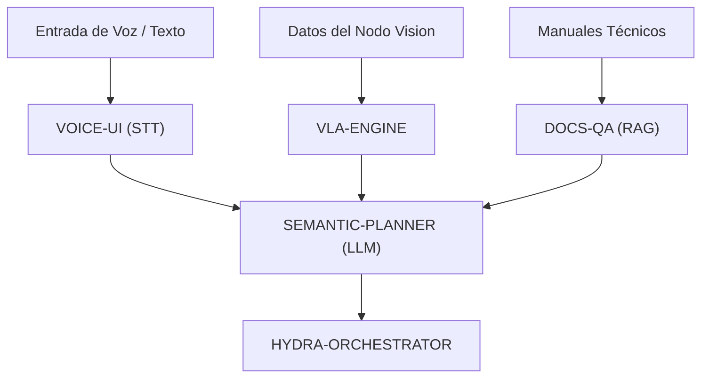

<p align="center">
  
</p>

# 🧠 HYDRA-UMC-COGNITIVE-NODE

<p align="center"><a href="README.md">🇺🇸 English</a> | 🇪🇸 <b>Español</b> | <a href="README_fra.md">🇫🇷 Français</a> | <a href="README_ita.md">🇮🇹 Italiano</a> | <a href="README_deu.md">🇩🇪 Deutsch</a> | <a href="README_zho.md">🇨🇳 简体中文</a> | <a href="README_jpn.md">🇯🇵 日本語</a></p>

### 🤖 Nodo de IA de Borde para Razonamiento Semántico y GenAI (Hailo-10 + Raspberry Pi CM5)

<p align="left">
  
  
  
  
</p>

---

## 1. 🛠️ VISIÓN GENERAL TÉCNICA

**HYDRA-UMC-COGNITIVE-NODE** actúa como el "lóbulo frontal" del ecosistema HYDRA-UMC. Impulsado por la NPU Hailo-10 (40 TOPS), permite el razonamiento semántico complejo, la comprensión del lenguaje natural y la planificación de tareas vision-language-action (VLA) directamente en el borde.

Transforma instrucciones humanas de alto nivel en secuencias robóticas lógicas, gestionando la recuperación de errores y la optimización de misiones sin dependencia de la nube.

### Características Clave:
* 🧠 **Ejecución de LLM Local:** Inferencia acelerada por hardware para modelos cuantizados (Llama/Mistral). *(planeado - necesita el runtime real de modelos de Hailo-10)*
* 👁️ **Integración VLA:** Modelos Vision-Language-Action para ejecución intuitiva de tareas. *(planeado)*
* 🎙️ **Procesamiento de Comandos de Voz:** STT/TTS en tiempo real para interacción humano-robot. *(planeado)*
* 🛡️ **Privacidad Primero:** Procesamiento 100% offline de todas las tareas cognitivas. *(cierto por diseño una vez existan las anteriores - nada aquí llama a ninguna red hoy)*
* 🧩 **Centro de Integración (v0):** Posee la imagen HydraOS compartida y los
  pesos de modelos cuantizados que consumen sus 4 hijos, y los conecta
  entre sí como servicios hermanos en un único `docker-compose.yml`.
  Chequeo real `family-status` lee el manifiesto real de cada hijo para
  reportar presencia/versión/madurez. *(implementado como un chequeo de
  disponibilidad real - ver BUILD Y EJECUCIÓN abajo)*
* 🔒 **Esquema de estado versionado + lecturas de manifiesto con límite de recursos:** `family-status --json` imprime un resultado real, versionado y legible por máquina; cualquier manifiesto de un hermano que supere los 64 KiB (un checkout corrupto o malicioso) degrada a "no encontrado" en vez de leerse sin límite. *(implementado)*
* 🪫 **Chequeo de degradación de los pesos de modelo compartidos:** `family-status` reporta honestamente si el propio directorio `models/` de este nodo tiene realmente pesos reales, no solo si los repos hermanos están clonados. *(implementado)*
* 📦 **Versionado Cuentakilómetros:** Cada build real incrementa
  automáticamente la versión de `pyproject.toml` (`bump_version.py`) - sin
  ediciones manuales de versión.

---

## 2. 🔄 FLUJO DE TRABAJO COGNITIVO



---

## 3. 🧱 ARQUITECTURA Y DECISIONES DE DISEÑO

Este repositorio es el **punto padre/de integración** de la familia
Cognitive AI Node. No ejecuta ningún modelo por sí mismo - posee los
recursos compartidos y el cableado que permite a sus cuatro hijos actuar
como una sola unidad cognitiva sobre la misma placa física:

* **Por qué este nodo no tiene hardware/firmware propio.** A diferencia
  del firmware a nivel de placa madre de HYDRA-UMC, este nodo corre por
  completo sobre una Raspberry Pi CM5 + módulo M.2 Hailo-10 ya
  existentes - no hay ninguna PCB o microcontrolador propio que diseñar
  aquí, así que las carpetas `hardware/`/`firmware/` se podaron en vez de
  dejarlas vacías.
* **Por qué `os/` y `models/` viven solo en el padre.** La imagen HydraOS
  y los pesos LLM/VLA cuantizados son recursos compartidos a nivel de
  placa - mantener una única copia en el padre y montarla de solo lectura
  en cada contenedor hijo (ver `docker-compose.yml`) evita cuatro copias
  divergentes de pesos de varios gigabytes.
* **Por qué una estructura `src/`.** Mantiene el paquete instalable
  (`hydra_umc_cognitive_node`) separado del tooling en la raíz del repo
  (`bump_version.py`, `docker-compose.yml`), igual que el resto de
  proyectos Python del ecosistema.
* **Por qué el punto de entrada solo imprime identidad/versión/rol hoy.**
  Esta es la etapa de andamiaje: demostrar que el paquete se instala,
  compila e importa correctamente - en la versión real de Python objetivo
  - es un requisito previo antes de añadir lógica real de orquestación
  LLM/VLA/voz, y mantiene ese trabajo posterior aislado de los problemas
  de empaquetado.
* **Por qué `docker-compose.yml` existe antes de que los hijos tengan
  Dockerfile.** Decidir y documentar el contrato de integración (qué
  servicio depende de cuál, qué montajes de dispositivo/volumen necesita
  cada uno) ahora evita que esa forma se invente más adelante de manera
  improvisada, aunque `docker compose up` no pueda tener éxito completo
  hasta que cada hijo publique su propio Dockerfile.
* **Cómo encaja en el resto del ecosistema.** Este nodo se sitúa una capa
  por encima de la percepción (HYDRA-UMC-VISION-NODE, Hailo-8) y una capa
  por debajo de la orquestación de misión (HYDRA-UMC-ORCHESTRATOR):
  convierte instrucciones de voz/texto y detecciones en decisiones
  semánticas, que el orquestador convierte después en comandos físicos
  para los robots.
* **Por qué `family-status` lee el manifiesto propio de cada hijo en vez
  de una lista mantenida a mano.** `hydra-umc.project.json` ya es la
  única fuente de verdad en la que confían el dashboard y el updater de
  todo el ecosistema - una segunda lista
  aquí se desincronizaría en cuanto cambiara la madurez real de un hijo y
  nadie se acordara de actualizarla.
* **Por qué un hijo sin checkout local es un "no encontrado" real y
  honesto, no un error.** Un centro de integración genuinamente no sabe
  si un desarrollador tiene los cuatro hijos clonados en local -
  `manifest.py` devuelve `None` para cada fallo real (repo ausente,
  manifiesto ausente, JSON malformado) para que `family-status` lo
  reporte con claridad en vez de reventar.
* **Por qué las lecturas del manifiesto de un hermano tienen un límite de
  64 KiB.** Cada manifiesto real de todo este ecosistema pesa de unos
  pocos cientos de bytes a un par de KiB - un checkout corrupto o
  malicioso cuyo manifiesto haya sido reemplazado por un archivo de
  tamaño desmedido nunca debe hacer que un chequeo de disponibilidad
  rutinario cargue una cantidad ilimitada de datos en memoria. Degrada a
  `None`, igual que cualquier otro manifiesto malformado.
* **Por qué `family-status` reporta `models/` aunque este nodo no
  ejecute ningún modelo.** "Los repos hermanos están clonados" y "los
  pesos compartidos que necesitarían están realmente presentes" son dos
  hechos reales distintos - `check_shared_models()` de `models.py`
  comprueba el segundo con honestidad (vacío pero presente cuenta como
  ausente) en vez de dejar que un operador asuma disponibilidad solo por
  la presencia de los hijos.

---

## 📂 ESTRUCTURA DE DIRECTORIOS

```text
HYDRA-UMC-COGNITIVE-NODE/
├── src/hydra_umc_cognitive_node/
│   ├── manifest.py                 # Lector real y defensivo del manifiesto propio de un hermano (límite de 64 KiB)
│   ├── models.py                   # Chequeo real del propio directorio de pesos de modelo compartidos de este nodo
│   ├── family.py                    # Chequeo real de disponibilidad de familia + esquema JSON versionado
│   └── main.py                        # Punto de entrada + subcomando real `family-status [--json]`
├── tests/                          # Tests reales: lectura de manifiesto, modelos, estado de familia, CLI end-to-end
├── docs/                           # Documentación y arquitectura
├── os/                             # Imagen/configuración de HydraOS para la CM5
├── models/                         # Pesos optimizados para Hailo-10 (LLM/VLA, compartidos por los 4 hijos)
├── images/                         # Medios y diagramas
├── scripts/                        # Scripts de utilidad
├── build/                          # Salida de build local (ignorada por git)
├── pyproject.toml                  # Metadatos del paquete (versión 0.0.5, incremento cuentakilómetros)
├── bump_version.py                 # Incremento de versión estilo cuentakilómetros (usado por build.sh/.bat)
├── docker-compose.yml              # Mapa de integración de los 4 servicios hijos
├── build.sh / build.bat            # Crea el venv, instala (con extras de dev), corre tests, verifica la importación
└── run.sh / run.bat                # Ejecuta el punto de entrada (reenvia argumentos, ej. `family-status`)
```

> **Nota:** se podaron `hardware/` y `firmware/` - este nodo corre sobre un
> módulo CM5 + Hailo-10 M.2 ya existente, sin diseño de hardware/firmware
> propio. Más adelante podría añadirse un microcontrolador auxiliar
> dedicado si llega a hacer falta.

---

## ⚙️ BUILD Y EJECUCIÓN

Requiere Python >= 3.10.

```bash
# Linux / macOS / Git Bash
./build.sh   # crea .venv, instala el paquete (editable), verifica la importación
./run.sh     # ejecuta el punto de entrada

# Windows (cmd)
build.bat
run.bat
```

`build.sh`/`build.bat` incrementan la versión (estilo cuentakilómetros, ver
`bump_version.py`) antes de cada build real, y corren la suite de tests
real (`pytest tests/`). Salida esperada de un `run.sh` sin argumentos:

```text
HYDRA-UMC-COGNITIVE-NODE v0.0.5
Semantic reasoning & GenAI edge node (Hailo-10) - integrates VLA-Engine, Voice-UI, Semantic-Planner and Docs-QA into one cognitive node.
```

Ver `docker-compose.yml` para cómo se conectan los cuatro servicios hijos
(VLA-Engine, Voice-UI, Semantic-Planner, Docs-QA) a este nodo una vez que
cada uno publique su propio Dockerfile.

El subcomando real `family-status` comprueba los hijos reales en un
checkout local real:

```bash
./run.sh family-status
./run.sh family-status --workspace /ruta/a/otro/checkout
./run.sh family-status --json

# Windows
run.bat family-status
```

`family-status` siempre reporta también los pesos de modelo compartidos
propios de este nodo - un `models/` real y vacío en una máquina de
desarrollo es honestamente `MISSING`, nunca se ignora en silencio:

```text
Cognitive AI Node family status (workspace: /path/to/workspace):
  HYDRA-UMC-VLA-ENGINE: v0.0.4, maturity=functional, role=service
  ...

Shared model weights: MISSING (.../HYDRA-UMC-COGNITIVE-NODE/models) - this node's own os/models weights have not been provisioned on this machine; children that need them will run in their own honest degraded/no-hardware mode.

All 4 children present.
```

`--json` imprime los mismos datos reales como un objeto versionado y
legible por máquina en su lugar:

```bash
$ ./run.sh family-status --json
{
  "schema_version": "1.0",
  "shared_models": { "present": false, "path": ".../models" },
  "children": [
    { "name": "HYDRA-UMC-VLA-ENGINE", "present": true, "version": "0.0.4", "maturity": "functional", "role": "service" },
    ...
  ],
  "all_children_present": true
}
```

Por defecto usa el propio directorio padre de este repo - el mismo
layout que ya usa cualquier checkout real de este ecosistema (todos los
repos como hermanos bajo una misma carpeta de workspace). Sale con `1`
si falta algún hijo real.

### 🩺 Solución de problemas

* **`python: comando no encontrado` / el build falla en el paso 1.**
  Requiere Python >= 3.10 en el `PATH`. En Windows, instálalo desde
  [python.org](https://python.org) y marca "Add to PATH" durante la
  instalación; en Linux/macOS suele llamarse `python3`.
* **`build.sh` no consigue activar el venv.** `python3 -m venv .venv`
  coloca el script de activación en una ruta distinta según la
  plataforma: `.venv/bin/activate` en Linux/macOS, `.venv/Scripts/activate`
  en Windows (también con un venv de Python de Windows usado desde Git
  Bash). `build.sh` ya comprueba ambas rutas - si sigue fallando, borra
  `.venv/` y vuelve a ejecutar `./build.sh` para reconstruirlo desde cero.
* **`pip install -e .` falla.** Normalmente por un `.venv/` obsoleto.
  Borra la carpeta `.venv/` y vuelve a ejecutar `./build.sh`/`build.bat`
  para recrearla.
* **`import OK` nunca se imprime.** Significa que `python -c "import
  hydra_umc_cognitive_node"` falló - vuelve a ejecutarlo con el venv
  activo para ver el traceback real (una edición manual rota de
  `pyproject.toml` suele ser la causa tras un merge manual).
* **`docker compose up` no hace nada útil.** Es lo esperado por ahora -
  los cuatro servicios hijos referenciados en `docker-compose.yml` aún no
  tienen Dockerfile publicado (cada uno solo tiene un punto de entrada
  Python por ahora). Ejecuta cada servicio directamente con su propio
  `run.sh`/`run.bat` durante el desarrollo.

---

## 🚀 HOJA DE RUTA
* **Fase 1:** Despliegue del motor VLA y procesamiento de entrada multi-modal en Hailo-10.
* **Fase 2:** Integración del planificador semántico con modelos de comportamiento de enjambre y memoria a largo plazo.
* **Fase 3:** Ejecución local de baja latencia de Voice UI y cancelación de ruido industrial.
* **Fase 4:** Auditorías de toma de decisiones autónomas e integración total con Dashboard AI para feedback "Ver y Preguntar".

---

## 🔗 PROYECTOS RELACIONADOS

Este proyecto forma parte de un ecosistema de robótica más amplio del mismo autor (JuanenRac / Electro Hobby 3D), que abarca firmware, software de control, nodos de IA y herramientas de flota.

### Familia

Este nodo es el Hub de Integración (v0) de los 4 servicios siguientes: posee la imagen compartida de HydraOS y los pesos de los modelos cuantizados, los conecta entre sí en un único `docker-compose.yml`, y comprueba su presencia/versión/madurez vía `family-status`.

**Hijos:**
- **[HYDRA-UMC-VOICE-UI](https://github.com/JuanenRac/HYDRA-UMC-VOICE-UI)** — pasarela STT/TTS; la entrada de voz desde la que arranca el flujo cognitivo de este nodo.
- **[HYDRA-UMC-SEMANTIC-PLANNER](https://github.com/JuanenRac/HYDRA-UMC-SEMANTIC-PLANNER)** — el planificador LLM que convierte las entradas de este nodo en decisiones de misión.
- **[HYDRA-UMC-VLA-ENGINE](https://github.com/JuanenRac/HYDRA-UMC-VLA-ENGINE)** — convierte los datos del nodo de visión en tokens de acción que consume el planificador de este nodo.
- **[HYDRA-UMC-DOCS-QA](https://github.com/JuanenRac/HYDRA-UMC-DOCS-QA)** — asistente RAG que fundamenta la planificación de este nodo en manuales técnicos.

### Directamente relacionados con este nodo

- **[HYDRA-UMC-ORCHESTRATOR](https://github.com/JuanenRac/HYDRA-UMC-ORCHESTRATOR)** — le da a este nodo sus órdenes de misión.
- **[HYDRA-UMC-VISION-NODE](https://github.com/JuanenRac/HYDRA-UMC-VISION-NODE)** — este nodo consume sus detecciones.
- **[HYDRA-UMC-STUDIO](https://github.com/JuanenRac/HYDRA-UMC-STUDIO)** / **[HYDRA-UMC-DSI](https://github.com/JuanenRac/HYDRA-UMC-DSI)** — superficies de control por voz para este nodo.

### Resto del ecosistema

**Plataforma HYDRA-UMC** — la micro-fábrica multi-robot
- **[HYDRA-UMC](https://github.com/JuanenRac/HYDRA-UMC)** — la placa base: host Raspberry Pi CM5 + coprocesador de tiempo real STM32H745 de doble núcleo, orquestando hasta 8 brazos robóticos distribuidos vía CAN-OTA/SPI-OTA.
- **[HYDRA-UMC SERVER](https://github.com/JuanenRac/HYDRA-UMC-SERVER)** — backend Express/WebSocket headless que posee el estado de los robots.
- **[HYDRA-UMC-ANDROID-CONTROL](https://github.com/JuanenRac/HYDRA-UMC-ANDROID-CONTROL)** — app Android de control para HYDRA-UMC.
- **[HYDRA-UMC-IOS-CONTROL](https://github.com/JuanenRac/HYDRA-UMC-IOS-CONTROL)** — app iOS/iPadOS de control para HYDRA-UMC.
- **[HYDRA-UMC-SUITE](https://github.com/JuanenRac/HYDRA-UMC-SUITE)** — centro de mando de escritorio para el enjambre.
- **[HYDRA-UMC-EDITOR-URDF](https://github.com/JuanenRac/HYDRA-UMC-EDITOR-URDF)** — creador/editor gráfico de escritorio para modelos URDF.

**Plataforma URTC** — el controlador de cabezal de herramienta que lleva cada brazo HYDRA-UMC
- **[URTC](https://github.com/JuanenRac/URTC)** — Universal Robot Tool Controller, firmware.
- **[URTC Flasher](https://github.com/JuanenRac/URTC-FLASHER)** — herramienta de escritorio de flasheo CAN-OTA + SWD/JTAG.
- **[URTC Tester](https://github.com/JuanenRac/URTC-TESTER)** — herramienta de escritorio de diagnóstico CAN en vivo.
- **[URTC Web Studio](https://github.com/JuanenRac/URTC-WEB-STUDIO)** — alternativa basada en navegador a las 2 herramientas de escritorio anteriores.

**👁️ Nodo de IA de Visión (Hailo-8)**
- [HYDRA-UMC-VISION-STREAMER](https://github.com/JuanenRac/HYDRA-UMC-VISION-STREAMER)
- [HYDRA-UMC-DETECTION-HEF](https://github.com/JuanenRac/HYDRA-UMC-DETECTION-HEF)
- [HYDRA-UMC-SAFETY-ZONES](https://github.com/JuanenRac/HYDRA-UMC-SAFETY-ZONES)
- [HYDRA-UMC-VISUAL-SERVOING-API](https://github.com/JuanenRac/HYDRA-UMC-VISUAL-SERVOING-API)

**🐝 Orquestación y Enjambre**
- [HYDRA-UMC-SWARM-SYNC](https://github.com/JuanenRac/HYDRA-UMC-SWARM-SYNC)
- [HYDRA-UMC-PATH-PLANNER-3D](https://github.com/JuanenRac/HYDRA-UMC-PATH-PLANNER-3D)
- [HYDRA-UMC-JOB-DISPATCHER](https://github.com/JuanenRac/HYDRA-UMC-JOB-DISPATCHER)
- [HYDRA-UMC-NODE-HEALING](https://github.com/JuanenRac/HYDRA-UMC-NODE-HEALING)

**🎮 Gemelo Digital y Simulación**
- [HYDRA-UMC-TWIN](https://github.com/JuanenRac/HYDRA-UMC-TWIN)
- [HYDRA-UMC-PHYSICS-REPLICA](https://github.com/JuanenRac/HYDRA-UMC-PHYSICS-REPLICA)
- [HYDRA-UMC-HIL-BRIDGE](https://github.com/JuanenRac/HYDRA-UMC-HIL-BRIDGE)
- [HYDRA-UMC-SYNTHETIC-DATA-GEN](https://github.com/JuanenRac/HYDRA-UMC-SYNTHETIC-DATA-GEN)

**📊 Datos y Analítica**
- [HYDRA-UMC-DATALAKE](https://github.com/JuanenRac/HYDRA-UMC-DATALAKE)
- [HYDRA-UMC-TELEMETRY-COLLECTOR](https://github.com/JuanenRac/HYDRA-UMC-TELEMETRY-COLLECTOR)
- [HYDRA-UMC-ANOMALY-DETECTOR](https://github.com/JuanenRac/HYDRA-UMC-ANOMALY-DETECTOR)
- [HYDRA-UMC-PRODUCTION-REPORTS](https://github.com/JuanenRac/HYDRA-UMC-PRODUCTION-REPORTS)

**🏭 Pasarela Industrial**
- [HYDRA-UMC-GATEWAY-INDUSTRIAL](https://github.com/JuanenRac/HYDRA-UMC-GATEWAY-INDUSTRIAL)
- [HYDRA-UMC-OPCUA-SERVER](https://github.com/JuanenRac/HYDRA-UMC-OPCUA-SERVER)
- [HYDRA-UMC-MQTT-BROKER](https://github.com/JuanenRac/HYDRA-UMC-MQTT-BROKER)
- [HYDRA-UMC-MTCONNECT-ADAPTER](https://github.com/JuanenRac/HYDRA-UMC-MTCONNECT-ADAPTER)

**🛠️ Herramientas Complementarias**
- [URTC-SMART-RACK](https://github.com/JuanenRac/URTC-SMART-RACK)
- [URTC-VISION-TOOL](https://github.com/JuanenRac/URTC-VISION-TOOL)
- [HYDRA-UMC-WATCH](https://github.com/JuanenRac/HYDRA-UMC-WATCH)
- [HYDRA-UMC-TOOL-CLI](https://github.com/JuanenRac/HYDRA-UMC-TOOL-CLI)
- [HYDRA-UMC-DASHBOARD-AI](https://github.com/JuanenRac/HYDRA-UMC-DASHBOARD-AI)

---

## 👤 AUTOR
**JuanenRac** (Electro Hobby 3D)
📧 electrohobby3d@gmail.com
📺 [youtube.com/@electrohobby3d](https://youtube.com/@electrohobby3d)

## 📜 LICENCIA
GPL-3.0 - Ver archivo LICENSE para más detalles.
