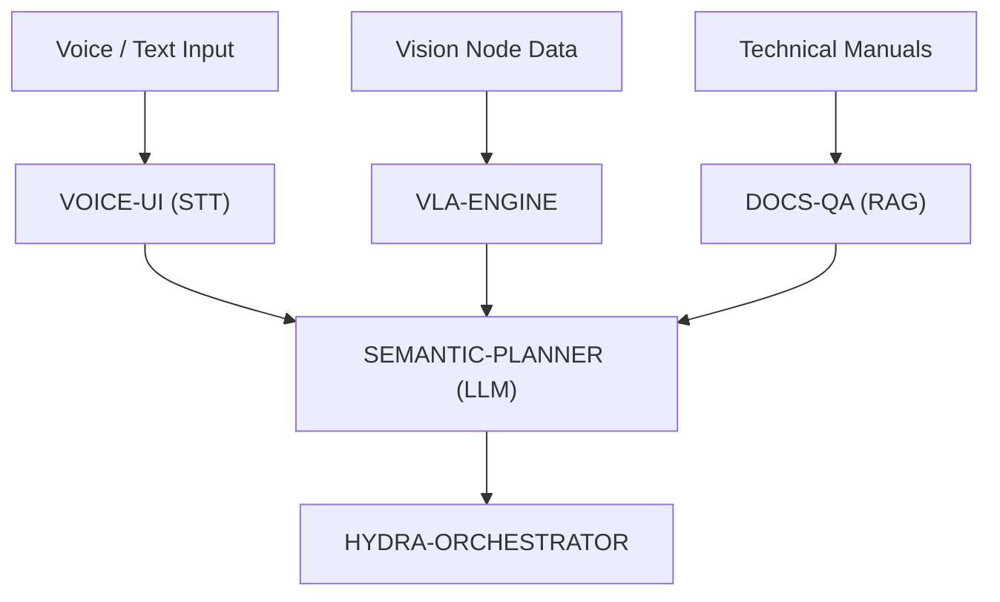

<p align="center">
  
</p>

# 🧠 HYDRA-UMC-COGNITIVE-NODE

<p align="center"><a href="README.md">🇺🇸 English</a> | <a href="README_spa.md">🇪🇸 Español</a> | <a href="README_fra.md">🇫🇷 Français</a> | <a href="README_ita.md">🇮🇹 Italiano</a> | <a href="README_deu.md">🇩🇪 Deutsch</a> | 🇨🇳 <b>简体中文</b> | <a href="README_jpn.md">🇯🇵 日本語</a></p>

### 🤖 语义推理与生成式 AI 边缘节点（Hailo-10 + Raspberry Pi CM5）

<p align="left">
  
  
  
  
</p>

---

## 1. 🛠️ 技术概述

**HYDRA-UMC-COGNITIVE-NODE** 充当 HYDRA-UMC 生态系统的"额叶"。由 Hailo-10
NPU（40 TOPS）驱动，它能直接在边缘端实现复杂的语义推理、自然语言理解，
以及视觉-语言-动作（VLA）任务规划。

它将高层的人类指令转化为逻辑化的机器人操作序列，管理错误恢复和任务优化，
无需依赖云端。

### 关键特性：
* 🧠 **本地 LLM 执行：** 针对量化模型（Llama/Mistral）的硬件加速推理。*（计划中——需要真实的 Hailo-10 模型运行时）*
* 👁️ **VLA 集成：** 用于直观任务执行的视觉-语言-动作模型。*（计划中）*
* 🎙️ **语音指令处理：** 用于人机交互的实时 STT/TTS。*（计划中）*
* 🛡️ **隐私优先：** 所有认知任务 100% 离线处理。*（一旦上述功能存在即天然成立——目前这里没有任何代码会调用网络）*
* 🧩 **集成中枢（v0）：** 拥有共享的 HydraOS 镜像和被其 4 个子项目消费的量化
  模型权重，并通过单一的 `docker-compose.yml` 将它们作为同级服务连接在
  一起。真实的 `family-status` 检查会读取每个子项目自身的真实清单，报告
  其是否存在/版本/成熟度。*（已实现为真实的就绪检查——见下方"构建与
  运行"）*
* 🔒 **版本化状态模式 + 资源受限的清单读取：** `family-status --json` 会打印真实的、版本化的、机器可读的结果；任何超过 64 KiB 的兄弟清单（损坏或恶意的检出）都会降级为"未找到"，而不会被无限制地读取。*（已实现）*
* 🪫 **共享模型权重降级检查：** `family-status` 会诚实地报告本节点自身的 `models/` 目录中是否真的存在真实权重，而不仅仅是兄弟仓库是否已被检出。*（已实现）*
* 📦 **里程表式版本管理：** 每次真实构建都会自动递增 `pyproject.toml`
  自身的版本号（`bump_version.py`）——无需手动编辑版本号。

---

## 2. 🔄 认知工作流



---

## 3. 🧱 架构与设计决策

本仓库是 Cognitive AI Node 系列的**父项目/集成点**。它本身不运行任何
模型——它拥有共享资源以及使其 4 个子项目能够作为同一物理板卡上单一认知
单元协同工作的连接方式：

* **为何本节点没有自己的硬件/固件。** 与主板级别的 HYDRA-UMC 固件不同，本节点完全运行在现成的 Raspberry Pi CM5 + Hailo-10 M.2 模块上——这里没有需要设计的定制 PCB 或微控制器，因此 `hardware/`/`firmware/` 文件夹被直接省略而非留空。
* **为何 `os/` 和 `models/` 仅存在于父项目中。** HydraOS 镜像和量化的 LLM/VLA 权重是共享的板卡级资源——在父项目中保留一份副本，并以只读方式挂载到每个子项目的容器中（见 `docker-compose.yml`），可以避免出现四份互不一致的、动辄数 GB 的模型权重副本。
* **为何采用 `src/` 布局。** 使可安装的包（`hydra_umc_cognitive_node`）与仓库根目录的工具（`bump_version.py`、`docker-compose.yml`）分离，并与生态系统中其他每个 Python 项目所使用的布局保持一致。
* **为何入口点今天只打印身份/版本/角色。** 这是脚手架（scaffolding）阶段：证明该包在实际目标 Python 版本上能够正确安装、编译并被导入，是后续添加真正的 LLM/VLA/语音编排逻辑的前提条件，并使那部分后续工作与打包相关的问题相互隔离。
* **为何 `docker-compose.yml` 在子项目拥有 Dockerfile 之前就已存在。** 现在决定并记录集成契约（哪个服务依赖哪个服务、每个服务需要哪些设备/卷挂载），避免这一形态日后被临时拼凑出来，尽管在每个子项目发布各自的 Dockerfile 之前，`docker compose up` 尚无法完全成功。
* **这如何融入生态系统的其余部分。** 本节点位于感知层（HYDRA-UMC-VISION-NODE，Hailo-8）之上一层，任务编排层（HYDRA-UMC-ORCHESTRATOR）之下一层：它将语音/文本指令和检测结果转化为语义决策，编排器随后将这些决策转化为物理机器人指令。
* **为何 `family-status` 读取每个子项目自身的清单，而不是一份手工维护的列表。** `hydra-umc.project.json` 已经是整个生态系统仪表盘和更新器都信任的唯一真相来源。再维护第二份列表会在某个子项目的真实成熟度变化时立刻产生偏差。
* **为何缺少某个兄弟项目的本地检出会得到一个真实、诚实的"未找到"，而非一个错误。** 一个集成中枢真的无法预先知道开发者是否在本地检出了全部 4 个子项目——`manifest.py` 对每一种真实的失败情形（仓库缺失、清单缺失、JSON 格式错误）都返回 `None`，让 `family-status` 清楚地报告出来，而不是直接崩溃。
* **为何兄弟清单的读取被限制在 64 KiB 以内。** 本生态系统中每一份真实的清单大小都在几百字节到几 KiB 之间——一个清单被替换成超大文件的、损坏或恶意的检出，绝不能让一次常规的就绪检查无限制地将数据加载到内存中。它会像任何其他格式错误的清单一样降级为 `None`。
* **为何 `family-status` 会报告 `models/`，即使本节点自身并不运行任何模型。** "兄弟仓库已被检出"和"它们所需的共享权重确实存在"是两个不同的真实事实——`models.py` 的 `check_shared_models()` 会诚实地检查后者（为空但存在也算作缺失），而不是让操作者仅凭子项目的存在就假定就绪。

---

## 📂 目录结构

```text
HYDRA-UMC-COGNITIVE-NODE/
├── src/hydra_umc_cognitive_node/
│   ├── manifest.py                 # 真实的、具防御性的兄弟项目自身清单读取器（64 KiB 上限）
│   ├── models.py                   # 对本节点自身共享模型权重目录的真实检查
│   ├── family.py                    # 真实的家族就绪检查 + 版本化 JSON 模式
│   ├── api.py                         # 简洁的 JSON/HTTP 接口(基于 stdlib http.server),桥接 `family-status`
│   └── main.py                        # 入口点 + 真实的 `family-status [--json]` 子命令
├── tests/                          # 真实测试：清单读取、模型、家族状态、api、端到端 CLI
├── docs/                           # 文档与架构
├── os/                             # CM5 的 HydraOS 镜像/配置 - 部署时填充(不在 git 中)
├── models/                         # Hailo-10 优化后的权重（LLM/VLA，由 4 个子项目共享） - 部署时填充(不在 git 中)
├── images/                         # 媒体与图表
├── systemd/
│   └── hydra-umc-cognitive-node.service # 本地 CM5 family-status API 的 systemd 单元
├── tools/
│   ├── build_test.py               # 不递增版本号的构建检查
│   └── ci_validate.py              # CI 使用的清单/CHANGELOG/文档校验
├── build/                          # 本地构建输出（已被 git 忽略）
├── pyproject.toml                  # 包元数据（里程表式递增版本号）
├── bump_version.py                 # 原生版本的里程表式递增（由 build.sh/.bat 使用）
├── bump_manifest_version.py        # 将 hydra-umc.project.json 的版本与原生版本同步(--sync)
├── docker-compose.yml              # 4 个子服务的集成蓝图
├── build.sh / build.bat            # 创建 venv、安装（含 dev 附加依赖）、运行测试、验证导入
└── run.sh / run.bat                # 运行入口点（转发参数，例如 `family-status`）
```

> **注意：** `hardware/` 和 `firmware/` 已被省略——本节点运行在现成的
> CM5 + Hailo-10 M.2 模块上，没有自己的硬件/固件设计。若日后有必要，
> 可能会添加专用的辅助微控制器。

---

## ⚙️ 构建与运行

需要 Python >= 3.10。

```bash
# Linux / macOS / Git Bash
./build.sh   # 创建 .venv，安装该包（可编辑模式），验证导入
./run.sh     # 运行入口点

# Windows (cmd)
build.bat
run.bat
```

`build.sh`/`build.bat` 会在每次真实构建之前递增版本号（里程表式，见
`bump_version.py`），并运行真实的测试套件（`pytest tests/`）。不带参数的
`run.sh` 的预期输出：

```text
HYDRA-UMC-COGNITIVE-NODE v0.0.8
Semantic reasoning & GenAI edge node (Hailo-10) - integrates VLA-Engine, Voice-UI, Semantic-Planner and Docs-QA into one cognitive node.
```

一旦 4 个子服务（VLA-Engine、Voice-UI、Semantic-Planner、Docs-QA）各自
发布了自己的 Dockerfile，它们如何接入本节点，请参见 `docker-compose.yml`。

真实的 `family-status` 子命令会在真实的本地检出中检查真实的子项目：

```bash
./run.sh family-status
./run.sh family-status --workspace /path/to/some/other/checkout
./run.sh family-status --json

# Windows
run.bat family-status
```

`family-status` 始终也会报告本节点自身的共享模型权重——开发机器上真实的、
空的 `models/` 会被诚实地报告为 `MISSING`，绝不会被静默忽略：

```text
Cognitive AI Node family status (workspace: /path/to/workspace):
  HYDRA-UMC-VLA-ENGINE: v0.0.4, maturity=functional, role=service
  ...

Shared model weights: MISSING (.../HYDRA-UMC-COGNITIVE-NODE/models) - this node's own os/models weights have not been provisioned on this machine; children that need them will run in their own honest degraded/no-hardware mode.

All 4 children present.
```

`--json` 则会打印相同的真实数据，形式是一个版本化的、机器可读的对象：

```bash
$ ./run.sh family-status --json
{
  "schema_version": "1.0",
  "shared_models": { "present": false, "path": ".../models" },
  "children": [
    { "name": "HYDRA-UMC-VLA-ENGINE", "present": true, "version": "0.0.4", "maturity": "functional", "role": "service" },
    ...
  ],
  "all_children_present": true
}
```

默认使用本仓库自身的父目录——这正是本生态系统任何真实检出已经在使用的
布局（所有仓库作为兄弟项目位于同一个工作区文件夹下）。如果缺少任何真实
子项目，将以 `1` 退出。

### 🩺 故障排查

* **`python: command not found` / 构建在第 1 步失败。** 需要 `PATH` 中存在 Python >= 3.10。在 Windows 上，从 [python.org](https://python.org) 安装，并确保安装过程中勾选了"Add to PATH"；`python3` 是 Linux/macOS 上的常见命令名。
* **`build.sh` 无法激活 venv。** `python3 -m venv .venv` 在不同平台上生成的激活脚本路径不同：Linux/macOS 上是 `.venv/bin/activate`，Windows（包括从 Git Bash 使用的 Windows Python venv）上是 `.venv/Scripts/activate`。`build.sh` 已经检查了这两个路径——如果仍然失败，删除 `.venv/` 并重新运行 `./build.sh` 从头重建。
* **`pip install -e .` 失败。** 通常是 `.venv/` 已过期。删除 `.venv/` 文件夹并重新运行 `./build.sh`/`build.bat` 重新创建它。
* **`import OK` 从未打印。** 意味着 `python -c "import hydra_umc_cognitive_node"` 本身失败了——在激活 venv 的情况下重新运行以查看真实的回溯信息（手动合并后 `pyproject.toml` 被破坏是常见原因）。
* **`docker compose up` 没有任何实际作用。** 目前这是预期的——`docker-compose.yml` 中引用的 4 个子服务尚未发布 Dockerfile（目前每个服务只提供一个 Python 入口点）。开发期间请改为使用各自的 `run.sh`/`run.bat` 直接运行每个服务。

---

## 🚀 路线图
* **第一阶段：** 在 Hailo-10 上部署 VLA 引擎并进行多模态输入处理。
* **第二阶段：** 语义规划器与集群行为模型及长期记忆的集成。
* **第三阶段：** 语音 UI 的低延迟本地执行以及工业噪声消除。
* **第四阶段：** 自主决策审计，以及与 Dashboard AI 的"所见即所问"反馈的完全集成。

---

## 🔗 相关项目

本项目是同一作者(JuanenRac / Electro Hobby 3D)打造的 HYDRA-UMC 机器人生态系统的一部分。值得了解,因为某个请求实际上可能是关于这些项目之一,而非本仓库本身。

**子项目** —— 每一个都是本节点自身认知流程(语音输入、决策、动作、依据支撑)中的一个阶段
- **[HYDRA-UMC-VOICE-UI](https://github.com/JuanenRac/HYDRA-UMC-VOICE-UI)** —— 具备受限、需确认的 Watch 中继的真实语音前端(VAD + 意图解析)。
- **[HYDRA-UMC-SEMANTIC-PLANNER](https://github.com/JuanenRac/HYDRA-UMC-SEMANTIC-PLANNER)** —— 基于真实规则的任务分解,以及针对 MCU 错误码的语义化错误恢复。
- **[HYDRA-UMC-VLA-ENGINE](https://github.com/JuanenRac/HYDRA-UMC-VLA-ENGINE)** —— 面向 Vision-Language-Action 模型的真实动作 token 编解码与轨迹生成。
- **[HYDRA-UMC-DOCS-QA](https://github.com/JuanenRac/HYDRA-UMC-DOCS-QA)** —— 面向本生态系统自身 Markdown 文档的真实纯标准库 TF-IDF 文档检索。

**直接相关**
- **[HYDRA-UMC-ORCHESTRATOR](https://github.com/JuanenRac/HYDRA-UMC-ORCHESTRATOR)** —— 具备真实 gRPC/Protobuf 健康报告契约与任务状态机的集成中枢;正是它向本节点下达自身的任务指令。
- **[HYDRA-UMC-VISION-NODE](https://github.com/JuanenRac/HYDRA-UMC-VISION-NODE)** —— 面向 Hailo-8 视觉流水线的集成中枢,具备逐阶段的真实硬件就绪检测;本节点自身的语义层消费其检测结果。
- **[HYDRA-UMC-STUDIO](https://github.com/JuanenRac/HYDRA-UMC-STUDIO)** —— 具有实时多机器人 3D 可视化的网页控制面板;本节点自身的语音控制界面之一。
- **[HYDRA-UMC-DSI](https://github.com/JuanenRac/HYDRA-UMC-DSI)** —— 面向机载 7 英寸 DSI 触摸屏的原生触控界面,直接嵌入 CM5 本体;本节点自身的另一个语音控制界面。

**生态系统中的其他项目**

*核心硬件与平台*
- **[HYDRA-UMC](https://github.com/JuanenRac/HYDRA-UMC)** —— 机器人手臂的真实主板——CM5 主机 + 双核 STM32H745,通过 CAN-OTA/SPI-OTA 协调最多 8 条工具臂。
- **[HYDRA-UMC-OS](https://github.com/JuanenRac/HYDRA-UMC-OS)** —— 面向 CM5 的可复现 Raspberry Pi OS 产品层——只读代理、经过验证的配置/配置文件、WiFi 首次配网。
- **[HYDRA-UMC-SDK](https://github.com/JuanenRac/HYDRA-UMC-SDK)** —— 每个桥接都据此校验自身指令的共享 JSON-Schema 契约与安全门限边界。

*核心后端与客户端*
- **[HYDRA-UMC-SERVER](https://github.com/JuanenRac/HYDRA-UMC-SERVER)** —— 每个控制客户端真正通信的真实无头后端(REST/WebSocket)。
- **[HYDRA-UMC-SUITE](https://github.com/JuanenRac/HYDRA-UMC-SUITE)** —— 面向多台服务器的桌面(PySide6)集群指挥中心,打包为独立可执行文件。
- **[HYDRA-UMC-ANDROID-CONTROL](https://github.com/JuanenRac/HYDRA-UMC-ANDROID-CONTROL)** —— 具有生物识别登录和配对 Wear OS 伴侣应用的原生 Android 控制应用。
- **[HYDRA-UMC-IOS-CONTROL](https://github.com/JuanenRac/HYDRA-UMC-IOS-CONTROL)** —— 具有实时 WebSocket 同步的 iOS/iPadOS 控制应用(Flutter)。
- **[HYDRA-UMC-EDITOR-URDF](https://github.com/JuanenRac/HYDRA-UMC-EDITOR-URDF)** —— 将完成的模型推送到 STUDIO 自身目录的桌面版图形化 URDF 创建/编辑工具。
- **[HYDRA-UMC-BRIDGE-AMR](https://github.com/JuanenRac/HYDRA-UMC-BRIDGE-AMR)** —— 通过真实的 VDA 5050 MQTT 发布者为 AGV/AMR 车队提供的协调边界。
- **[HYDRA-UMC-BRIDGE-CNC](https://github.com/JuanenRac/HYDRA-UMC-BRIDGE-CNC)** —— 具备真实 GRBL 状态/控制字节访问能力的高层 CNC 单元协调器。
- **[HYDRA-UMC-BRIDGE-DROIDS](https://github.com/JuanenRac/HYDRA-UMC-BRIDGE-DROIDS)** —— 面向足式/人形机器人的协调边界,具备真实的 Boston Dynamics Spot 指令发送器。
- **[HYDRA-UMC-BRIDGE-LASER](https://github.com/JuanenRac/HYDRA-UMC-BRIDGE-LASER)** —— 读取 3 项真实钥匙/外壳/联锁 GPIO 安全信号的激光单元安全协调器。
- **[HYDRA-UMC-BRIDGE-OPENPNP](https://github.com/JuanenRac/HYDRA-UMC-BRIDGE-OPENPNP)** —— 面向 OpenPnP 贴片机板级流程的安全高层协调器。
- **[HYDRA-UMC-BRIDGE-PRINTER3D](https://github.com/JuanenRac/HYDRA-UMC-BRIDGE-PRINTER3D)** —— 面向 Moonraker/Klipper 3D 打印机的安全协调边界,具备真实的受控作业指令。
- **[HYDRA-UMC-BRIDGE-ROS2](https://github.com/JuanenRac/HYDRA-UMC-BRIDGE-ROS2)** —— 具备真实的惰性导入 rclpy ROS 2 传输层的安全协调器。
- **[HYDRA-UMC-BRIDGE-UAV](https://github.com/JuanenRac/HYDRA-UMC-BRIDGE-UAV)** —— 面向搭载摄像头的无人机的协调边界,具备真实的 MAVLink 指令发送器。

*URTC 工具平台*
- **[URTC](https://github.com/JuanenRac/URTC)** —— 面向实体 Universal Robot Tool Controller 板卡的固件,通过 CAN 总线支持 25 种以上工具配置。
- **[URTC-FLASHER](https://github.com/JuanenRac/URTC-FLASHER)** —— 面向 URTC 板卡的桌面图形烧录工具,支持 CAN-OTA 以及全芯片 SWD/JTAG。
- **[URTC-TESTER](https://github.com/JuanenRac/URTC-TESTER)** —— 面向 URTC 板卡的桌面实时 CAN 总线诊断工具,每种工具配置对应一个面板。
- **[URTC-WEB-STUDIO](https://github.com/JuanenRac/URTC-WEB-STUDIO)** —— 通过 Web Serial API 实现的浏览器版 URTC-TESTER 替代方案,无需本地安装。

*视觉 AI 节点(Hailo-8)*
- **[HYDRA-UMC-DETECTION-HEF](https://github.com/JuanenRac/HYDRA-UMC-DETECTION-HEF)** —— 具备 Hailo 架构/校验和安全加载验证的真实编译模型注册表。
- **[HYDRA-UMC-VISION-STREAMER](https://github.com/JuanenRac/HYDRA-UMC-VISION-STREAMER)** —— 具备真实 HailoRT 集成边界的真实 GStreamer 流水线 + MediaMTX 配置生成器。
- **[HYDRA-UMC-VISUAL-SERVOING-API](https://github.com/JuanenRac/HYDRA-UMC-VISUAL-SERVOING-API)** —— 具备真实 Position-Based Visual Servoing 修正律,并依据上游区域状态进行安全门控。
- **[HYDRA-UMC-SAFETY-ZONES](https://github.com/JuanenRac/HYDRA-UMC-SAFETY-ZONES)** —— 具备校准新鲜度强制检查的真实区域入侵检测与 E-STOP 请求。

*编排与集群*
- **[HYDRA-UMC-JOB-DISPATCHER](https://github.com/JuanenRac/HYDRA-UMC-JOB-DISPATCHER)** —— 基于真实 HTTP API 的真实优先级任务队列,支持去重。
- **[HYDRA-UMC-NODE-HEALING](https://github.com/JuanenRac/HYDRA-UMC-NODE-HEALING)** —— 具备重试/退避与身份不匹配检测的真实基于 gRPC 的车队健康看门狗。
- **[HYDRA-UMC-PATH-PLANNER-3D](https://github.com/JuanenRac/HYDRA-UMC-PATH-PLANNER-3D)** —— 具备真实障碍物/工作空间碰撞校验的真实基于 RRT 的三维路径规划器。
- **[HYDRA-UMC-SWARM-SYNC](https://github.com/JuanenRac/HYDRA-UMC-SWARM-SYNC)** —— 经过多单元收敛属性测试的真实 CRDT LWW-Element-Map 状态同步。

*数字孪生与仿真*
- **[HYDRA-UMC-TWIN](https://github.com/JuanenRac/HYDRA-UMC-TWIN)** —— 面向数字孪生引擎的集成中枢,具备真实的版本兼容性同步契约。
- **[HYDRA-UMC-HIL-BRIDGE](https://github.com/JuanenRac/HYDRA-UMC-HIL-BRIDGE)** —— 在仿真与真实硬件之间路由指令的真实硬件在环安全联锁。
- **[HYDRA-UMC-PHYSICS-REPLICA](https://github.com/JuanenRac/HYDRA-UMC-PHYSICS-REPLICA)** —— 面向真实 URDF 子集的真实正向运动学与关节限位校验。
- **[HYDRA-UMC-SYNTHETIC-DATA-GEN](https://github.com/JuanenRac/HYDRA-UMC-SYNTHETIC-DATA-GEN)** —— 具备 YOLO/COCO 标注导出功能的真实程序化 2D 场景生成器。

*数据与分析*
- **[HYDRA-UMC-DATALAKE](https://github.com/JuanenRac/HYDRA-UMC-DATALAKE)** —— 具备真实数据摄入/查询 HTTP API 的真实 sqlite3 时序数据存储。
- **[HYDRA-UMC-ANOMALY-DETECTOR](https://github.com/JuanenRac/HYDRA-UMC-ANOMALY-DETECTOR)** —— 具备漂移监测能力的真实 FFT + 统计基线异常检测器。
- **[HYDRA-UMC-PRODUCTION-REPORTS](https://github.com/JuanenRac/HYDRA-UMC-PRODUCTION-REPORTS)** —— 基于 DATALAKE 历史数据的真实 OEE/可用率计算,支持可复现的 CSV 导出。
- **[HYDRA-UMC-TELEMETRY-COLLECTOR](https://github.com/JuanenRac/HYDRA-UMC-TELEMETRY-COLLECTOR)** —— 面向 DATALAKE 的真实 CAN/WebSocket 数据摄入管道,支持序列去重。

*工业网关*
- **[HYDRA-UMC-GATEWAY-INDUSTRIAL](https://github.com/JuanenRac/HYDRA-UMC-GATEWAY-INDUSTRIAL)** —— 中继至工业协议的集成中枢,具备真实的指令白名单/背压控制层。
- **[HYDRA-UMC-OPCUA-SERVER](https://github.com/JuanenRac/HYDRA-UMC-OPCUA-SERVER)** —— 经真实二进制协议客户端会话验证的真实 OPC-UA 地址空间。
- **[HYDRA-UMC-MQTT-BROKER](https://github.com/JuanenRac/HYDRA-UMC-MQTT-BROKER)** —— 具备可选按客户端认证与主题 ACL 的真实 MQTT 代理。
- **[HYDRA-UMC-MTCONNECT-ADAPTER](https://github.com/JuanenRac/HYDRA-UMC-MTCONNECT-ADAPTER)** —— 具备降级模式输出的真实 MTConnect `/probe` 与 `/current` XML 端点。

*辅助工具与生态系统运维*
- **[HYDRA-UMC-DASHBOARD-AI](https://github.com/JuanenRac/HYDRA-UMC-DASHBOARD-AI)** —— 基于 DATALAKE/ANOMALY-DETECTOR 的智能摘要与异常高亮面板,具备诚实的统计回退机制。
- **[HYDRA-UMC-TOOL-CLI](https://github.com/JuanenRac/HYDRA-UMC-TOOL-CLI)** —— 具备真实、稳定退出码契约的车队 CLI,是 HYDRA-UMC-SERVER 自身 API 的真实在线客户端。
- **[HYDRA-UMC-WATCH](https://github.com/JuanenRac/HYDRA-UMC-WATCH)** —— 具备真实触觉提醒与配对手机语音中继功能的 WearOS 伴侣应用。
- **[URTC-SMART-RACK](https://github.com/JuanenRac/URTC-SMART-RACK)** —— 面向板卡安装机架的固件,具备真实的工具 ID 解码与 Smart Idle 预热逻辑。
- **[URTC-VISION-TOOL](https://github.com/JuanenRac/URTC-VISION-TOOL)** —— 面向热成像/RGB 检测工具头的固件及真实 Python 视觉伴侣程序。
- **[HYDRA-UMC-UPDATER](https://github.com/JuanenRac/HYDRA-UMC-UPDATER)** —— 发现、克隆并更新本生态系统中每个仓库的管理类桌面工具。

---

## 👤 作者
**JuanenRac** (Electro Hobby 3D)
📧 electrohobby3d@gmail.com
📺 [youtube.com/@electrohobby3d](https://youtube.com/@electrohobby3d)

## 📜 许可证
GPL-3.0 —— 详见 LICENSE。
