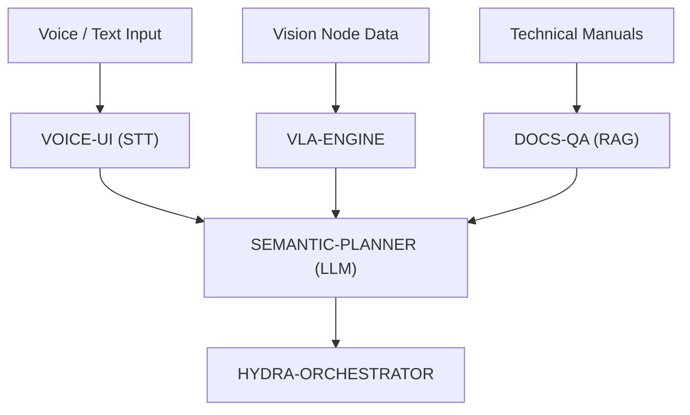

<p align="center">
  
</p>

# 🧠 HYDRA-UMC-COGNITIVE-NODE

<p align="center"><a href="README.md">🇺🇸 English</a> | <a href="README_spa.md">🇪🇸 Español</a> | <a href="README_fra.md">🇫🇷 Français</a> | <a href="README_ita.md">🇮🇹 Italiano</a> | <a href="README_deu.md">🇩🇪 Deutsch</a> | 🇨🇳 <b>简体中文</b> | <a href="README_jpn.md">🇯🇵 日本語</a></p>

### 🤖 语义推理与生成式 AI 边缘节点（Hailo-10 + Raspberry Pi CM5）

<p align="left">
  
  
  
  
</p>

---

## 1. 🛠️ 技术概述

**HYDRA-UMC-COGNITIVE-NODE** 充当 HYDRA-UMC 生态系统的"额叶"。由 Hailo-10
NPU（40 TOPS）驱动，它能直接在边缘端实现复杂的语义推理、自然语言理解，
以及视觉-语言-动作（VLA）任务规划。

它将高层的人类指令转化为逻辑化的机器人操作序列，管理错误恢复和任务优化，
无需依赖云端。

### 关键特性：
* 🧠 **本地 LLM 执行：** 针对量化模型（Llama/Mistral）的硬件加速推理。*（计划中——需要真实的 Hailo-10 模型运行时）*
* 👁️ **VLA 集成：** 用于直观任务执行的视觉-语言-动作模型。*（计划中）*
* 🎙️ **语音指令处理：** 用于人机交互的实时 STT/TTS。*（计划中）*
* 🛡️ **隐私优先：** 所有认知任务 100% 离线处理。*（一旦上述功能存在即天然成立——目前这里没有任何代码会调用网络）*
* 🧩 **集成中枢（v0）：** 拥有共享的 HydraOS 镜像和被其 4 个子项目消费的量化
  模型权重，并通过单一的 `docker-compose.yml` 将它们作为同级服务连接在
  一起。真实的 `family-status` 检查会读取每个子项目自身的真实清单，报告
  其是否存在/版本/成熟度。*（已实现为真实的就绪检查——见下方"构建与
  运行"）*
* 📦 **里程表式版本管理：** 每次真实构建都会自动递增 `pyproject.toml`
  自身的版本号（`bump_version.py`）——无需手动编辑版本号。

---

## 2. 🔄 认知工作流



---

## 3. 🧱 架构与设计决策

本仓库是 Cognitive AI Node 系列的**父项目/集成点**。它本身不运行任何
模型——它拥有共享资源以及使其 4 个子项目能够作为同一物理板卡上单一认知
单元协同工作的连接方式：

* **为何本节点没有自己的硬件/固件。** 与主板级别的 HYDRA-UMC 固件不同，本节点完全运行在现成的 Raspberry Pi CM5 + Hailo-10 M.2 模块上——这里没有需要设计的定制 PCB 或微控制器，因此 `hardware/`/`firmware/` 文件夹被直接省略而非留空。
* **为何 `os/` 和 `models/` 仅存在于父项目中。** HydraOS 镜像和量化的 LLM/VLA 权重是共享的板卡级资源——在父项目中保留一份副本，并以只读方式挂载到每个子项目的容器中（见 `docker-compose.yml`），可以避免出现四份互不一致的、动辄数 GB 的模型权重副本。
* **为何采用 `src/` 布局。** 使可安装的包（`hydra_umc_cognitive_node`）与仓库根目录的工具（`bump_version.py`、`docker-compose.yml`）分离，并与生态系统中其他每个 Python 项目所使用的布局保持一致。
* **为何入口点今天只打印身份/版本/角色。** 这是脚手架（scaffolding）阶段：证明该包在实际目标 Python 版本上能够正确安装、编译并被导入，是后续添加真正的 LLM/VLA/语音编排逻辑的前提条件，并使那部分后续工作与打包相关的问题相互隔离。
* **为何 `docker-compose.yml` 在子项目拥有 Dockerfile 之前就已存在。** 现在决定并记录集成契约（哪个服务依赖哪个服务、每个服务需要哪些设备/卷挂载），避免这一形态日后被临时拼凑出来，尽管在每个子项目发布各自的 Dockerfile 之前，`docker compose up` 尚无法完全成功。
* **这如何融入生态系统的其余部分。** 本节点位于感知层（HYDRA-UMC-VISION-NODE，Hailo-8）之上一层，任务编排层（HYDRA-UMC-ORCHESTRATOR）之下一层：它将语音/文本指令和检测结果转化为语义决策，编排器随后将这些决策转化为物理机器人指令。
* **为何 `family-status` 读取每个子项目自身的清单，而不是一份手工维护的列表。** `hydra-umc.project.json` 已经是整个生态系统仪表盘和更新器都信任的唯一真相来源（见 `SONNET/BIBLIA HYDRA-UMC`）——在这里再维护第二份列表，只要某个子项目的真实成熟度发生变化而没人记得同步更新，就会立刻产生偏差。
* **为何缺少某个兄弟项目的本地检出会得到一个真实、诚实的"未找到"，而非一个错误。** 一个集成中枢真的无法预先知道开发者是否在本地检出了全部 4 个子项目——`manifest.py` 对每一种真实的失败情形（仓库缺失、清单缺失、JSON 格式错误）都返回 `None`，让 `family-status` 清楚地报告出来，而不是直接崩溃。

---

## 📂 目录结构

```text
HYDRA-UMC-COGNITIVE-NODE/
├── src/hydra_umc_cognitive_node/
│   ├── manifest.py                 # 真实的、具防御性的兄弟项目自身清单读取器
│   ├── family.py                    # 对 4 个真实子项目的真实家族就绪检查
│   └── main.py                        # 入口点 + 真实的 `family-status` 子命令
├── tests/                          # 真实测试：清单读取、家族状态、端到端 CLI
├── docs/                           # 文档与架构
├── os/                             # CM5 的 HydraOS 镜像/配置
├── models/                         # Hailo-10 优化后的权重（LLM/VLA，由 4 个子项目共享）
├── images/                         # 媒体与图表
├── scripts/                        # 实用脚本
├── build/                          # 本地构建输出（已被 git 忽略）
├── pyproject.toml                  # 包元数据（版本 0.0.5，里程表式递增）
├── bump_version.py                 # 里程表式版本递增（由 build.sh/.bat 使用）
├── docker-compose.yml              # 4 个子服务的集成蓝图
├── build.sh / build.bat            # 创建 venv、安装（含 dev 附加依赖）、运行测试、验证导入
└── run.sh / run.bat                # 运行入口点（转发参数，例如 `family-status`）
```

> **注意：** `hardware/` 和 `firmware/` 已被省略——本节点运行在现成的
> CM5 + Hailo-10 M.2 模块上，没有自己的硬件/固件设计。若日后有必要，
> 可能会添加专用的辅助微控制器。

---

## ⚙️ 构建与运行

需要 Python >= 3.10。

```bash
# Linux / macOS / Git Bash
./build.sh   # 创建 .venv，安装该包（可编辑模式），验证导入
./run.sh     # 运行入口点

# Windows (cmd)
build.bat
run.bat
```

`build.sh`/`build.bat` 会在每次真实构建之前递增版本号（里程表式，见
`bump_version.py`），并运行真实的测试套件（`pytest tests/`）。不带参数的
`run.sh` 的预期输出：

```text
HYDRA-UMC-COGNITIVE-NODE v0.0.5
Semantic reasoning & GenAI edge node (Hailo-10) - integrates VLA-Engine, Voice-UI, Semantic-Planner and Docs-QA into one cognitive node.
```

一旦 4 个子服务（VLA-Engine、Voice-UI、Semantic-Planner、Docs-QA）各自
发布了自己的 Dockerfile，它们如何接入本节点，请参见 `docker-compose.yml`。

真实的 `family-status` 子命令会在真实的本地检出中检查真实的子项目：

```bash
./run.sh family-status
./run.sh family-status --workspace /path/to/some/other/checkout

# Windows
run.bat family-status
```

默认使用本仓库自身的父目录——这正是本生态系统任何真实检出已经在使用的
布局（所有仓库作为兄弟项目位于同一个工作区文件夹下）。如果缺少任何真实
子项目，将以 `1` 退出。

### 🩺 故障排查

* **`python: command not found` / 构建在第 1 步失败。** 需要 `PATH` 中存在 Python >= 3.10。在 Windows 上，从 [python.org](https://python.org) 安装，并确保安装过程中勾选了"Add to PATH"；`python3` 是 Linux/macOS 上的常见命令名。
* **`build.sh` 无法激活 venv。** `python3 -m venv .venv` 在不同平台上生成的激活脚本路径不同：Linux/macOS 上是 `.venv/bin/activate`，Windows（包括从 Git Bash 使用的 Windows Python venv）上是 `.venv/Scripts/activate`。`build.sh` 已经检查了这两个路径——如果仍然失败，删除 `.venv/` 并重新运行 `./build.sh` 从头重建。
* **`pip install -e .` 失败。** 通常是 `.venv/` 已过期。删除 `.venv/` 文件夹并重新运行 `./build.sh`/`build.bat` 重新创建它。
* **`import OK` 从未打印。** 意味着 `python -c "import hydra_umc_cognitive_node"` 本身失败了——在激活 venv 的情况下重新运行以查看真实的回溯信息（手动合并后 `pyproject.toml` 被破坏是常见原因）。
* **`docker compose up` 没有任何实际作用。** 目前这是预期的——`docker-compose.yml` 中引用的 4 个子服务尚未发布 Dockerfile（目前每个服务只提供一个 Python 入口点）。开发期间请改为使用各自的 `run.sh`/`run.bat` 直接运行每个服务。

---

## 🚀 路线图
* **第一阶段：** 在 Hailo-10 上部署 VLA 引擎并进行多模态输入处理。
* **第二阶段：** 语义规划器与集群行为模型及长期记忆的集成。
* **第三阶段：** 语音 UI 的低延迟本地执行以及工业噪声消除。
* **第四阶段：** 自主决策审计，以及与 Dashboard AI 的"所见即所问"反馈的完全集成。

---

## 🔗 相关项目

本项目是同一作者（JuanenRac / Electro Hobby 3D）打造的更大规模机器人生态
系统的一部分，涵盖固件、控制软件、AI 节点和车队工具。

### 与本节点直接相关

- **[HYDRA-UMC-ORCHESTRATOR](https://github.com/JuanenRac/HYDRA-UMC-ORCHESTRATOR)** —— 向本节点下达任务指令。
- **[HYDRA-UMC-VISION-NODE](https://github.com/JuanenRac/HYDRA-UMC-VISION-NODE)** —— 本节点消费其检测结果。
- **[HYDRA-UMC-STUDIO](https://github.com/JuanenRac/HYDRA-UMC-STUDIO)** / **[HYDRA-UMC-DSI](https://github.com/JuanenRac/HYDRA-UMC-DSI)** —— 本节点的语音控制界面。

### 生态系统的其余部分

**HYDRA-UMC 平台** —— 多机器人微工厂单元
- **[HYDRA-UMC](https://github.com/JuanenRac/HYDRA-UMC)** —— 主板本身：Raspberry Pi CM5 主机 + 双核 STM32H745 实时协处理器，通过 CAN-OTA/SPI-OTA 协调最多 8 条分布式机械臂。
- **[HYDRA-UMC SERVER](https://github.com/JuanenRac/HYDRA-UMC-SERVER)** —— 拥有机器人状态的无头 Express/WebSocket 后端。
- **[HYDRA-UMC-ANDROID-CONTROL](https://github.com/JuanenRac/HYDRA-UMC-ANDROID-CONTROL)** —— HYDRA-UMC 的 Android 控制应用。
- **[HYDRA-UMC-IOS-CONTROL](https://github.com/JuanenRac/HYDRA-UMC-IOS-CONTROL)** —— HYDRA-UMC 的 iOS/iPadOS 控制应用。
- **[HYDRA-UMC-SUITE](https://github.com/JuanenRac/HYDRA-UMC-SUITE)** —— 桌面端集群指挥中心。
- **[HYDRA-UMC-EDITOR-URDF](https://github.com/JuanenRac/HYDRA-UMC-EDITOR-URDF)** —— 桌面端图形化 URDF 创建/编辑器。

**URTC 平台** —— 每台 HYDRA-UMC 机械臂搭载的工具头控制器
- **[URTC](https://github.com/JuanenRac/URTC)** —— Universal Robot Tool Controller 固件。
- **[URTC Flasher](https://github.com/JuanenRac/URTC-FLASHER)** —— 桌面端 CAN-OTA + SWD/JTAG 刷写工具。
- **[URTC Tester](https://github.com/JuanenRac/URTC-TESTER)** —— 桌面端实时 CAN 总线诊断工具。
- **[URTC Web Studio](https://github.com/JuanenRac/URTC-WEB-STUDIO)** —— 上述两款桌面工具的浏览器端替代方案。

**👁️ 视觉 AI 节点（Hailo-8）**
- [HYDRA-UMC-VISION-STREAMER](https://github.com/JuanenRac/HYDRA-UMC-VISION-STREAMER)
- [HYDRA-UMC-DETECTION-HEF](https://github.com/JuanenRac/HYDRA-UMC-DETECTION-HEF)
- [HYDRA-UMC-SAFETY-ZONES](https://github.com/JuanenRac/HYDRA-UMC-SAFETY-ZONES)
- [HYDRA-UMC-VISUAL-SERVOING-API](https://github.com/JuanenRac/HYDRA-UMC-VISUAL-SERVOING-API)

**🐝 编排与集群**
- [HYDRA-UMC-SWARM-SYNC](https://github.com/JuanenRac/HYDRA-UMC-SWARM-SYNC)
- [HYDRA-UMC-PATH-PLANNER-3D](https://github.com/JuanenRac/HYDRA-UMC-PATH-PLANNER-3D)
- [HYDRA-UMC-JOB-DISPATCHER](https://github.com/JuanenRac/HYDRA-UMC-JOB-DISPATCHER)
- [HYDRA-UMC-NODE-HEALING](https://github.com/JuanenRac/HYDRA-UMC-NODE-HEALING)

**🎮 数字孪生与仿真**
- [HYDRA-UMC-TWIN](https://github.com/JuanenRac/HYDRA-UMC-TWIN)
- [HYDRA-UMC-PHYSICS-REPLICA](https://github.com/JuanenRac/HYDRA-UMC-PHYSICS-REPLICA)
- [HYDRA-UMC-HIL-BRIDGE](https://github.com/JuanenRac/HYDRA-UMC-HIL-BRIDGE)
- [HYDRA-UMC-SYNTHETIC-DATA-GEN](https://github.com/JuanenRac/HYDRA-UMC-SYNTHETIC-DATA-GEN)

**📊 数据与分析**
- [HYDRA-UMC-DATALAKE](https://github.com/JuanenRac/HYDRA-UMC-DATALAKE)
- [HYDRA-UMC-TELEMETRY-COLLECTOR](https://github.com/JuanenRac/HYDRA-UMC-TELEMETRY-COLLECTOR)
- [HYDRA-UMC-ANOMALY-DETECTOR](https://github.com/JuanenRac/HYDRA-UMC-ANOMALY-DETECTOR)
- [HYDRA-UMC-PRODUCTION-REPORTS](https://github.com/JuanenRac/HYDRA-UMC-PRODUCTION-REPORTS)

**🏭 工业网关**
- [HYDRA-UMC-GATEWAY-INDUSTRIAL](https://github.com/JuanenRac/HYDRA-UMC-GATEWAY-INDUSTRIAL)
- [HYDRA-UMC-OPCUA-SERVER](https://github.com/JuanenRac/HYDRA-UMC-OPCUA-SERVER)
- [HYDRA-UMC-MQTT-BROKER](https://github.com/JuanenRac/HYDRA-UMC-MQTT-BROKER)
- [HYDRA-UMC-MTCONNECT-ADAPTER](https://github.com/JuanenRac/HYDRA-UMC-MTCONNECT-ADAPTER)

**🛠️ 配套工具**
- [URTC-SMART-RACK](https://github.com/JuanenRac/URTC-SMART-RACK)
- [URTC-VISION-TOOL](https://github.com/JuanenRac/URTC-VISION-TOOL)
- [HYDRA-UMC-WATCH](https://github.com/JuanenRac/HYDRA-UMC-WATCH)
- [HYDRA-UMC-TOOL-CLI](https://github.com/JuanenRac/HYDRA-UMC-TOOL-CLI)
- [HYDRA-UMC-DASHBOARD-AI](https://github.com/JuanenRac/HYDRA-UMC-DASHBOARD-AI)

---

## 👤 作者
**JuanenRac**（Electro Hobby 3D）
📧 electrohobby3d@gmail.com

## 📜 许可证
GPL-3.0 —— 详见 LICENSE。
